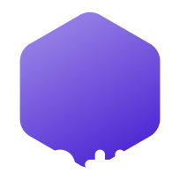

> ⚠未完成区域，如果你不清楚自己在干什么，请回退至主分支。此外此处信息存在极其多的谬误，请不要跟维护者提此处相关部分的issue，我们将会慢慢修改。   
> 我们急需人手，烷烃快要被累死了。有帮助意向者联系： c8h18-dev@smart-teach.cn

<h1>
<picture>
    <source media="(prefers-color-scheme: dark)" srcset="./images/fontlogo/aiwb-font-white.png">
    
</picture>
</h1>

「Awesome Iwb」是专为广大中小学电教打造的班级希沃/鸿合等一体机/数字白板/班班通一站式软件推荐清单和实用知识手册，助你在新学期快速上手班级一体机新玩法，让日常教学更加便利与智慧！
 **为广大电教倾情撰写，让班级大屏更好用！**

**🌟 风带来故事的种子，时间使之发芽 🌟**

 

 

## ⚠️ 注意

> [!CAUTION]
> 我们（指 [Awesome Iwb](https://github.com/awesome-iwb) ）和 [天津静海汇智卓创文化发展有限公司](https://tjhzzc.cn) 以及其旗下的 [智教联盟](https://smart-teach.cn)组织 没有任何隶属关系。Awesome Iwb坚持保持自由与开放，不受任何商业公司/企业或商业股份所控制。团队内所有成员均为爱发电，没有相互隶属关系。同时 [Awesome Iwb](https://github.com/awesome-iwb) 和旗下所有项目均不以任何形式隶属或被控制于 [智教联盟](https://smart-teach.cn)组织。

> [!IMPORTANT]
> 在使用任何软件之前，应仔细阅读其仓库中的 README 或其他形式的说明。本文档旨在推荐以下优质软件，尽可能详细展现其功能，但组织本身不提供相关软件的人工答疑服务。如欲提出问题，请前往对应开源仓库/交流平台。

> [!IMPORTANT]
> 我们将不再严格遵循「仅收录开源软件」的规则，但是我们也会确保收录上架的软件不是商业付费软件。也就是说，你能在这个列表中看到商业免费软件和非开源软件。

> [!IMPORTANT]
> 使用电脑端的现代浏览器浏览本页面以获得最佳阅读体验。使用 GitHub 手机客户端浏览可能会导致乱码！如果您更喜欢简约的排版风格，请点击浏览 [简洁排版模式](./README.legacy.md) 。

 
 
 

# 💻 &nbsp;&nbsp; IwbPark

$\large{\textsf{Awesome Iwb - IwbPark}}$

「IwbPark」收录了用于班级教学一体机/数字白板/班班通的实用软件，涵盖课表/看板/随机点名/小工具/白板等多类软件，**且绝大多数软件均开源/完全免费**，帮助您快速拿捏班级一体机，让日常教学体验变得更加轻松愉快。

 

## 📚 目录

### ✏️ 屏幕书写

该分类下的软件为用户提供了在屏幕上绘图的能力，一般还内置PPT联动和快捷白板等功能。这方面的话，Ink Canvas家族有点令人眼花缭乱，因为分支版本实在是太多了。不过建议还是详细看完再做出自己的选择。

| 排行/框架 |   | 开发者 |
| - | - | - |
| ![#1](https://img.shields.io/badge/-%2301-red?logo=data%3Aimage%2Fsvg%2Bxml%3Bbase64%2CPHN2ZyB4bWxucz0iaHR0cDovL3d3dy53My5vcmcvMjAwMC9zdmciIHdpZHRoPSIyNCIgaGVpZ2h0PSIyNCIgdmlld0JveD0iMCAwIDI0IDI0IiBmaWxsPSIjZWVlIj48cGF0aCBkPSJNMCAwaDI0djI0SDB6IiBmaWxsPSJub25lIi8%2BPHBhdGggZD0ibTE5LjQ5NiAxMy45ODMgMS45NjYgMy40MDZhMSAxIDAgMCAxLS43MDUgMS40ODhsLS4xMTMuMDExLS4xMTItLjAwMS0yLjkzMy0uMTktMS4zMDMgMi42MzZhMSAxIDAgMCAxLTEuNjA4LjI2bC0uMDgyLS4wOTQtLjA3Mi0uMTEtMS45NjgtMy40MDdhOSA5IDAgMCAwIDYuOTMtMy45OTltLTguMDY2IDMuOTk5TDkuNDY0IDIxLjM5YTEgMSAwIDAgMS0xLjYyMi4xNTdsLS4wNzYtLjEtLjA2NC0uMTE0LTEuMzA0LTIuNjM1LTIuOTMxLjE5YTEgMSAwIDAgMS0xLjAyMi0xLjI5bC4wNC0uMTA3LjA1LS4xIDEuOTY4LTMuNDA5YTkgOSAwIDAgMCA2LjkyNyA0LjAwMXpNMTIgMmwuMjQuMDA0QTcgNyAwIDAgMSAxOSA5bC0uMDAzLjE5My0uMDA3LjE5Mi0uMDE4LjI0NS0uMDI2LjI0Mi0uMDI0LjE3OGE3IDcgMCAwIDEtLjMxNyAxLjI2OGwtLjExNi4zMDgtLjE1My4zNDhhNy4wMDEgNy4wMDEgMCAwIDEtMTIuNjg4LS4wMjhsLS4xMy0uMjk3LS4wNTItLjEzMy0uMDgtLjIxNy0uMDk1LS4yOTRhNyA3IDAgMCAxLS4wOTMtLjM0NGwtLjA2LS4yNzEtLjA0OS0uMjcxLS4wMi0uMTM5LS4wMzktLjMyMy0uMDI0LS4zNjVMNSA5YTcgNyAwIDAgMSA2Ljc2LTYuOTk2eiIvPjwvc3ZnPg%3D%3D) &nbsp;  | [**Ink Canvas Plus**](#ink-canvas-plus) &nbsp;   | <picture><source media="(prefers-color-scheme: dark)" srcset="https://images.weserv.nl/?url=github.com/clover-yan.png?v=4&h=64&w=64&fit=cover&mask=circle&maxage=7d&bg=222"></picture>&nbsp;<a href="https://github.com/clover-yan">Clover Yan</a> |
| ![#2](https://img.shields.io/badge/-%2302-orange?logo=data%3Aimage%2Fsvg%2Bxml%3Bbase64%2CPHN2ZyB4bWxucz0iaHR0cDovL3d3dy53My5vcmcvMjAwMC9zdmciIHdpZHRoPSIyNCIgaGVpZ2h0PSIyNCIgdmlld0JveD0iMCAwIDI0IDI0IiBmaWxsPSIjZWVlIj48cGF0aCBkPSJNMCAwaDI0djI0SDB6IiBmaWxsPSJub25lIi8%2BPHBhdGggZD0ibTE5LjQ5NiAxMy45ODMgMS45NjYgMy40MDZhMSAxIDAgMCAxLS43MDUgMS40ODhsLS4xMTMuMDExLS4xMTItLjAwMS0yLjkzMy0uMTktMS4zMDMgMi42MzZhMSAxIDAgMCAxLTEuNjA4LjI2bC0uMDgyLS4wOTQtLjA3Mi0uMTEtMS45NjgtMy40MDdhOSA5IDAgMCAwIDYuOTMtMy45OTltLTguMDY2IDMuOTk5TDkuNDY0IDIxLjM5YTEgMSAwIDAgMS0xLjYyMi4xNTdsLS4wNzYtLjEtLjA2NC0uMTE0LTEuMzA0LTIuNjM1LTIuOTMxLjE5YTEgMSAwIDAgMS0xLjAyMi0xLjI5bC4wNC0uMTA3LjA1LS4xIDEuOTY4LTMuNDA5YTkgOSAwIDAgMCA2LjkyNyA0LjAwMXpNMTIgMmwuMjQuMDA0QTcgNyAwIDAgMSAxOSA5bC0uMDAzLjE5My0uMDA3LjE5Mi0uMDE4LjI0NS0uMDI2LjI0Mi0uMDI0LjE3OGE3IDcgMCAwIDEtLjMxNyAxLjI2OGwtLjExNi4zMDgtLjE1My4zNDhhNy4wMDEgNy4wMDEgMCAwIDEtMTIuNjg4LS4wMjhsLS4xMy0uMjk3LS4wNTItLjEzMy0uMDgtLjIxNy0uMDk1LS4yOTRhNyA3IDAgMCAxLS4wOTMtLjM0NGwtLjA2LS4yNzEtLjA0OS0uMjcxLS4wMi0uMTM5LS4wMzktLjMyMy0uMDI0LS4zNjVMNSA5YTcgNyAwIDAgMSA2Ljc2LTYuOTk2eiIvPjwvc3ZnPg%3D%3D) &nbsp;  | [**Ink Canvas Artistry**](#ink-canvas-artistry) &nbsp;   | <picture><source media="(prefers-color-scheme: dark)" srcset="https://images.weserv.nl/?url=github.com/WuChanging.png?v=4&h=64&w=64&fit=cover&mask=circle&maxage=7d&bg=222"></picture>&nbsp;<a href="https://github.com/WuChanging">WuChanging</a> |
| ![#3](https://img.shields.io/badge/-%2303-yellow?logo=data%3Aimage%2Fsvg%2Bxml%3Bbase64%2CPHN2ZyB4bWxucz0iaHR0cDovL3d3dy53My5vcmcvMjAwMC9zdmciIHdpZHRoPSIyNCIgaGVpZ2h0PSIyNCIgdmlld0JveD0iMCAwIDI0IDI0IiBmaWxsPSIjZWVlIj48cGF0aCBkPSJNMCAwaDI0djI0SDB6IiBmaWxsPSJub25lIi8%2BPHBhdGggZD0ibTE5LjQ5NiAxMy45ODMgMS45NjYgMy40MDZhMSAxIDAgMCAxLS43MDUgMS40ODhsLS4xMTMuMDExLS4xMTItLjAwMS0yLjkzMy0uMTktMS4zMDMgMi42MzZhMSAxIDAgMCAxLTEuNjA4LjI2bC0uMDgyLS4wOTQtLjA3Mi0uMTEtMS45NjgtMy40MDdhOSA5IDAgMCAwIDYuOTMtMy45OTltLTguMDY2IDMuOTk5TDkuNDY0IDIxLjM5YTEgMSAwIDAgMS0xLjYyMi4xNTdsLS4wNzYtLjEtLjA2NC0uMTE0LTEuMzA0LTIuNjM1LTIuOTMxLjE5YTEgMSAwIDAgMS0xLjAyMi0xLjI5bC4wNC0uMTA3LjA1LS4xIDEuOTY4LTMuNDA5YTkgOSAwIDAgMCA2LjkyNyA0LjAwMXpNMTIgMmwuMjQuMDA0QTcgNyAwIDAgMSAxOSA5bC0uMDAzLjE5My0uMDA3LjE5Mi0uMDE4LjI0NS0uMDI2LjI0Mi0uMDI0LjE3OGE3IDcgMCAwIDEtLjMxNyAxLjI2OGwtLjExNi4zMDgtLjE1My4zNDhhNy4wMDEgNy4wMDEgMCAwIDEtMTIuNjg4LS4wMjhsLS4xMy0uMjk3LS4wNTItLjEzMy0uMDgtLjIxNy0uMDk1LS4yOTRhNyA3IDAgMCAxLS4wOTMtLjM0NGwtLjA2LS4yNzEtLjA0OS0uMjcxLS4wMi0uMTM5LS4wMzktLjMyMy0uMDI0LS4zNjVMNSA5YTcgNyAwIDAgMSA2Ljc2LTYuOTk2eiIvPjwvc3ZnPg%3D%3D) &nbsp;  | [**智绘教 Inkeys**](#智绘教inkeys) &nbsp;  | <picture><source media="(prefers-color-scheme: dark)" srcset="https://images.weserv.nl/?url=github.com/Alan-CRL.png?v=4&h=64&w=64&fit=cover&mask=circle&maxage=7d&bg=222"></picture>&nbsp;<a href="https://github.com/Alan-CRL">Alan-CRL</a> |
|  &nbsp;  | [**icc! Community**](#icc-ce) &nbsp;   | <picture><source media="(prefers-color-scheme: dark)" srcset="https://images.weserv.nl/?url=github.com/CJKmkp.png?v=4&h=64&w=64&fit=cover&mask=circle&maxage=7d&bg=222"></picture>&nbsp;<a href="https://github.com/CJKmkp">CJKmkp</a> |
|  &nbsp;  | [**icc! Remastered**](#iccre) &nbsp;   | <picture><source media="(prefers-color-scheme: dark)" srcset="https://images.weserv.nl/?url=github.com/LiuYan-xwx.png?v=4&h=64&w=64&fit=cover&mask=circle&maxage=7d&bg=222"></picture>&nbsp;<a href="https://github.com/LiuYan-xwx">流焰xwx</a> |
|  &nbsp;  | [**Ink Canvas Better**](#ink-canvas-better) &nbsp;   | <picture><source media="(prefers-color-scheme: dark)" srcset="https://images.weserv.nl/?url=github.com/BaiYang2238.png?v=4&h=64&w=64&fit=cover&mask=circle&maxage=7d&bg=222"></picture>&nbsp;<a href="https://github.com/BaiYang2238">BaiYang2238</a> |
|  &nbsp;  | [**LanStartWrite**](#LanStartWrite) &nbsp;  | <picture><source media="(prefers-color-scheme: dark)" srcset="https://images.weserv.nl/?url=github.com/wwiinnddyy.png?v=4&h=64&w=64&fit=cover&mask=circle&maxage=7d&bg=222"></picture>&nbsp;<a href="https://github.com/wwiinnddyy">wwiinnddyy</a> |
|  &nbsp;  | [**ppInk**](#ppink) &nbsp;   | <picture><source media="(prefers-color-scheme: dark)" srcset="https://images.weserv.nl/?url=github.com/pubpub-zz.png?v=4&h=64&w=64&fit=cover&mask=circle&maxage=7d&bg=222"></picture>&nbsp;<a href="https://github.com/pubpub-zz">pubpub-zz</a> |
|  &nbsp;  | ~~[**Ink Canvas**](#ink-canvas)~~ &nbsp;   | <picture><source media="(prefers-color-scheme: dark)" srcset="https://images.weserv.nl/?url=github.com/WXRIW.png?v=4&h=64&w=64&fit=cover&mask=circle&maxage=7d&bg=222"></picture>&nbsp;<a href="https://github.com/WXRIW">WXRIW</a> |
|  &nbsp;  | [**OpenBoard**](#ink-canvas-better) &nbsp;  | <picture><source media="(prefers-color-scheme: dark)" srcset="https://images.weserv.nl/?url=github.com/OpenBoard-org.png?v=4&h=64&w=64&fit=cover&mask=circle&maxage=7d&bg=222"></picture>&nbsp;<a href="https://github.com/OpenBoard-org">OpenBoard</a> |

### 📷 第三方视频展台

这个分类下面没啥太多的选择，目前只有 ShowWrite 这一款独苗可以用，且用且珍惜吧。

| 排行/框架 |   | 开发者 |
| - | - | - |
| ![#1](https://img.shields.io/badge/-%2301-red?logo=data%3Aimage%2Fsvg%2Bxml%3Bbase64%2CPHN2ZyB4bWxucz0iaHR0cDovL3d3dy53My5vcmcvMjAwMC9zdmciIHdpZHRoPSIyNCIgaGVpZ2h0PSIyNCIgdmlld0JveD0iMCAwIDI0IDI0IiBmaWxsPSIjZWVlIj48cGF0aCBkPSJNMCAwaDI0djI0SDB6IiBmaWxsPSJub25lIi8%2BPHBhdGggZD0ibTE5LjQ5NiAxMy45ODMgMS45NjYgMy40MDZhMSAxIDAgMCAxLS43MDUgMS40ODhsLS4xMTMuMDExLS4xMTItLjAwMS0yLjkzMy0uMTktMS4zMDMgMi42MzZhMSAxIDAgMCAxLTEuNjA4LjI2bC0uMDgyLS4wOTQtLjA3Mi0uMTEtMS45NjgtMy40MDdhOSA5IDAgMCAwIDYuOTMtMy45OTltLTguMDY2IDMuOTk5TDkuNDY0IDIxLjM5YTEgMSAwIDAgMS0xLjYyMi4xNTdsLS4wNzYtLjEtLjA2NC0uMTE0LTEuMzA0LTIuNjM1LTIuOTMxLjE5YTEgMSAwIDAgMS0xLjAyMi0xLjI5bC4wNC0uMTA3LjA1LS4xIDEuOTY4LTMuNDA5YTkgOSAwIDAgMCA2LjkyNyA0LjAwMXpNMTIgMmwuMjQuMDA0QTcgNyAwIDAgMSAxOSA5bC0uMDAzLjE5My0uMDA3LjE5Mi0uMDE4LjI0NS0uMDI2LjI0Mi0uMDI0LjE3OGE3IDcgMCAwIDEtLjMxNyAxLjI2OGwtLjExNi4zMDgtLjE1My4zNDhhNy4wMDEgNy4wMDEgMCAwIDEtMTIuNjg4LS4wMjhsLS4xMy0uMjk3LS4wNTItLjEzMy0uMDgtLjIxNy0uMDk1LS4yOTRhNyA3IDAgMCAxLS4wOTMtLjM0NGwtLjA2LS4yNzEtLjA0OS0uMjcxLS4wMi0uMTM5LS4wMzktLjMyMy0uMDI0LS4zNjVMNSA5YTcgNyAwIDAgMSA2Ljc2LTYuOTk2eiIvPjwvc3ZnPg%3D%3D) &nbsp;  | [**ShowWrite 视频展台**](#showwrite视频展台) &nbsp;  | <picture><source media="(prefers-color-scheme: dark)" srcset="https://images.weserv.nl/?url=github.com/wwcrdrvf6u.png?v=4&h=64&w=64&fit=cover&mask=circle&maxage=7d&bg=222"></picture>&nbsp;<a href="https://github.com/wwcrdrvf6u">wwcrdrvf6u</a> |

### 📆 课表类软件

该分类下的软件可以在桌面上常驻显示动态的课程表或排课信息。非常建议各位试试 ClassIsland，是目前使用人数最多，同时也是维护最为积极的。当然如果你不习惯，也可以看看下面的其他选择。

> 请注意：这个分类和下面的 桌面小组件 分类可以合着一起看，因为很多项目不仅有课程表功能，也同时包含很多桌面实用组件，这就导致对分类不太友好，所以这个分类只列出广为人知的课程表软件。

| 排行/框架 | 项目信息 | 开发者 |
| :--- | :--- | :--- |
| ![#1](https://img.shields.io/badge/-%2301-red?logo=data%3Aimage%2Fsvg%2Bxml%3Bbase64%2CPHN2ZyB4bWxucz0iaHR0cDovL3d3dy53My5vcmcvMjAwMC9zdmciIHdpZHRoPSIyNCIgaGVpZ2h0PSIyNCIgdmlld0JveD0iMCAwIDI0IDI0IiBmaWxsPSIjZWVlIj48cGF0aCBkPSJNMCAwaDI0djI0SDB6IiBmaWxsPSJub25lIi8%2BPHBhdGggZD0ibTE5LjQ5NiAxMy45ODMgMS45NjYgMy40MDZhMSAxIDAgMCAxLS43MDUgMS40ODhsLS4xMTMuMDExLS4xMTItLjAwMS0yLjkzMy0uMTktMS4zMDMgMi42MzZhMSAxIDAgMCAxLTEuNjA4LjI2bC0uMDgyLS4wOTQtLjA3Mi0uMTEtMS45NjgtMy40MDdhOSA5IDAgMCAwIDYuOTMtMy45OTltLTguMDY2IDMuOTk5TDkuNDY0IDIxLjM5YTEgMSAwIDAgMS0xLjYyMi4xNTdsLS4wNzYtLjEtLjA2NC0uMTE0LTEuMzA0LTIuNjM1LTIuOTMxLjE5YTEgMSAwIDAgMS0xLjAyMi0xLjI5bC4wNC0uMTA3LjA1LS4xIDEuOTY4LTMuNDA5YTkgOSAwIDAgMCA2LjkyNyA0LjAwMXpNMTIgMmwuMjQuMDA0QTcgNyAwIDAgMSAxOSA5bC0uMDAzLjE5My0uMDA3LjE5Mi0uMDE4LjI0NS0uMDI2LjI0Mi0uMDI0LjE3OGE3IDcgMCAwIDEtLjMxNyAxLjI2OGwtLjExNi4zMDgtLjE1My4zNDhhNy4wMDEgNy4wMDEgMCAwIDEtMTIuNjg4LS4wMjhsLS4xMy0uMjk3LS4wNTItLjEzMy0uMDgtLjIxNy0uMDk1LS4yOTRhNyA3IDAgMCAxLS4wOTMtLjM0NGwtLjA2LS4yNzEtLjA0OS0uMjcxLS4wMi0uMTM5LS4wMzktLjMyMy0uMDI0LS4zNjVMNSA5YTcgNyAwIDAgMSA2Ljc2LTYuOTk2eiIvPjwvc3ZnPg%3D%3D) &nbsp;  | [**ClassIsland**](#classisland) &nbsp;  | <picture><source media="(prefers-color-scheme: dark)" srcset="https://images.weserv.nl/?url=github.com/HelloWRC.png?v=4&h=64&w=64&fit=cover&mask=circle&maxage=7d&bg=222"></picture>&nbsp;<a href="https://github.com/HelloWRC">HelloWRC</a> |
| ![#2](https://img.shields.io/badge/-%2302-orange?logo=data%3Aimage%2Fsvg%2Bxml%3Bbase64%2CPHN2ZyB4bWxucz0iaHR0cDovL3d3dy53My5vcmcvMjAwMC9zdmciIHdpZHRoPSIyNCIgaGVpZ2h0PSIyNCIgdmlld0JveD0iMCAwIDI0IDI0IiBmaWxsPSIjZWVlIj48cGF0aCBkPSJNMCAwaDI0djI0SDB6IiBmaWxsPSJub25lIi8%2BPHBhdGggZD0ibTE5LjQ5NiAxMy45ODMgMS45NjYgMy40MDZhMSAxIDAgMCAxLS43MDUgMS40ODhsLS4xMTMuMDExLS4xMTItLjAwMS0yLjkzMy0uMTktMS4zMDMgMi42MzZhMSAxIDAgMCAxLTEuNjA4LjI2bC0uMDgyLS4wOTQtLjA3Mi0uMTEtMS45NjgtMy40MDdhOSA5IDAgMCAwIDYuOTMtMy45OTltLTguMDY2IDMuOTk5TDkuNDY0IDIxLjM5YTEgMSAwIDAgMS0xLjYyMi4xNTdsLS4wNzYtLjEtLjA2NC0uMTE0LTEuMzA0LTIuNjM1LTIuOTMxLjE5YTEgMSAwIDAgMS0xLjAyMi0xLjI5bC4wNC0uMTA3LjA1LS4xIDEuOTY4LTMuNDA5YTkgOSAwIDAgMCA2LjkyNyA0LjAwMXpNMTIgMmwuMjQuMDA0QTcgNyAwIDAgMSAxOSA5bC0uMDAzLjE5My0uMDA3LjE5Mi0uMDE4LjI0NS0uMDI2LjI0Mi0uMDI0LjE3OGE3IDcgMCAwIDEtLjMxNyAxLjI2OGwtLjExNi4zMDgtLjE1My4zNDhhNy4wMDEgNy4wMDEgMCAwIDEtMTIuNjg4LS4wMjhsLS4xMy0uMjk3LS4wNTItLjEzMy0uMDgtLjIxNy0uMDk1LS4yOTRhNyA3IDAgMCAxLS4wOTMtLjM0NGwtLjA2LS4yNzEtLjA0OS0uMjcxLS4wMi0uMTM5LS4wMzktLjMyMy0uMDI0LS4zNjVMNSA5YTcgNyAwIDAgMSA2Ljc2LTYuOTk2eiIvPjwvc3ZnPg%3D%3D) &nbsp;  | [**Class Widgets**](#class-widgets) &nbsp;  | <picture><source media="(prefers-color-scheme: dark)" srcset="https://images.weserv.nl/?url=github.com/RinLit-233-shiroko.png?v=4&h=64&w=64&fit=cover&mask=circle&maxage=7d&bg=222"></picture>&nbsp;<a href="https://github.com/RinLit-233-shiroko">RinLit</a> |
| ![#3](https://img.shields.io/badge/-%2303-yellow?logo=data%3Aimage%2Fsvg%2Bxml%3Bbase64%2CPHN2ZyB4bWxucz0iaHR0cDovL3d3dy53My5vcmcvMjAwMC9zdmciIHdpZHRoPSIyNCIgaGVpZ2h0PSIyNCIgdmlld0JveD0iMCAwIDI0IDI0IiBmaWxsPSIjZWVlIj48cGF0aCBkPSJNMCAwaDI0djI0SDB6IiBmaWxsPSJub25lIi8%2BPHBhdGggZD0ibTE5LjQ5NiAxMy45ODMgMS45NjYgMy40MDZhMSAxIDAgMCAxLS43MDUgMS40ODhsLS4xMTMuMDExLS4xMTItLjAwMS0yLjkzMy0uMTktMS4zMDMgMi42MzZhMSAxIDAgMCAxLTEuNjA4LjI2bC0uMDgyLS4wOTQtLjA3Mi0uMTEtMS45NjgtMy40MDdhOSA5IDAgMCAwIDYuOTMtMy45OTltLTguMDY2IDMuOTk5TDkuNDY0IDIxLjM5YTEgMSAwIDAgMS0xLjYyMi4xNTdsLS4wNzYtLjEtLjA2NC0uMTE0LTEuMzA0LTIuNjM1LTIuOTMxLjE5YTEgMSAwIDAgMS0xLjAyMi0xLjI5bC4wNC0uMTA3LjA1LS4xIDEuOTY4LTMuNDA5YTkgOSAwIDAgMCA2LjkyNyA0LjAwMXpNMTIgMmwuMjQuMDA0QTcgNyAwIDAgMSAxOSA5bC0uMDAzLjE5My0uMDA3LjE5Mi0uMDE4LjI0NS0uMDI2LjI0Mi0uMDI0LjE3OGE3IDcgMCAwIDEtLjMxNyAxLjI2OGwtLjExNi4zMDgtLjE1My4zNDhhNy4wMDEgNy4wMDEgMCAwIDEtMTIuNjg4LS4wMjhsLS4xMy0uMjk3LS4wNTItLjEzMy0uMDgtLjIxNy0uMDk1LS4yOTRhNyA3IDAgMCAxLS4wOTMtLjM0NGwtLjA2LS4yNzEtLjA0OS0uMjcxLS4wMi0uMTM5LS4wMzktLjMyMy0uMDI0LS4zNjVMNSA5YTcgNyAwIDAgMSA2Ljc2LTYuOTk2eiIvPjwvc3ZnPg%3D%3D) &nbsp;  | [**ZongziTEK 黑板贴**](#zongzitek-黑板贴) &nbsp;  | <picture><source media="(prefers-color-scheme: dark)" srcset="https://images.weserv.nl/?url=github.com/ZongziTEK.png?v=4&h=64&w=64&fit=cover&mask=circle&maxage=7d&bg=222"></picture>&nbsp;<a href="https://github.com/ZongziTEK">ZongziTEK</a> |
|  &nbsp;  | ~~[**ElectronClassSchedule**](#electronclassschedule)~~ &nbsp;  | <picture><source media="(prefers-color-scheme: dark)" srcset="https://images.weserv.nl/?url=github.com/EnderWolf006.png?v=4&h=64&w=64&fit=cover&mask=circle&maxage=7d&bg=222"></picture>&nbsp;<a href="https://github.com/EnderWolf006">EnderWolf006</a> |

### 📊 看板类软件

这是一个大分类，里面的软件基本上主要的功能都是信息展示，包括作业展示，课程表展示，考试信息展示之类的。（至于说为什么不把课程表展示相关的软件放到课程表软件里面，是因为这里的软件功能比较杂，并不是专门的课表软件。）

| 排行/框架 | 项目信息 | 开发者 |
| :--- | :--- | :--- |
| ![#1](https://img.shields.io/badge/-%2301-red?logo=data%3Aimage%2Fsvg%2Bxml%3Bbase64%2CPHN2ZyB4bWxucz0iaHR0cDovL3d3dy53My5vcmcvMjAwMC9zdmciIHdpZHRoPSIyNCIgaGVpZ2h0PSIyNCIgdmlld0JveD0iMCAwIDI0IDI0IiBmaWxsPSIjZWVlIj48cGF0aCBkPSJNMCAwaDI0djI0SDB6IiBmaWxsPSJub25lIi8%2BPHBhdGggZD0ibTE5LjQ5NiAxMy45ODMgMS45NjYgMy40MDZhMSAxIDAgMCAxLS43MDUgMS40ODhsLS4xMTMuMDExLS4xMTItLjAwMS0yLjkzMy0uMTktMS4zMDMgMi42MzZhMSAxIDAgMCAxLTEuNjA4LjI2bC0uMDgyLS4wOTQtLjA3Mi0uMTEtMS45NjgtMy40MDdhOSA5IDAgMCAwIDYuOTMtMy45OTltLTguMDY2IDMuOTk5TDkuNDY0IDIxLjM5YTEgMSAwIDAgMS0xLjYyMi4xNTdsLS4wNzYtLjEtLjA2NC0uMTE0LTEuMzA0LTIuNjM1LTIuOTMxLjE5YTEgMSAwIDAgMS0xLjAyMi0xLjI5bC4wNC0uMTA3LjA1LS4xIDEuOTY4LTMuNDA5YTkgOSAwIDAgMCA2LjkyNyA0LjAwMXpNMTIgMmwuMjQuMDA0QTcgNyAwIDAgMSAxOSA5bC0uMDAzLjE5My0uMDA3LjE5Mi0uMDE4LjI0NS0uMDI2LjI0Mi0uMDI0LjE3OGE3IDcgMCAwIDEtLjMxNyAxLjI2OGwtLjExNi4zMDgtLjE1My4zNDhhNy4wMDEgNy4wMDEgMCAwIDEtMTIuNjg4LS4wMjhsLS4xMy0uMjk3LS4wNTItLjEzMy0uMDgtLjIxNy0uMDk1LS4yOTRhNyA3IDAgMCAxLS4wOTMtLjM0NGwtLjA2LS4yNzEtLjA0OS0uMjcxLS4wMi0uMTM5LS4wMzktLjMyMy0uMDI0LS4zNjVMNSA5YTcgNyAwIDAgMSA2Ljc2LTYuOTk2eiIvPjwvc3ZnPg%3D%3D) &nbsp;  | [**Ris_ClassTool**](#ris_classtool-瑞思课堂工具) &nbsp;  | <picture><source media="(prefers-color-scheme: dark)" srcset="https://images.weserv.nl/?url=github.com/PYLXU.png?v=4&h=64&w=64&fit=cover&mask=circle&maxage=7d&bg=222"></picture>&nbsp;<a href="https://github.com/PYLXU">PYLXU</a> |
| ![#2](https://img.shields.io/badge/-%2302-orange?logo=data%3Aimage%2Fsvg%2Bxml%3Bbase64%2CPHN2ZyB4bWxucz0iaHR0cDovL3d3dy53My5vcmcvMjAwMC9zdmciIHdpZHRoPSIyNCIgaGVpZ2h0PSIyNCIgdmlld0JveD0iMCAwIDI0IDI0IiBmaWxsPSIjZWVlIj48cGF0aCBkPSJNMCAwaDI0djI0SDB6IiBmaWxsPSJub25lIi8%2BPHBhdGggZD0ibTE5LjQ5NiAxMy45ODMgMS45NjYgMy40MDZhMSAxIDAgMCAxLS43MDUgMS40ODhsLS4xMTMuMDExLS4xMTItLjAwMS0yLjkzMy0uMTktMS4zMDMgMi42MzZhMSAxIDAgMCAxLTEuNjA4LjI2bC0uMDgyLS4wOTQtLjA3Mi0uMTEtMS45NjgtMy40MDdhOSA5IDAgMCAwIDYuOTMtMy45OTltLTguMDY2IDMuOTk5TDkuNDY0IDIxLjM5YTEgMSAwIDAgMS0xLjYyMi4xNTdsLS4wNzYtLjEtLjA2NC0uMTE0LTEuMzA0LTIuNjM1LTIuOTMxLjE5YTEgMSAwIDAgMS0xLjAyMi0xLjI5bC4wNC0uMTA3LjA1LS4xIDEuOTY4LTMuNDA5YTkgOSAwIDAgMCA2LjkyNyA0LjAwMXpNMTIgMmwuMjQuMDA0QTcgNyAwIDAgMSAxOSA5bC0uMDAzLjE5My0uMDA3LjE5Mi0uMDE4LjI0NS0uMDI2LjI0Mi0uMDI0LjE3OGE3IDcgMCAwIDEtLjMxNyAxLjI2OGwtLjExNi4zMDgtLjE1My4zNDhhNy4wMDEgNy4wMDEgMCAwIDEtMTIuNjg4LS4wMjhsLS4xMy0uMjk3LS4wNTItLjEzMy0uMDgtLjIxNy0uMDk1LS4yOTRhNyA3IDAgMCAxLS4wOTMtLjM0NGwtLjA2LS4yNzEtLjA0OS0uMjcxLS4wMi0uMTM5LS4wMzktLjMyMy0uMDI0LS4zNjVMNSA5YTcgNyAwIDAgMSA2Ljc2LTYuOTk2eiIvPjwvc3ZnPg%3D%3D) &nbsp;  | [**Classworks**](#classworks) &nbsp;  | <picture><source media="(prefers-color-scheme: dark)" srcset="https://images.weserv.nl/?url=github.com/SunWuyuan.png?v=4&h=64&w=64&fit=cover&mask=circle&maxage=7d&bg=222"></picture>&nbsp;<a href="https://github.com/SunWuyuan">SunWuyuan</a> |
| ![#3](https://img.shields.io/badge/-%2303-yellow?logo=data%3Aimage%2Fsvg%2Bxml%3Bbase64%2CPHN2ZyB4bWxucz0iaHR0cDovL3d3dy53My5vcmcvMjAwMC9zdmciIHdpZHRoPSIyNCIgaGVpZ2h0PSIyNCIgdmlld0JveD0iMCAwIDI0IDI0IiBmaWxsPSIjZWVlIj48cGF0aCBkPSJNMCAwaDI0djI0SDB6IiBmaWxsPSJub25lIi8%2BPHBhdGggZD0ibTE5LjQ5NiAxMy45ODMgMS45NjYgMy40MDZhMSAxIDAgMCAxLS43MDUgMS40ODhsLS4xMTMuMDExLS4xMTItLjAwMS0yLjkzMy0uMTktMS4zMDMgMi42MzZhMSAxIDAgMCAxLTEuNjA4LjI2bC0uMDgyLS4wOTQtLjA3Mi0uMTEtMS45NjgtMy40MDdhOSA5IDAgMCAwIDYuOTMtMy45OTltLTguMDY2IDMuOTk5TDkuNDY0IDIxLjM5YTEgMSAwIDAgMS0xLjYyMi4xNTdsLS4wNzYtLjEtLjA2NC0uMTE0LTEuMzA0LTIuNjM1LTIuOTMxLjE5YTEgMSAwIDAgMS0xLjAyMi0xLjI5bC4wNC0uMTA3LjA1LS4xIDEuOTY4LTMuNDA5YTkgOSAwIDAgMCA2LjkyNyA0LjAwMXpNMTIgMmwuMjQuMDA0QTcgNyAwIDAgMSAxOSA5bC0uMDAzLjE5My0uMDA3LjE5Mi0uMDE4LjI0NS0uMDI2LjI0Mi0uMDI0LjE3OGE3IDcgMCAwIDEtLjMxNyAxLjI2OGwtLjExNi4zMDgtLjE1My4zNDhhNy4wMDEgNy4wMDEgMCAwIDEtMTIuNjg4LS4wMjhsLS4xMy0uMjk3LS4wNTItLjEzMy0uMDgtLjIxNy0uMDk1LS4yOTRhNyA3IDAgMCAxLS4wOTMtLjM0NGwtLjA2LS4yNzEtLjA0OS0uMjcxLS4wMi0uMTM5LS4wMzktLjMyMy0uMDI0LS4zNjVMNSA5YTcgNyAwIDAgMSA2Ljc2LTYuOTk2eiIvPjwvc3ZnPg%3D%3D) &nbsp;  | [**极序**](#极序) &nbsp;  | 极序 |
|  &nbsp;  | [**Sticky-attention**](#sticky-attention) &nbsp;  | <picture><source media="(prefers-color-scheme: dark)" srcset="https://images.weserv.nl/?url=github.com/jizilin6732.png?v=4&h=64&w=64&fit=cover&mask=circle&maxage=7d&bg=222"></picture>&nbsp;<a href="https://github.com/jizilin6732">jizilin6732</a> |
|  &nbsp;  | [**ClassBoardSharp**](#classboardsharp) &nbsp;  | <picture><source media="(prefers-color-scheme: dark)" srcset="https://images.weserv.nl/?url=github.com/Candlest.png?v=4&h=64&w=64&fit=cover&mask=circle&maxage=7d&bg=222"></picture>&nbsp;<a href="https://github.com/Candlest">Candlest</a> |
|  &nbsp;  | [**凌云班级组件**](#凌云班级组件) &nbsp;  | <picture><source media="(prefers-color-scheme: dark)" srcset="https://images.weserv.nl/?url=github.com/Yamikani-Flipped.png?v=4&h=64&w=64&fit=cover&mask=circle&maxage=7d&bg=222"></picture>&nbsp;<a href="https://github.com/Yamikani-Flipped">Yamikani-Flipped</a> |
|  &nbsp;  | [**Education Clock**](#education-clock) &nbsp;  | <picture><source media="(prefers-color-scheme: dark)" srcset="https://images.weserv.nl/?url=github.com/Return-Log.png?v=4&h=64&w=64&fit=cover&mask=circle&maxage=7d&bg=222"></picture>&nbsp;<a href="https://github.com/Return-Log">Return-Log</a> |
|  &nbsp;  | [**班级热搜排行**](#class-hot-search-班级热搜排行) &nbsp;  | <picture><source media="(prefers-color-scheme: dark)" srcset="https://images.weserv.nl/?url=github.com/SRInternet-Studio.png?v=4&h=64&w=64&fit=cover&mask=circle&maxage=7d&bg=222"></picture>&nbsp;<a href="https://github.com/SRInternet-Studio">SRInternet-Studio</a> |
|  &nbsp;  | [**TimerIn**](#timerin) &nbsp;  | <picture><source media="(prefers-color-scheme: dark)" srcset="https://images.weserv.nl/?url=github.com/SRInternet-Studio.png?v=4&h=64&w=64&fit=cover&mask=circle&maxage=7d&bg=222"></picture>&nbsp;<a href="https://github.com/SRInternet-Studio">SRInternet-Studio</a> |
|  &nbsp;  | ~~[**StickyHomeworks**](#stickyhomeworks)~~ &nbsp;  | <picture><source media="(prefers-color-scheme: dark)" srcset="https://images.weserv.nl/?url=github.com/HelloWRC.png?v=4&h=64&w=64&fit=cover&mask=circle&maxage=7d&bg=222"></picture>&nbsp;<a href="https://github.com/HelloWRC">HelloWRC</a> |
|  &nbsp;  | ~~[**HomeworkBoard**](#homeworkboard)~~ &nbsp;  | <picture><source media="(prefers-color-scheme: dark)" srcset="https://images.weserv.nl/?url=github.com/EnderWolf006.png?v=4&h=64&w=64&fit=cover&mask=circle&maxage=7d&bg=222"></picture>&nbsp;<a href="https://github.com/EnderWolf006">EnderWolf006</a> |
|  &nbsp;  | ~~[**ClassTools**](#classtools)~~ &nbsp;  | <picture><source media="(prefers-color-scheme: dark)" srcset="https://images.weserv.nl/?url=github.com/clansty.png?v=4&h=64&w=64&fit=cover&mask=circle&maxage=7d&bg=222"></picture>&nbsp;<a href="https://github.com/clansty">clansty</a> |
|  &nbsp;  | ~~[**CountBoard**](#countboard)~~ &nbsp;  | <picture><source media="(prefers-color-scheme: dark)" srcset="https://images.weserv.nl/?url=github.com/Gaoyongxian666.png?v=4&h=64&w=64&fit=cover&mask=circle&maxage=7d&bg=222"></picture>&nbsp;<a href="https://github.com/Gaoyongxian666">Gaoyongxian666</a> |

### 🧮 考试看板

其实这个算是专题了。这里不仅收录了 ExamAware 组织的项目，还上线了其他开发者维护的优质考试展示类工具。

| 排行/框架 | 项目信息 | 开发者 |
| :--- | :--- | :--- |
| ![#1](https://img.shields.io/badge/-%2301-red?logo=data%3Aimage%2Fsvg%2Bxml%3Bbase64%2CPHN2ZyB4bWxucz0iaHR0cDovL3d3dy53My5vcmcvMjAwMC9zdmciIHdpZHRoPSIyNCIgaGVpZ2h0PSIyNCIgdmlld0JveD0iMCAwIDI0IDI0IiBmaWxsPSIjZWVlIj48cGF0aCBkPSJNMCAwaDI0djI0SDB6IiBmaWxsPSJub25lIi8%2BPHBhdGggZD0ibTE5LjQ5NiAxMy45ODMgMS45NjYgMy40MDZhMSAxIDAgMCAxLS43MDUgMS40ODhsLS4xMTMuMDExLS4xMTItLjAwMS0yLjkzMy0uMTktMS4zMDMgMi42MzZhMSAxIDAgMCAxLTEuNjA4LjI2bC0uMDgyLS4wOTQtLjA3Mi0uMTEtMS45NjgtMy40MDdhOSA5IDAgMCAwIDYuOTMtMy45OTltLTguMDY2IDMuOTk5TDkuNDY0IDIxLjM5YTEgMSAwIDAgMS0xLjYyMi4xNTdsLS4wNzYtLjEtLjA2NC0uMTE0LTEuMzA0LTIuNjM1LTIuOTMxLjE5YTEgMSAwIDAgMS0xLjAyMi0xLjI5bC4wNC0uMTA3LjA1LS4xIDEuOTY4LTMuNDA5YTkgOSAwIDAgMCA2LjkyNyA0LjAwMXpNMTIgMmwuMjQuMDA0QTcgNyAwIDAgMSAxOSA5bC0uMDAzLjE5My0uMDA3LjE5Mi0uMDE4LjI0NS0uMDI2LjI0Mi0uMDI0LjE3OGE3IDcgMCAwIDEtLjMxNyAxLjI2OGwtLjExNi4zMDgtLjE1My4zNDhhNy4wMDEgNy4wMDEgMCAwIDEtMTIuNjg4LS4wMjhsLS4xMy0uMjk3LS4wNTItLjEzMy0uMDgtLjIxNy0uMDk1LS4yOTRhNyA3IDAgMCAxLS4wOTMtLjM0NGwtLjA2LS4yNzEtLjA0OS0uMjcxLS4wMi0uMTM5LS4wMzktLjMyMy0uMDI0LS4zNjVMNSA5YTcgNyAwIDAgMSA2Ljc2LTYuOTk2eiIvPjwvc3ZnPg%3D%3D) &nbsp;  | [**ExamSchedule**](#examschedule) &nbsp;  | <picture><source media="(prefers-color-scheme: dark)" srcset="https://images.weserv.nl/?url=github.com/MKStoler1024.png?v=4&h=64&w=64&fit=cover&mask=circle&maxage=7d&bg=222"></picture>&nbsp;<a href="https://github.com/MKStoler1024">MKStoler1024</a> |
| ![#2](https://img.shields.io/badge/-%2302-orange?logo=data%3Aimage%2Fsvg%2Bxml%3Bbase64%2CPHN2ZyB4bWxucz0iaHR0cDovL3d3dy53My5vcmcvMjAwMC9zdmciIHdpZHRoPSIyNCIgaGVpZ2h0PSIyNCIgdmlld0JveD0iMCAwIDI0IDI0IiBmaWxsPSIjZWVlIj48cGF0aCBkPSJNMCAwaDI0djI0SDB6IiBmaWxsPSJub25lIi8%2BPHBhdGggZD0ibTE5LjQ5NiAxMy45ODMgMS45NjYgMy40MDZhMSAxIDAgMCAxLS43MDUgMS40ODhsLS4xMTMuMDExLS4xMTItLjAwMS0yLjkzMy0uMTktMS4zMDMgMi42MzZhMSAxIDAgMCAxLTEuNjA4LjI2bC0uMDgyLS4wOTQtLjA3Mi0uMTEtMS45NjgtMy40MDdhOSA5IDAgMCAwIDYuOTMtMy45OTltLTguMDY2IDMuOTk5TDkuNDY0IDIxLjM5YTEgMSAwIDAgMS0xLjYyMi4xNTdsLS4wNzYtLjEtLjA2NC0uMTE0LTEuMzA0LTIuNjM1LTIuOTMxLjE5YTEgMSAwIDAgMS0xLjAyMi0xLjI5bC4wNC0uMTA3LjA1LS4xIDEuOTY4LTMuNDA5YTkgOSAwIDAgMCA2LjkyNyA0LjAwMXpNMTIgMmwuMjQuMDA0QTcgNyAwIDAgMSAxOSA5bC0uMDAzLjE5My0uMDA3LjE5Mi0uMDE4LjI0NS0uMDI2LjI0Mi0uMDI0LjE3OGE3IDcgMCAwIDEtLjMxNyAxLjI2OGwtLjExNi4zMDgtLjE1My4zNDhhNy4wMDEgNy4wMDEgMCAwIDEtMTIuNjg4LS4wMjhsLS4xMy0uMjk3LS4wNTItLjEzMy0uMDgtLjIxNy0uMDk1LS4yOTRhNyA3IDAgMCAxLS4wOTMtLjM0NGwtLjA2LS4yNzEtLjA0OS0uMjcxLS4wMi0uMTM5LS4wMzktLjMyMy0uMDI0LS4zNjVMNSA5YTcgNyAwIDAgMSA2Ljc2LTYuOTk2eiIvPjwvc3ZnPg%3D%3D) &nbsp;  | [**考试看板**](#考试看板) &nbsp;  | <picture><source media="(prefers-color-scheme: dark)" srcset="https://images.weserv.nl/?url=github.com/Hello8693.png?v=4&h=64&w=64&fit=cover&mask=circle&maxage=7d&bg=222"></picture>&nbsp;<a href="https://github.com/Hello8693">Hello8693</a> |
| ![#3](https://img.shields.io/badge/-%2303-yellow?logo=data%3Aimage%2Fsvg%2Bxml%3Bbase64%2CPHN2ZyB4bWxucz0iaHR0cDovL3d3dy53My5vcmcvMjAwMC9zdmciIHdpZHRoPSIyNCIgaGVpZ2h0PSIyNCIgdmlld0JveD0iMCAwIDI0IDI0IiBmaWxsPSIjZWVlIj48cGF0aCBkPSJNMCAwaDI0djI0SDB6IiBmaWxsPSJub25lIi8%2BPHBhdGggZD0ibTE5LjQ5NiAxMy45ODMgMS45NjYgMy40MDZhMSAxIDAgMCAxLS43MDUgMS40ODhsLS4xMTMuMDExLS4xMTItLjAwMS0yLjkzMy0uMTktMS4zMDMgMi42MzZhMSAxIDAgMCAxLTEuNjA4LjI2bC0uMDgyLS4wOTQtLjA3Mi0uMTEtMS45NjgtMy40MDdhOSA5IDAgMCAwIDYuOTMtMy45OTltLTguMDY2IDMuOTk5TDkuNDY0IDIxLjM5YTEgMSAwIDAgMS0xLjYyMi4xNTdsLS4wNzYtLjEtLjA2NC0uMTE0LTEuMzA0LTIuNjM1LTIuOTMxLjE5YTEgMSAwIDAgMS0xLjAyMi0xLjI5bC4wNC0uMTA3LjA1LS4xIDEuOTY4LTMuNDA5YTkgOSAwIDAgMCA2LjkyNyA0LjAwMXpNMTIgMmwuMjQuMDA0QTcgNyAwIDAgMSAxOSA5bC0uMDAzLjE5My0uMDA3LjE5Mi0uMDE4LjI0NS0uMDI2LjI0Mi0uMDI0LjE3OGE3IDcgMCAwIDEtLjMxNyAxLjI2OGwtLjExNi4zMDgtLjE1My4zNDhhNy4wMDEgNy4wMDEgMCAwIDEtMTIuNjg4LS4wMjhsLS4xMy0uMjk3LS4wNTItLjEzMy0uMDgtLjIxNy0uMDk1LS4yOTRhNyA3IDAgMCAxLS4wOTMtLjM0NGwtLjA2LS4yNzEtLjA0OS0uMjcxLS4wMi0uMTM5LS4wMzktLjMyMy0uMDI0LS4zNjVMNSA5YTcgNyAwIDAgMSA2Ljc2LTYuOTk2eiIvPjwvc3ZnPg%3D%3D) &nbsp;  | [**考试语音播报系统**](#考试语音播报系统) &nbsp;  | <picture><source media="(prefers-color-scheme: dark)" srcset="https://images.weserv.nl/?url=github.com/cloudy059.png?v=4&h=64&w=64&fit=cover&mask=circle&maxage=7d&bg=222"></picture>&nbsp;<a href="https://github.com/cloudy059">cloudy059</a> |
|  &nbsp;  | [**ExamClock**](#examclock) &nbsp;  | <picture><source media="(prefers-color-scheme: dark)" srcset="https://images.weserv.nl/?url=github.com/L33Z22L11.png?v=4&h=64&w=64&fit=cover&mask=circle&maxage=7d&bg=222"></picture>&nbsp;<a href="https://github.com/L33Z22L11">L33Z22L11</a> |
|  &nbsp;  | [**Classpaper-v4**](#classpaper-v4) &nbsp;  | <picture><source media="(prefers-color-scheme: dark)" srcset="https://images.weserv.nl/?url=github.com/E7G.png?v=4&h=64&w=64&fit=cover&mask=circle&maxage=7d&bg=222"></picture>&nbsp;<a href="https://github.com/E7G">E7G</a> |
|  &nbsp;  | [**FinitoBoard**](#finitoboard) &nbsp;  | <picture><source media="(prefers-color-scheme: dark)" srcset="https://images.weserv.nl/?url=github.com/Xwei1645.png?v=4&h=64&w=64&fit=cover&mask=circle&maxage=7d&bg=222"></picture>&nbsp;<a href="https://github.com/Xwei1645">Xwei1645</a> |

### 🧩 ClassIsland 插件

这里专门收录 ClassIsland 插件。由于 ClassIsland 本身基于 .NET (C#) 开发，因此其插件也必须使用 C# 编写。

| 排行/框架 | 项目信息 | 开发者 |
| :--- | :--- | :--- |
| ![#1](https://img.shields.io/badge/-%2301-red?logo=data%3Aimage%2Fsvg%2Bxml%3Bbase64%2CPHN2ZyB4bWxucz0iaHR0cDovL3d3dy53My5vcmcvMjAwMC9zdmciIHdpZHRoPSIyNCIgaGVpZ2h0PSIyNCIgdmlld0JveD0iMCAwIDI0IDI0IiBmaWxsPSIjZWVlIj48cGF0aCBkPSJNMCAwaDI0djI0SDB6IiBmaWxsPSJub25lIi8%2BPHBhdGggZD0ibTE5LjQ5NiAxMy45ODMgMS45NjYgMy40MDZhMSAxIDAgMCAxLS43MDUgMS40ODhsLS4xMTMuMDExLS4xMTItLjAwMS0yLjkzMy0uMTktMS4zMDMgMi42MzZhMSAxIDAgMCAxLTEuNjA4LjI2bC0uMDgyLS4wOTQtLjA3Mi0uMTEtMS45NjgtMy40MDdhOSA5IDAgMCAwIDYuOTMtMy45OTltLTguMDY2IDMuOTk5TDkuNDY0IDIxLjM5YTEgMSAwIDAgMS0xLjYyMi4xNTdsLS4wNzYtLjEtLjA2NC0uMTE0LTEuMzA0LTIuNjM1LTIuOTMxLjE5YTEgMSAwIDAgMS0xLjAyMi0xLjI5bC4wNC0uMTA3LjA1LS4xIDEuOTY4LTMuNDA5YTkgOSAwIDAgMCA2LjkyNyA0LjAwMXpNMTIgMmwuMjQuMDA0QTcgNyAwIDAgMSAxOSA5bC0uMDAzLjE5My0uMDA3LjE5Mi0uMDE4LjI0NS0uMDI2LjI0Mi0uMDI0LjE3OGE3IDcgMCAwIDEtLjMxNyAxLjI2OGwtLjExNi4zMDgtLjE1My4zNDhhNy4wMDEgNy4wMDEgMCAwIDEtMTIuNjg4LS4wMjhsLS4xMy0uMjk3LS4wNTItLjEzMy0uMDgtLjIxNy0uMDk1LS4yOTRhNyA3IDAgMCAxLS4wOTMtLjM0NGwtLjA2LS4yNzEtLjA0OS0uMjcxLS4wMi0uMTM5LS4wMzktLjMyMy0uMDI0LS4zNjVMNSA5YTcgNyAwIDAgMSA2Ljc2LTYuOTk2eiIvPjwvc3ZnPg%3D%3D) &nbsp;  | [**ExtraIsland**](#extraisland) &nbsp;  | <picture><source media="(prefers-color-scheme: dark)" srcset="https://images.weserv.nl/?url=github.com/LiPolymer.png?v=4&h=64&w=64&fit=cover&mask=circle&maxage=7d&bg=222"></picture>&nbsp;<a href="https://github.com/LiPolymer">LiPolymer</a> |
| ![#2](https://img.shields.io/badge/-%2302-orange?logo=data%3Aimage%2Fsvg%2Bxml%3Bbase64%2CPHN2ZyB4bWxucz0iaHR0cDovL3d3dy53My5vcmcvMjAwMC9zdmciIHdpZHRoPSIyNCIgaGVpZ2h0PSIyNCIgdmlld0JveD0iMCAwIDI0IDI0IiBmaWxsPSIjZWVlIj48cGF0aCBkPSJNMCAwaDI0djI0SDB6IiBmaWxsPSJub25lIi8%2BPHBhdGggZD0ibTE5LjQ5NiAxMy45ODMgMS45NjYgMy40MDZhMSAxIDAgMCAxLS43MDUgMS40ODhsLS4xMTMuMDExLS4xMTItLjAwMS0yLjkzMy0uMTktMS4zMDMgMi42MzZhMSAxIDAgMCAxLTEuNjA4LjI2bC0uMDgyLS4wOTQtLjA3Mi0uMTEtMS45NjgtMy40MDdhOSA5IDAgMCAwIDYuOTMtMy45OTltLTguMDY2IDMuOTk5TDkuNDY0IDIxLjM5YTEgMSAwIDAgMS0xLjYyMi4xNTdsLS4wNzYtLjEtLjA2NC0uMTE0LTEuMzA0LTIuNjM1LTIuOTMxLjE5YTEgMSAwIDAgMS0xLjAyMi0xLjI5bC4wNC0uMTA3LjA1LS4xIDEuOTY4LTMuNDA5YTkgOSAwIDAgMCA2LjkyNyA0LjAwMXpNMTIgMmwuMjQuMDA0QTcgNyAwIDAgMSAxOSA5bC0uMDAzLjE5My0uMDA3LjE5Mi0uMDE4LjI0NS0uMDI2LjI0Mi0uMDI0LjE3OGE3IDcgMCAwIDEtLjMxNyAxLjI2OGwtLjExNi4zMDgtLjE1My4zNDhhNy4wMDEgNy4wMDEgMCAwIDEtMTIuNjg4LS4wMjhsLS4xMy0uMjk3LS4wNTItLjEzMy0uMDgtLjIxNy0uMDk1LS4yOTRhNyA3IDAgMCAxLS4wOTMtLjM0NGwtLjA2LS4yNzEtLjA0OS0uMjcxLS4wMi0uMTM5LS4wMzktLjMyMy0uMDI0LS4zNjVMNSA5YTcgNyAwIDAgMSA2Ljc2LTYuOTk2eiIvPjwvc3ZnPg%3D%3D) &nbsp;  | [**IslandCaller**](#islandcaller) &nbsp;  | <picture><source media="(prefers-color-scheme: dark)" srcset="https://images.weserv.nl/?url=github.com/HUSX100.png?v=4&h=64&w=64&fit=cover&mask=circle&maxage=7d&bg=222"></picture>&nbsp;<a href="https://github.com/HUSX100">HUSX100</a> |

### 🤴🏻 随机点名类

这里收录随机点名，抽学号，抽奖软件等。

| 排行/框架 | 项目信息 | 开发者 |
| :--- | :--- | :--- |
| ![#1](https://img.shields.io/badge/-%2301-red?logo=data%3Aimage%2Fsvg%2Bxml%3Bbase64,PHN2ZyB4bWxucz0iaHR0cDovL3d3dy53My5vcmcvMjAwMC9zdmciIHdpZHRoPSIyNCIgaGVpZ2h0PSIyNCIgdmlld0JveD0iMCAwIDI0IDI0IiBmaWxsPSIjZWVlIj48cGF0aCBkPSJNMCAwaDI0djI0SDB6IiBmaWxsPSJub25lIi8+PHBhdGggZD0ibTE5LjQ5NiAxMy45ODMgMS45NjYgMy40MDZhMSAxIDAgMCAxLS43MDUgMS40ODhsLS4xMTMuMDExLS4xMTItLjAwMS0yLjkzMy0uMTktMS4zMDMgMi42MzZhMSAxIDAgMCAxLTEuNjA4LjI2bC0uMDgyLS4wOTQtLjA3Mi0uMTEtMS45NjgtMy40MDdhOSA5IDAgMCAwIDYuOTMtMy45OTltLTguMDY2IDMuOTk5TDkuNDY0IDIxLjM5YTEgMSAwIDAgMS0xLjYyMi4xNTdsLS4wNzYtLjEtLjA2NC0uMTE0LTEuMzA0LTIuNjM1LTIuOTMxLjE5YTEgMSAwIDAgMS0xLjAyMi0xLjI5bC4wNC0uMTA3LjA1LS4xIDEuOTY4LTMuNDA5YTkgOSAwIDAgMCA2LjkyNyA0LjAwMXpNMTIgMmwuMjQuMDA0QTcgNyAwIDAgMSAxOSA5bC0uMDAzLjE5My0uMDA3LjE5Mi0uMDE4LjI0NS0uMDI2LjI0Mi0uMDI0LjE3OGE3IDcgMCAwIDEtLjMxNyAxLjI2OGwtLjExNi4zMDgtLjE1My4zNDhhNy4wMDEgNy4wMDEgMCAwIDEtMTIuNjg4LS4wMjhsLS4xMy0uMjk3LS4wNTItLjEzMy0uMDgtLjIxNy0uMDk1LS4yOTRhNyA3IDAgMCAxLS4wOTMtLjM0NGwtLjA2LS4yNzEtLjA0OS0uMjcxLS4wMi0uMTM5LS4wMzktLjMyMy0uMDI0LS4zNjVMNSA5YTcgNyAwIDAgMSA2Ljc2LTYuOTk2eiIvPjwvc3ZnPg==) &nbsp;  | [**OpenLuckyRandom**](#openluckyrandom) &nbsp;  | <picture><source media="(prefers-color-scheme: dark)" srcset="https://images.weserv.nl/?url=github.com/WhatDamon.png?v=4&h=64&w=64&fit=cover&mask=circle&maxage=7d&bg=222"></picture>&nbsp;<a href="https://github.com/WhatDamon">WhatDamon</a> |
| ![#2](https://img.shields.io/badge/-%2302-orange?logo=data%3Aimage%2Fsvg%2Bxml%3Bbase64,PHN2ZyB4bWxucz0iaHR0cDovL3d3dy53My5vcmcvMjAwMC9zdmciIHdpZHRoPSIyNCIgaGVpZ2h0PSIyNCIgdmlld0JveD0iMCAwIDI0IDI0IiBmaWxsPSIjZWVlIj48cGF0aCBkPSJNMCAwaDI0djI0SDB6IiBmaWxsPSJub25lIi8+PHBhdGggZD0ibTE5LjQ5NiAxMy45ODMgMS45NjYgMy40MDZhMSAxIDAgMCAxLS43MDUgMS40ODhsLS4xMTMuMDExLS4xMTItLjAwMS0yLjkzMy0uMTktMS4zMDMgMi42MzZhMSAxIDAgMCAxLTEuNjA4LjI2bC0uMDgyLS4wOTQtLjA3Mi0uMTEtMS45NjgtMy40MDdhOSA5IDAgMCAwIDYuOTMtMy45OTltLTguMDY2IDMuOTk5TDkuNDY0IDIxLjM5YTEgMSAwIDAgMS0xLjYyMi4xNTdsLS4wNzYtLjEtLjA2NC0uMTE0LTEuMzA0LTIuNjM1LTIuOTMxLjE5YTEgMSAwIDAgMS0xLjAyMi0xLjI5bC4wNC0uMTA3LjA1LS4xIDEuOTY4LTMuNDA5YTkgOSAwIDAgMCA2LjkyNyA0LjAwMXpNMTIgMmwuMjQuMDA0QTcgNyAwIDAgMSAxOSA5bC0uMDAzLjE5My0uMDA3LjE5Mi0uMDE4LjI0NS0uMDI2LjI0Mi0uMDI0LjE3OGE3IDcgMCAwIDEtLjMxNyAxLjI2OGwtLjExNi4zMDgtLjE1My4zNDhhNy4wMDEgNy4wMDEgMCAwIDEtMTIuNjg4LS4wMjhsLS4xMy0uMjk3LS4wNTItLjEzMy0uMDgtLjIxNy0uMDk1LS4yOTRhNyA3IDAgMCAxLS4wOTMtLjM0NGwtLjA2LS4yNzEtLjA0OS0uMjcxLS4wMi0uMTM5LS4wMzktLjMyMy0uMDI0LS4zNjVMNSA5YTcgNyAwIDAgMSA2Ljc2LTYuOTk2eiIvPjwvc3ZnPg==) &nbsp;  | [**ExCaller**](#ex-caller) &nbsp;  | <picture><source media="(prefers-color-scheme: dark)" srcset="https://images.weserv.nl/?url=github.com/typed-sigterm.png?v=4&h=64&w=64&fit=cover&mask=circle&maxage=7d&bg=222"></picture>&nbsp;<a href="https://github.com/typed-sigterm">typed-sigterm</a> |
| ![#3](https://img.shields.io/badge/-%2303-yellow?logo=data%3Aimage%2Fsvg%2Bxml%3Bbase64,PHN2ZyB4bWxucz0iaHR0cDovL3d3dy53My5vcmcvMjAwMC9zdmciIHdpZHRoPSIyNCIgaGVpZ2h0PSIyNCIgdmlld0JveD0iMCAwIDI0IDI0IiBmaWxsPSIjZWVlIj48cGF0aCBkPSJNMCAwaDI0djI0SDB6IiBmaWxsPSJub25lIi8+PHBhdGggZD0ibTE5LjQ5NiAxMy45ODMgMS45NjYgMy40MDZhMSAxIDAgMCAxLS43MDUgMS40ODhsLS4xMTMuMDExLS4xMTItLjAwMS0yLjkzMy0uMTktMS4zMDMgMi42MzZhMSAxIDAgMCAxLTEuNjA4LjI2bC0uMDgyLS4wOTQtLjA3Mi0uMTEtMS45NjgtMy40MDdhOSA5IDAgMCAwIDYuOTMtMy45OTltLTguMDY2IDMuOTk5TDkuNDY0IDIxLjM5YTEgMSAwIDAgMS0xLjYyMi4xNTdsLS4wNzYtLjEtLjA2NC0uMTE0LTEuMzA0LTIuNjM1LTIuOTMxLjE5YTEgMSAwIDAgMS0xLjAyMi0xLjI5bC4wNC0uMTA3LjA1LS4xIDEuOTY4LTMuNDA5YTkgOSAwIDAgMCA2LjkyNyA0LjAwMXpNMTIgMmwuMjQuMDA0QTcgNyAwIDAgMSAxOSA5bC0uMDAzLjE5My0uMDA3LjE5Mi0uMDE4LjI0NS0uMDI2LjI0Mi0uMDI0LjE3OGE3IDcgMCAwIDEtLjMxNyAxLjI2OGwtLjExNi4zMDgtLjE1My4zNDhhNy4wMDEgNy4wMDEgMCAwIDEtMTIuNjg4LS4wMjhsLS4xMy0uMjk3LS4wNTItLjEzMy0uMDgtLjIxNy0uMDk1LS4yOTRhNyA3IDAgMCAxLS4wOTMtLjM0NGwtLjA2LS4yNzEtLjA0OS0uMjcxLS4wMi0uMTM5LS4wMzktLjMyMy0uMDI0LS4zNjVMNSA5YTcgNyAwIDAgMSA2Ljc2LTYuOTk2eiIvPjwvc3ZnPg==) &nbsp;  | [**ClassNamePicker**](#classnamepicker) &nbsp;  | <picture><source media="(prefers-color-scheme: dark)" srcset="https://images.weserv.nl/?url=github.com/Chengzi600.png?v=4&h=64&w=64&fit=cover&mask=circle&maxage=7d&bg=222"></picture>&nbsp;<a href="https://github.com/Chengzi600">Chengzi600</a> |
|  &nbsp;  |  [**Rand 抽号器**](#rand-抽号器) &nbsp;  | <picture><source media="(prefers-color-scheme: dark)" srcset="https://images.weserv.nl/?url=github.com/LuoYunXi0407.png?v=4&h=64&w=64&fit=cover&mask=circle&maxage=7d&bg=222"></picture>&nbsp;<a href="https://github.com/LuoYunXi0407">LuoYunXi0407</a> |
|  &nbsp;  |  [**NamePicker**](#namepicker) &nbsp;  | <picture><source media="(prefers-color-scheme: dark)" srcset="https://images.weserv.nl/?url=github.com/LHGS-github.png?v=4&h=64&w=64&fit=cover&mask=circle&maxage=7d&bg=222"></picture>&nbsp;<a href="https://github.com/LHGS-github">LHGS-github</a> |
|  &nbsp;  |  [**SecRandom**](#secrandom) &nbsp;  | <picture><source media="(prefers-color-scheme: dark)" srcset="https://images.weserv.nl/?url=github.com/SECTL.png?v=4&h=64&w=64&fit=cover&mask=circle&maxage=7d&bg=222"></picture>&nbsp;<a href="https://github.com/SECTL">SECTL</a> |
|  &nbsp;  |  [**RandPicker**](#randpicker) &nbsp;  | <picture><source media="(prefers-color-scheme: dark)" srcset="https://images.weserv.nl/?url=github.com/xuanxuan1231.png?v=4&h=64&w=64&fit=cover&mask=circle&maxage=7d&bg=222"></picture>&nbsp;<a href="https://github.com/xuanxuan1231">xuanxuan1231</a> |
|  &nbsp;  | [**蓝屏抽奖机**](#蓝屏抽奖机) &nbsp;  | <picture><source media="(prefers-color-scheme: dark)" srcset="https://images.weserv.nl/?url=github.com/Lanpinggai666.png?v=4&h=64&w=64&fit=cover&mask=circle&maxage=7d&bg=222"></picture>&nbsp;<a href="https://github.com/Lanpinggai666">Lanpinggai666</a> |

### 🛠️ 辅助类软件与实用工具

这里收录了各种提升教学效率、优化设备体验的实用工具。

| 排行/框架 | 项目信息 | 开发者 |
| :--- | :--- | :--- |
| ![#01](https://img.shields.io/badge/-%2301-red?logo=data%3Aimage%2Fsvg%2Bxml%3Bbase64,PHN2ZyB4bWxucz0iaHR0cDovL3d3dy53My5vcmcvMjAwMC9zdmciIHdpZHRoPSIyNCIgaGVpZ2h0PSIyNCIgdmlld0JveD0iMCAwIDI0IDI0IiBmaWxsPSIjZWVlIj48cGF0aCBkPSJNMCAwaDI0djI0SDB6IiBmaWxsPSJub25lIi8+PHBhdGggZD0ibTE5LjQ5NiAxMy45ODMgMS45NjYgMy40MDZhMSAxIDAgMCAxLS43MDUgMS40ODhsLS4xMTMuMDExLS4xMTItLjAwMS0yLjkzMy0uMTktMS4zMDMgMi42MzZhMSAxIDAgMCAxLTEuNjA4LjI2bC0uMDgyLS4wOTQtLjA3Mi0uMTEtMS45NjgtMy40MDdhOSA5IDAgMCAwIDYuOTMtMy45OTltLTguMDY2IDMuOTk5TDkuNDY0IDIxLjM5YTEgMSAwIDAgMS0xLjYyMi4xNTdsLS4wNzYtLjEtLjA2NC0uMTE0LTEuMzA0LTIuNjM1LTIuOTMxLjE5YTEgMSAwIDAgMS0xLjAyMi0xLjI5bC4wNC0uMTA3LjA1LS4xIDEuOTY4LTMuNDA5YTkgOSAwIDAgMCA2LjkyNyA0LjAwMXpNMTIgMmwuMjQuMDA0QTcgNyAwIDAgMSAxOSA5bC0uMDAzLjE5My0uMDA3LjE5Mi0uMDE4LjI0NS0uMDI2LjI0Mi0uMDI0LjE3OGE3IDcgMCAwIDEtLjMxNyAxLjI2OGwtLjExNi4zMDgtLjE1My4zNDhhNy4wMDEgNy4wMDEgMCAwIDEtMTIuNjg4LS4wMjhsLS4xMy0uMjk3LS4wNTItLjEzMy0uMDgtLjIxNy0uMDk1LS4yOTRhNyA3IDAgMCAxLS4wOTMtLjM0NGwtLjA2LS4yNzEtLjA0OS0uMjcxLS4wMi0uMTM5LS4wMzktLjMyMy0uMDI0LS4zNjVMNSA5YTcgNyAwIDAgMSA2Ljc2LTYuOTk2eiIvPjwvc3ZnPg==) &nbsp;  | [**(希沃) 定制启动器**](#定制启动器) &nbsp;  | <picture><source media="(prefers-color-scheme: dark)" srcset="https://images.weserv.nl/?url=github.com/SRInternet-Studio.png?v=4&h=64&w=64&fit=cover&mask=circle&maxage=7d&bg=222"></picture>&nbsp;<a href="https://github.com/SRInternet-Studio">SRInternet-Studio</a> |
| ![#02](https://img.shields.io/badge/-%2302-orange?logo=data%3Aimage%2Fsvg%2Bxml%3Bbase64,PHN2ZyB4bWxucz0iaHR0cDovL3d3dy53My5vcmcvMjAwMC9zdmciIHdpZHRoPSIyNCIgaGVpZ2h0PSIyNCIgdmlld0JveD0iMCAwIDI0IDI0IiBmaWxsPSIjZWVlIj48cGF0aCBkPSJNMCAwaDI0djI0SDB6IiBmaWxsPSJub25lIi8+PHBhdGggZD0ibTE5LjQ5NiAxMy45ODMgMS45NjYgMy40MDZhMSAxIDAgMCAxLS43MDUgMS40ODhsLS4xMTMuMDExLS4xMTItLjAwMS0yLjkzMy0uMTktMS4zMDMgMi42MzZhMSAxIDAgMCAxLTEuNjA4LjI2bC0uMDgyLS4wOTQtLjA3Mi0uMTEtMS45NjgtMy40MDdhOSA5IDAgMCAwIDYuOTMtMy45OTltLTguMDY2IDMuOTk5TDkuNDY0IDIxLjM5YTEgMSAwIDAgMS0xLjYyMi4xNTdsLS4wNzYtLjEtLjA2NC0uMTE0LTEuMzA0LTIuNjM1LTIuOTMxLjE5YTEgMSAwIDAgMS0xLjAyMi0xLjI5bC4wNC0uMTA3LjA1LS4xIDEuOTY4LTMuNDA5YTkgOSAwIDAgMCA2LjkyNyA0LjAwMXpNMTIgMmwuMjQuMDA0QTcgNyAwIDAgMSAxOSA5bC0uMDAzLjE5My0uMDA3LjE5Mi0uMDE4LjI0NS0uMDI2LjI0Mi0uMDI0LjE3OGE3IDcgMCAwIDEtLjMxNyAxLjI2OGwtLjExNi4zMDgtLjE1My4zNDhhNy4wMDEgNy4wMDEgMCAwIDEtMTIuNjg4LS4wMjhsLS4xMy0uMjk3LS4wNTItLjEzMy0uMDgtLjIxNy0uMDk1LS4yOTRhNyA3IDAgMCAxLS4wOTMtLjM0NGwtLjA2LS4yNzEtLjA0OS0uMjcxLS4wMi0uMTM5LS4wMzktLjMyMy0uMDI0LS4zNjVMNSA5YTcgNyAwIDAgMSA2Ljc2LTYuOTk2eiIvPjwvc3ZnPg==) &nbsp;  | [**HugoAura**](#hugoaura) &nbsp;  | <picture><source media="(prefers-color-scheme: dark)" srcset="https://images.weserv.nl/?url=github.com/Minoricew.png?v=4&h=64&w=64&fit=cover&mask=circle&maxage=7d&bg=222"></picture>&nbsp;<a href="https://github.com/Minoricew">Minoricew</a> |
| ![#03](https://img.shields.io/badge/-%2303-yellow?logo=data%3Aimage%2Fsvg%2Bxml%3Bbase64,PHN2ZyB4bWxucz0iaHR0cDovL3d3dy53My5vcmcvMjAwMC9zdmciIHdpZHRoPSIyNCIgaGVpZ2h0PSIyNCIgdmlld0JveD0iMCAwIDI0IDI0IiBmaWxsPSIjZWVlIj48cGF0aCBkPSJNMCAwaDI0djI0SDB6IiBmaWxsPSJub25lIi8+PHBhdGggZD0ibTE5LjQ5NiAxMy45ODMgMS45NjYgMy40MDZhMSAxIDAgMCAxLS43MDUgMS40ODhsLS4xMTMuMDExLS4xMTItLjAwMS0yLjkzMy0uMTktMS4zMDMgMi42MzZhMSAxIDAgMCAxLTEuNjA4LjI2bC0uMDgyLS4wOTQtLjA3Mi0uMTEtMS45NjgtMy40MDdhOSA5IDAgMCAwIDYuOTMtMy45OTltLTguMDY2IDMuOTk5TDkuNDY0IDIxLjM5YTEgMSAwIDAgMS0xLjYyMi4xNTdsLS4wNzYtLjEtLjA2NC0uMTE0LTEuMzA0LTIuNjM1LTIuOTMxLjE5YTEgMSAwIDAgMS0xLjAyMi0xLjI5bC4wNC0uMTA3LjA1LS4xIDEuOTY4LTMuNDA5YTkgOSAwIDAgMCA2LjkyNyA0LjAwMXpNMTIgMmwuMjQuMDA0QTcgNyAwIDAgMSAxOSA5bC0uMDAzLjE5My0uMDA3LjE5Mi0uMDE4LjI0NS0uMDI2LjI0Mi0uMDI0LjE3OGE3IDcgMCAwIDEtLjMxNyAxLjI2OGwtLjExNi4zMDgtLjE1My4zNDhhNy4wMDEgNy4wMDEgMCAwIDEtMTIuNjg4LS4wMjhsLS4xMy0uMjk3LS4wNTItLjEzMy0uMDgtLjIxNy0uMDk1LS4yOTRhNyA3IDAgMCAxLS4wOTMtLjM0NGwtLjA2LS4yNzEtLjA0OS0uMjcxLS4wMi0uMTM5LS4wMzktLjMyMy0uMDI0LS4zNjVMNSA5YTcgNyAwIDAgMSA2Ljc2LTYuOTk2eiIvPjwvc3ZnPg==) &nbsp;  | [**ENAL 希沃易登**](#enal-希沃易登) &nbsp;  | <picture><source media="(prefers-color-scheme: dark)" srcset="https://images.weserv.nl/?url=github.com/Xiaocuitang.png?v=4&h=64&w=64&fit=cover&mask=circle&maxage=7d&bg=222"></picture>&nbsp;<a href="https://github.com/Xiaocuitang">Xiaocuitang</a> |
| ![#04](https://img.shields.io/badge/-%2304-green?logo=data%3Aimage%2Fsvg%2Bxml%3Bbase64,PHN2ZyB4bWxucz0iaHR0cDovL3d3dy53My5vcmcvMjAwMC9zdmciIHdpZHRoPSIyNCIgaGVpZ2h0PSIyNCIgdmlld0JveD0iMCAwIDI0IDI0IiBmaWxsPSIjZWVlIj48cGF0aCBkPSJNMCAwaDI0djI0SDB6IiBmaWxsPSJub25lIi8+PHBhdGggZD0ibTE5LjQ5NiAxMy45ODMgMS45NjYgMy40MDZhMSAxIDAgMCAxLS43MDUgMS40ODhsLS4xMTMuMDExLS4xMTItLjAwMS0yLjkzMy0uMTktMS4zMDMgMi42MzZhMSAxIDAgMCAxLTEuNjA4LjI2bC0uMDgyLS4wOTQtLjA3Mi0uMTEtMS45NjgtMy40MDdhOSA5IDAgMCAwIDYuOTMtMy45OTltLTguMDY2IDMuOTk5TDkuNDY0IDIxLjM5YTEgMSAwIDAgMS0xLjYyMi4xNTdsLS4wNzYtLjEtLjA2NC0uMTE0LTEuMzA0LTIuNjM1LTIuOTMxLjE5YTEgMSAwIDAgMS0xLjAyMi0xLjI5bC4wNC0uMTA3LjA1LS4xIDEuOTY4LTMuNDA5YTkgOSAwIDAgMCA2LjkyNyA0LjAwMXpNMTIgMmwuMjQuMDA0QTcgNyAwIDAgMSAxOSA5bC0uMDAzLjE5My0uMDA3LjE5Mi0uMDE4LjI0NS0uMDI2LjI0Mi0uMDI0LjE3OGE3IDcgMCAwIDEtLjMxNyAxLjI2OGwtLjExNi4zMDgtLjE1My4zNDhhNy4wMDEgNy4wMDEgMCAwIDEtMTIuNjg4LS4wMjhsLS4xMy0uMjk3LS4wNTItLjEzMy0uMDgtLjIxNy0uMDk1LS4yOTRhNyA3IDAgMCAxLS4wOTMtLjM0NGwtLjA2LS4yNzEtLjA0OS0uMjcxLS4wMi0uMTM5LS4wMzktLjMyMy0uMDI0LS4zNjVMNSA5YTcgNyAwIDAgMSA2Ljc2LTYuOTk2eiIvPjwvc3ZnPg==) &nbsp;  | [**C30 智能教学自动登录工具**](#c30-智能教学自动登录工具) &nbsp;  | <picture><source media="(prefers-color-scheme: dark)" srcset="https://images.weserv.nl/?url=github.com/WSXYT.png?v=4&h=64&w=64&fit=cover&mask=circle&maxage=7d&bg=222"></picture>&nbsp;<a href="https://github.com/WSXYT">WSXYT</a> |
| ![#05](https://img.shields.io/badge/-%2305-blue?logo=data%3Aimage%2Fsvg%2Bxml%3Bbase64,PHN2ZyB4bWxucz0iaHR0cDovL3d3dy53My5vcmcvMjAwMC9zdmciIHdpZHRoPSIyNCIgaGVpZ2h0PSIyNCIgdmlld0JveD0iMCAwIDI0IDI0IiBmaWxsPSIjZWVlIj48cGF0aCBkPSJNMCAwaDI0djI0SDB6IiBmaWxsPSJub25lIi8+PHBhdGggZD0ibTE5LjQ5NiAxMy45ODMgMS45NjYgMy40MDZhMSAxIDAgMCAxLS43MDUgMS40ODhsLS4xMTMuMDExLS4xMTItLjAwMS0yLjkzMy0uMTktMS4zMDMgMi42MzZhMSAxIDAgMCAxLTEuNjA4LjI2bC0uMDgyLS4wOTQtLjA3Mi0uMTEtMS45NjgtMy40MDdhOSA5IDAgMCAwIDYuOTMtMy45OTltLTguMDY2IDMuOTk5TDkuNDY0IDIxLjM5YTEgMSAwIDAgMS0xLjYyMi4xNTdsLS4wNzYtLjEtLjA2NC0uMTE0LTEuMzA0LTIuNjM1LTIuOTMxLjE5YTEgMSAwIDAgMS0xLjAyMi0xLjI5bC4wNC0uMTA3LjA1LS4xIDEuOTY4LTMuNDA5YTkgOSAwIDAgMCA2LjkyNyA0LjAwMXpNMTIgMmwuMjQuMDA0QTcgNyAwIDAgMSAxOSA5bC0uMDAzLjE5My0uMDA3LjE5Mi0uMDE4LjI0NS0uMDI2LjI0Mi0uMDI0LjE3OGE3IDcgMCAwIDEtLjMxNyAxLjI2OGwtLjExNi4zMDgtLjE1My4zNDhhNy4wMDEgNy4wMDEgMCAwIDEtMTIuNjg4LS4wMjhsLS4xMy0uMjk3LS4wNTItLjEzMy0uMDgtLjIxNy0uMDk1LS4yOTRhNyA3IDAgMCAxLS4wOTMtLjM0NGwtLjA2LS4yNzEtLjA0OS0uMjcxLS4wMi0uMTM5LS4wMzktLjMyMy0uMDI0LS4zNjVMNSA5YTcgNyAwIDAgMSA2Ljc2LTYuOTk2eiIvPjwvc3ZnPg==) &nbsp;  | [**Kazuha**](#kazuha) &nbsp;  | <picture><source media="(prefers-color-scheme: dark)" srcset="https://images.weserv.nl/?url=github.com/Haraguse.png?v=4&h=64&w=64&fit=cover&mask=circle&maxage=7d&bg=222"></picture>&nbsp;<a href="https://github.com/Haraguse">Haraguse</a> |
| ![#06](https://img.shields.io/badge/-%2306-violet?logo=data%3Aimage%2Fsvg%2Bxml%3Bbase64,PHN2ZyB4bWxucz0iaHR0cDovL3d3dy53My5vcmcvMjAwMC9zdmciIHdpZHRoPSIyNCIgaGVpZ2h0PSIyNCIgdmlld0JveD0iMCAwIDI0IDI0IiBmaWxsPSIjZWVlIj48cGF0aCBkPSJNMCAwaDI0djI0SDB6IiBmaWxsPSJub25lIi8+PHBhdGggZD0ibTE5LjQ5NiAxMy45ODMgMS45NjYgMy40MDZhMSAxIDAgMCAxLS43MDUgMS40ODhsLS4xMTMuMDExLS4xMTItLjAwMS0yLjkzMy0uMTktMS4zMDMgMi42MzZhMSAxIDAgMCAxLTEuNjA4LjI2bC0uMDgyLS4wOTQtLjA3Mi0uMTEtMS45NjgtMy40MDdhOSA5IDAgMCAwIDYuOTMtMy45OTltLTguMDY2IDMuOTk5TDkuNDY0IDIxLjM5YTEgMSAwIDAgMS0xLjYyMi4xNTdsLS4wNzYtLjEtLjA2NC0uMTE0LTEuMzA0LTIuNjM1LTIuOTMxLjE5YTEgMSAwIDAgMS0xLjAyMi0xLjI5bC4wNC0uMTA3LjA1LS4xIDEuOTY4LTMuNDA5YTkgOSAwIDAgMCA2LjkyNyA0LjAwMXpNMTIgMmwuMjQuMDA0QTcgNyAwIDAgMSAxOSA5bC0uMDAzLjE5My0uMDA3LjE5Mi0uMDE4LjI0NS0uMDI2LjI0Mi0uMDI0LjE3OGE3IDcgMCAwIDEtLjMxNyAxLjI2OGwtLjExNi4zMDgtLjE1My4zNDhhNy4wMDEgNy4wMDEgMCAwIDEtMTIuNjg4LS4wMjhsLS4xMy0uMjk3LS4wNTItLjEzMy0uMDgtLjIxNy0uMDk1LS4yOTRhNyA3IDAgMCAxLS4wOTMtLjM0NGwtLjA2LS4yNzEtLjA0OS0uMjcxLS4wMi0uMTM5LS4wMzktLjMyMy0uMDI0LS4zNjVMNSA5YTcgNyAwIDAgMSA2Ljc2LTYuOTk2eiIvPjwvc3ZnPg==) &nbsp;  | [**PPT 触屏辅助**](#ppt-触屏辅助) &nbsp;  | <picture><source media="(prefers-color-scheme: dark)" srcset="https://images.weserv.nl/?url=github.com/RinLit-233-shiroko.png?v=4&h=64&w=64&fit=cover&mask=circle&maxage=7d&bg=222"></picture>&nbsp;<a href="https://github.com/RinLit-233-shiroko">RinLit-233-shiroko</a> |
| ![#07](https://img.shields.io/badge/-%2307-gray?logo=data%3Aimage%2Fsvg%2Bxml%3Bbase64,PHN2ZyB4bWxucz0iaHR0cDovL3d3dy53My5vcmcvMjAwMC9zdmciIHdpZHRoPSIyNCIgaGVpZ2h0PSIyNCIgdmlld0JveD0iMCAwIDI0IDI0IiBmaWxsPSIjZWVlIj48cGF0aCBkPSJNMCAwaDI0djI0SDB6IiBmaWxsPSJub25lIi8+PHBhdGggZD0ibTE5LjQ5NiAxMy45ODMgMS45NjYgMy40MDZhMSAxIDAgMCAxLS43MDUgMS40ODhsLS4xMTMuMDExLS4xMTItLjAwMS0yLjkzMy0uMTktMS4zMDMgMi42MzZhMSAxIDAgMCAxLTEuNjA4LjI2bC0uMDgyLS4wOTQtLjA3Mi0uMTEtMS45NjgtMy40MDdhOSA5IDAgMCAwIDYuOTMtMy45OTltLTguMDY2IDMuOTk5TDkuNDY0IDIxLjM5YTEgMSAwIDAgMS0xLjYyMi4xNTdsLS4wNzYtLjEtLjA2NC0uMTE0LTEuMzA0LTIuNjM1LTIuOTMxLjE5YTEgMSAwIDAgMS0xLjAyMi0xLjI5bC4wNC0uMTA3LjA1LS4xIDEuOTY4LTMuNDA5YTkgOSAwIDAgMCA2LjkyNyA0LjAwMXpNMTIgMmwuMjQuMDA0QTcgNyAwIDAgMSAxOSA5bC0uMDAzLjE5My0uMDA3LjE5Mi0uMDE4LjI0NS0uMDI2LjI0Mi0uMDI0LjE3OGE3IDcgMCAwIDEtLjMxNyAxLjI2OGwtLjExNi4zMDgtLjE1My4zNDhhNy4wMDEgNy4wMDEgMCAwIDEtMTIuNjg4LS4wMjhsLS4xMy0uMjk3LS4wNTItLjEzMy0uMDgtLjIxNy0uMDk1LS4yOTRhNyA3IDAgMCAxLS4wOTMtLjM0NGwtLjA2LS4yNzEtLjA0OS0uMjcxLS4wMi0uMTM5LS4wMzktLjMyMy0uMDI0LS4zNjVMNSA5YTcgNyAwIDAgMSA2Ljc2LTYuOTk2eiIvPjwvc3ZnPg==) &nbsp;  | [**全能班辅**](#全能班辅) &nbsp;  | <picture><source media="(prefers-color-scheme: dark)" srcset="https://images.weserv.nl/?url=github.com/XeonMEMZ.png?v=4&h=64&w=64&fit=cover&mask=circle&maxage=7d&bg=222"></picture>&nbsp;<a href="https://github.com/XeonMEMZ">XeonMEMZ</a> |
| ![#08](https://img.shields.io/badge/-%2308-gray?logo=data%3Aimage%2Fsvg%2Bxml%3Bbase64,PHN2ZyB4bWxucz0iaHR0cDovL3d3dy53My5vcmcvMjAwMC9zdmciIHdpZHRoPSIyNCIgaGVpZ2h0PSIyNCIgdmlld0JveD0iMCAwIDI0IDI0IiBmaWxsPSIjZWVlIj48cGF0aCBkPSJNMCAwaDI0djI0SDB6IiBmaWxsPSJub25lIi8+PHBhdGggZD0ibTE5LjQ5NiAxMy45ODMgMS45NjYgMy40MDZhMSAxIDAgMCAxLS43MDUgMS40ODhsLS4xMTMuMDExLS4xMTItLjAwMS0yLjkzMy0uMTktMS4zMDMgMi42MzZhMSAxIDAgMCAxLTEuNjA4LjI2bC0uMDgyLS4wOTQtLjA3Mi0uMTEtMS45NjgtMy40MDdhOSA5IDAgMCAwIDYuOTMtMy45OTltLTguMDY2IDMuOTk5TDkuNDY0IDIxLjM5YTEgMSAwIDAgMS0xLjYyMi4xNTdsLS4wNzYtLjEtLjA2NC0uMTE0LTEuMzA0LTIuNjM1LTIuOTMxLjE5YTEgMSAwIDAgMS0xLjAyMi0xLjI5bC4wNC0uMTA3LjA1LS4xIDEuOTY4LTMuNDA5YTkgOSAwIDAgMCA2LjkyNyA0LjAwMXpNMTIgMmwuMjQuMDA0QTcgNyAwIDAgMSAxOSA5bC0uMDAzLjE5My0uMDA3LjE5Mi0uMDE4LjI0NS0uMDI2LjI0Mi0uMDI0LjE3OGE3IDcgMCAwIDEtLjMxNyAxLjI2OGwtLjExNi4zMDgtLjE1My4zNDhhNy4wMDEgNy4wMDEgMCAwIDEtMTIuNjg4LS4wMjhsLS4xMy0uMjk3LS4wNTItLjEzMy0uMDgtLjIxNy0uMDk1LS4yOTRhNyA3IDAgMCAxLS4wOTMtLjM0NGwtLjA2LS4yNzEtLjA0OS0uMjcxLS4wMi0uMTM5LS4wMzktLjMyMy0uMDI0LS4zNjVMNSA5YTcgNyAwIDAgMSA2Ljc2LTYuOTk2eiIvPjwvc3ZnPg==) &nbsp;  | [**MythwareToolkit**](#mythwaretoolkit) &nbsp;  | <picture><source media="(prefers-color-scheme: dark)" srcset="https://images.weserv.nl/?url=github.com/BengbuGuards.png?v=4&h=64&w=64&fit=cover&mask=circle&maxage=7d&bg=222"></picture>&nbsp;<a href="https://github.com/BengbuGuards">BengbuGuards</a> |
| ![#09](https://img.shields.io/badge/-%2309-gray?logo=data%3Aimage%2Fsvg%2Bxml%3Bbase64,PHN2ZyB4bWxucz0iaHR0cDovL3d3dy53My5vcmcvMjAwMC9zdmciIHdpZHRoPSIyNCIgaGVpZ2h0PSIyNCIgdmlld0JveD0iMCAwIDI0IDI0IiBmaWxsPSIjZWVlIj48cGF0aCBkPSJNMCAwaDI0djI0SDB6IiBmaWxsPSJub25lIi8+PHBhdGggZD0ibTE5LjQ5NiAxMy45ODMgMS45NjYgMy40MDZhMSAxIDAgMCAxLS43MDUgMS40ODhsLS4xMTMuMDExLS4xMTItLjAwMS0yLjkzMy0uMTktMS4zMDMgMi42MzZhMSAxIDAgMCAxLTEuNjA4LjI2bC0uMDgyLS4wOTQtLjA3Mi0uMTEtMS45NjgtMy40MDdhOSA5IDAgMCAwIDYuOTMtMy45OTltLTguMDY2IDMuOTk5TDkuNDY0IDIxLjM5YTEgMSAwIDAgMS0xLjYyMi4xNTdsLS4wNzYtLjEtLjA2NC0uMTE0LTEuMzA0LTIuNjM1LTIuOTMxLjE5YTEgMSAwIDAgMS0xLjAyMi0xLjI5bC4wNC0uMTA3LjA1LS4xIDEuOTY4LTMuNDA5YTkgOSAwIDAgMCA2LjkyNyA0LjAwMXpNMTIgMmwuMjQuMDA0QTcgNyAwIDAgMSAxOSA5bC0uMDAzLjE5My0uMDA3LjE5Mi0uMDE4LjI0NS0uMDI2LjI0Mi0uMDI0LjE3OGE3IDcgMCAwIDEtLjMxNyAxLjI2OGwtLjExNi4zMDgtLjE1My4zNDhhNy4wMDEgNy4wMDEgMCAwIDEtMTIuNjg4LS4wMjhsLS4xMy0uMjk3LS4wNTItLjEzMy0uMDgtLjIxNy0uMDk1LS4yOTRhNyA3IDAgMCAxLS4wOTMtLjM0NGwtLjA2LS4yNzEtLjA0OS0uMjcxLS4wMi0uMTM5LS4wMzktLjMyMy0uMDI0LS4zNjVMNSA5YTcgNyAwIDAgMSA2Ljc2LTYuOTk2eiIvPjwvc3ZnPg==) &nbsp;  | [**EasiAuto**](#easiauto) &nbsp;  | <picture><source media="(prefers-color-scheme: dark)" srcset="https://images.weserv.nl/?url=github.com/hxabcd.png?v=4&h=64&w=64&fit=cover&mask=circle&maxage=7d&bg=222"></picture>&nbsp;<a href="https://github.com/hxabcd">hxabcd</a> |
| ![#10](https://img.shields.io/badge/-%2310-gray?logo=data%3Aimage%2Fsvg%2Bxml%3Bbase64,PHN2ZyB4bWxucz0iaHR0cDovL3d3dy53My5vcmcvMjAwMC9zdmciIHdpZHRoPSIyNCIgaGVpZ2h0PSIyNCIgdmlld0JveD0iMCAwIDI0IDI0IiBmaWxsPSIjZWVlIj48cGF0aCBkPSJNMCAwaDI0djI0SDB6IiBmaWxsPSJub25lIi8+PHBhdGggZD0ibTE5LjQ5NiAxMy45ODMgMS45NjYgMy40MDZhMSAxIDAgMCAxLS43MDUgMS40ODhsLS4xMTMuMDExLS4xMTItLjAwMS0yLjkzMy0uMTktMS4zMDMgMi42MzZhMSAxIDAgMCAxLTEuNjA4LjI2bC0uMDgyLS4wOTQtLjA3Mi0uMTEtMS45NjgtMy40MDdhOSA5IDAgMCAwIDYuOTMtMy45OTltLTguMDY2IDMuOTk5TDkuNDY0IDIxLjM5YTEgMSAwIDAgMS0xLjYyMi4xNTdsLS4wNzYtLjEtLjA2NC0uMTE0LTEuMzA0LTIuNjM1LTIuOTMxLjE5YTEgMSAwIDAgMS0xLjAyMi0xLjI5bC4wNC0uMTA3LjA1LS4xIDEuOTY4LTMuNDA5YTkgOSAwIDAgMCA2LjkyNyA0LjAwMXpNMTIgMmwuMjQuMDA0QTcgNyAwIDAgMSAxOSA5bC0uMDAzLjE5My0uMDA3LjE5Mi0uMDE4LjI0NS0uMDI2LjI0Mi0uMDI0LjE3OGE3IDcgMCAwIDEtLjMxNyAxLjI2OGwtLjExNi4zMDgtLjE1My4zNDhhNy4wMDEgNy4wMDEgMCAwIDEtMTIuNjg4LS4wMjhsLS4xMy0uMjk3LS4wNTItLjEzMy0uMDgtLjIxNy0uMDk1LS4yOTRhNyA3IDAgMCAxLS4wOTMtLjM0NGwtLjA2LS4yNzEtLjA0OS0uMjcxLS4wMi0uMTM5LS4wMzktLjMyMy0uMDI0LS4zNjVMNSA5YTcgNyAwIDAgMSA2Ljc2LTYuOTk2eiIvPjwvc3ZnPg==) &nbsp;  | [**SectionIstool**](#sectionistool) &nbsp;  | <picture><source media="(prefers-color-scheme: dark)" srcset="https://images.weserv.nl/?url=github.com/lzy98276.png?v=4&h=64&w=64&fit=cover&mask=circle&maxage=7d&bg=222"></picture>&nbsp;<a href="https://github.com/lzy98276">lzy98276</a> |
| ![#11](https://img.shields.io/badge/-%2311-gray?logo=data%3Aimage%2Fsvg%2Bxml%3Bbase64,PHN2ZyB4bWxucz0iaHR0cDovL3d3dy53My5vcmcvMjAwMC9zdmciIHdpZHRoPSIyNCIgaGVpZ2h0PSIyNCIgdmlld0JveD0iMCAwIDI0IDI0IiBmaWxsPSIjZWVlIj48cGF0aCBkPSJNMCAwaDI0djI0SDB6IiBmaWxsPSJub25lIi8+PHBhdGggZD0ibTE5LjQ5NiAxMy45ODMgMS45NjYgMy40MDZhMSAxIDAgMCAxLS43MDUgMS40ODhsLS4xMTMuMDExLS4xMTItLjAwMS0yLjkzMy0uMTktMS4zMDMgMi42MzZhMSAxIDAgMCAxLTEuNjA4LjI2bC0uMDgyLS4wOTQtLjA3Mi0uMTEtMS45NjgtMy40MDdhOSA5IDAgMCAwIDYuOTMtMy45OTltLTguMDY2IDMuOTk5TDkuNDY0IDIxLjM5YTEgMSAwIDAgMS0xLjYyMi4xNTdsLS4wNzYtLjEtLjA2NC0uMTE0LTEuMzA0LTIuNjM1LTIuOTMxLjE5YTEgMSAwIDAgMS0xLjAyMi0xLjI5bC4wNC0uMTA3LjA1LS4xIDEuOTY4LTMuNDA5YTkgOSAwIDAgMCA2LjkyNyA0LjAwMXpNMTIgMmwuMjQuMDA0QTcgNyAwIDAgMSAxOSA5bC0uMDAzLjE5My0uMDA3LjE5Mi0uMDE4LjI0NS0uMDI2LjI0Mi0uMDI0LjE3OGE3IDcgMCAwIDEtLjMxNyAxLjI2OGwtLjExNi4zMDgtLjE1My4zNDhhNy4wMDEgNy4wMDEgMCAwIDEtMTIuNjg4LS4wMjhsLS4xMy0uMjk3LS4wNTItLjEzMy0uMDgtLjIxNy0uMDk1LS4yOTRhNyA3IDAgMCAxLS4wOTMtLjM0NGwtLjA2LS4yNzEtLjA0OS0uMjcxLS4wMi0uMTM5LS4wMzktLjMyMy0uMDI0LS4zNjVMNSA5YTcgNyAwIDAgMSA2Ljc2LTYuOTk2eiIvPjwvc3ZnPg==) &nbsp;  | [**SmartBoardTools**](#smartboardtools) &nbsp;  | <picture><source media="(prefers-color-scheme: dark)" srcset="https://images.weserv.nl/?url=github.com/FeedWhisper5148.png?v=4&h=64&w=64&fit=cover&mask=circle&maxage=7d&bg=222"></picture>&nbsp;<a href="https://github.com/FeedWhisper5148">FeedWhisper5148</a> |
| ![#12](https://img.shields.io/badge/-%2312-gray?logo=data%3Aimage%2Fsvg%2Bxml%3Bbase64,PHN2ZyB4bWxucz0iaHR0cDovL3d3dy53My5vcmcvMjAwMC9zdmciIHdpZHRoPSIyNCIgaGVpZ2h0PSIyNCIgdmlld0JveD0iMCAwIDI0IDI0IiBmaWxsPSIjZWVlIj48cGF0aCBkPSJNMCAwaDI0djI0SDB6IiBmaWxsPSJub25lIi8+PHBhdGggZD0ibTE5LjQ5NiAxMy45ODMgMS45NjYgMy40MDZhMSAxIDAgMCAxLS43MDUgMS40ODhsLS4xMTMuMDExLS4xMTItLjAwMS0yLjkzMy0uMTktMS4zMDMgMi42MzZhMSAxIDAgMCAxLTEuNjA4LjI2bC0uMDgyLS4wOTQtLjA3Mi0uMTEtMS45NjgtMy40MDdhOSA5IDAgMCAwIDYuOTMtMy45OTltLTguMDY2IDMuOTk5TDkuNDY0IDIxLjM5YTEgMSAwIDAgMS0xLjYyMi4xNTdsLS4wNzYtLjEtLjA2NC0uMTE0LTEuMzA0LTIuNjM1LTIuOTMxLjE5YTEgMSAwIDAgMS0xLjAyMi0xLjI5bC4wNC0uMTA3LjA1LS4xIDEuOTY4LTMuNDA5YTkgOSAwIDAgMCA2LjkyNyA0LjAwMXpNMTIgMmwuMjQuMDA0QTcgNyAwIDAgMSAxOSA5bC0uMDAzLjE5My0uMDA3LjE5Mi0uMDE4LjI0NS0uMDI2LjI0Mi0uMDI0LjE3OGE3IDcgMCAwIDEtLjMxNyAxLjI2OGwtLjExNi4zMDgtLjE1My4zNDhhNy4wMDEgNy4wMDEgMCAwIDEtMTIuNjg4LS4wMjhsLS4xMy0uMjk3LS4wNTItLjEzMy0uMDgtLjIxNy0uMDk1LS4yOTRhNyA3IDAgMCAxLS4wOTMtLjM0NGwtLjA2LS4yNzEtLjA0OS0uMjcxLS4wMi0uMTM5LS4wMzktLjMyMy0uMDI0LS4zNjVMNSA5YTcgNyAwIDAgMSA2Ljc2LTYuOTk2eiIvPjwvc3ZnPg==) &nbsp;  | [**SeewoSplash**](#seewosplash) &nbsp;  | <picture><source media="(prefers-color-scheme: dark)" srcset="https://images.weserv.nl/?url=github.com/fengyec2.png?v=4&h=64&w=64&fit=cover&mask=circle&maxage=7d&bg=222"></picture>&nbsp;<a href="https://github.com/fengyec2">fengyec2</a> |
| ![#13](https://img.shields.io/badge/-%2313-gray?logo=data%3Aimage%2Fsvg%2Bxml%3Bbase64,PHN2ZyB4bWxucz0iaHR0cDovL3d3dy53My5vcmcvMjAwMC9zdmciIHdpZHRoPSIyNCIgaGVpZ2h0PSIyNCIgdmlld0JveD0iMCAwIDI0IDI0IiBmaWxsPSIjZWVlIj48cGF0aCBkPSJNMCAwaDI0djI0SDB6IiBmaWxsPSJub25lIi8+PHBhdGggZD0ibTE5LjQ5NiAxMy45ODMgMS45NjYgMy40MDZhMSAxIDAgMCAxLS43MDUgMS40ODhsLS4xMTMuMDExLS4xMTItLjAwMS0yLjkzMy0uMTktMS4zMDMgMi42MzZhMSAxIDAgMCAxLTEuNjA4LjI2bC0uMDgyLS4wOTQtLjA3Mi0uMTEtMS45NjgtMy40MDdhOSA5IDAgMCAwIDYuOTMtMy45OTltLTguMDY2IDMuOTk5TDkuNDY0IDIxLjM5YTEgMSAwIDAgMS0xLjYyMi4xNTdsLS4wNzYtLjEtLjA2NC0uMTE0LTEuMzA0LTIuNjM1LTIuOTMxLjE5YTEgMSAwIDAgMS0xLjAyMi0xLjI5bC4wNC0uMTA3LjA1LS4xIDEuOTY4LTMuNDA5YTkgOSAwIDAgMCA2LjkyNyA0LjAwMXpNMTIgMmwuMjQuMDA0QTcgNyAwIDAgMSAxOSA5bC0uMDAzLjE5My0uMDA3LjE5Mi0uMDE4LjI0NS0uMDI2LjI0Mi0uMDI0LjE3OGE3IDcgMCAwIDEtLjMxNyAxLjI2OGwtLjExNi4zMDgtLjE1My4zNDhhNy4wMDEgNy4wMDEgMCAwIDEtMTIuNjg4LS4wMjhsLS4xMy0uMjk3LS4wNTItLjEzMy0uMDgtLjIxNy0uMDk1LS4yOTRhNyA3IDAgMCAxLS4wOTMtLjM0NGwtLjA2LS4yNzEtLjA0OS0uMjcxLS4wMi0uMTM5LS4wMzktLjMyMy0uMDI0LS4zNjVMNSA5YTcgNyAwIDAgMSA2Ljc2LTYuOTk2eiIvPjwvc3ZnPg==) &nbsp;  | [**Class-Website**](#class-website) &nbsp;  | <picture><source media="(prefers-color-scheme: dark)" srcset="https://images.weserv.nl/?url=github.com/jiugulixiaoniu.png?v=4&h=64&w=64&fit=cover&mask=circle&maxage=7d&bg=222"></picture>&nbsp;<a href="https://github.com/jiugulixiaoniu">jiugulixiaoniu</a> |
| ![#14](https://img.shields.io/badge/-%2314-gray?logo=data%3Aimage%2Fsvg%2Bxml%3Bbase64,PHN2ZyB4bWxucz0iaHR0cDovL3d3dy53My5vcmcvMjAwMC9zdmciIHdpZHRoPSIyNCIgaGVpZ2h0PSIyNCIgdmlld0JveD0iMCAwIDI0IDI0IiBmaWxsPSIjZWVlIj48cGF0aCBkPSJNMCAwaDI0djI0SDB6IiBmaWxsPSJub25lIi8+PHBhdGggZD0ibTE5LjQ5NiAxMy45ODMgMS45NjYgMy40MDZhMSAxIDAgMCAxLS43MDUgMS40ODhsLS4xMTMuMDExLS4xMTItLjAwMS0yLjkzMy0uMTktMS4zMDMgMi42MzZhMSAxIDAgMCAxLTEuNjA4LjI2bC0uMDgyLS4wOTQtLjA3Mi0uMTEtMS45NjgtMy40MDdhOSA5IDAgMCAwIDYuOTMtMy45OTltLTguMDY2IDMuOTk5TDkuNDY0IDIxLjM5YTEgMSAwIDAgMS0xLjYyMi4xNTdsLS4wNzYtLjEtLjA2NC0uMTE0LTEuMzA0LTIuNjM1LTIuOTMxLjE5YTEgMSAwIDAgMS0xLjAyMi0xLjI5bC4wNC0uMTA3LjA1LS4xIDEuOTY4LTMuNDA5YTkgOSAwIDAgMCA2LjkyNyA0LjAwMXpNMTIgMmwuMjQuMDA0QTcgNyAwIDAgMSAxOSA5bC0uMDAzLjE5My0uMDA3LjE5Mi0uMDE4LjI0NS0uMDI2LjI0Mi0uMDI0LjE3OGE3IDcgMCAwIDEtLjMxNyAxLjI2OGwtLjExNi4zMDgtLjE1My4zNDhhNy4wMDEgNy4wMDEgMCAwIDEtMTIuNjg4LS4wMjhsLS4xMy0uMjk3LS4wNTItLjEzMy0uMDgtLjIxNy0uMDk1LS4yOTRhNyA3IDAgMCAxLS4wOTMtLjM0NGwtLjA2LS4yNzEtLjA0OS0uMjcxLS4wMi0uMTM5LS4wMzktLjMyMy0uMDI0LS4zNjVMNSA5YTcgNyAwIDAgMSA2Ljc2LTYuOTk2eiIvPjwvc3ZnPg==) &nbsp;  | [**沉浸式时钟**](#沉浸式时钟) &nbsp;  | <picture><source media="(prefers-color-scheme: dark)" srcset="https://images.weserv.nl/?url=github.com/QQHKX.png?v=4&h=64&w=64&fit=cover&mask=circle&maxage=7d&bg=222"></picture>&nbsp;<a href="https://github.com/QQHKX">QQHKX</a> |
| ![#15](https://img.shields.io/badge/-%2315-gray?logo=data%3Aimage%2Fsvg%2Bxml%3Bbase64,PHN2ZyB4bWxucz0iaHR0cDovL3d3dy53My5vcmcvMjAwMC9zdmciIHdpZHRoPSIyNCIgaGVpZ2h0PSIyNCIgdmlld0JveD0iMCAwIDI0IDI0IiBmaWxsPSIjZWVlIj48cGF0aCBkPSJNMCAwaDI0djI0SDB6IiBmaWxsPSJub25lIi8+PHBhdGggZD0ibTE5LjQ5NiAxMy45ODMgMS45NjYgMy40MDZhMSAxIDAgMCAxLS43MDUgMS40ODhsLS4xMTMuMDExLS4xMTItLjAwMS0yLjkzMy0uMTktMS4zMDMgMi42MzZhMSAxIDAgMCAxLTEuNjA4LjI2bC0uMDgyLS4wOTQtLjA3Mi0uMTEtMS45NjgtMy40MDdhOSA5IDAgMCAwIDYuOTMtMy45OTltLTguMDY2IDMuOTk5TDkuNDY0IDIxLjM5YTEgMSAwIDAgMS0xLjYyMi4xNTdsLS4wNzYtLjEtLjA2NC0uMTE0LTEuMzA0LTIuNjM1LTIuOTMxLjE5YTEgMSAwIDAgMS0xLjAyMi0xLjI5bC4wNC0uMTA3LjA1LS4xIDEuOTY4LTMuNDA5YTkgOSAwIDAgMCA2LjkyNyA0LjAwMXpNMTIgMmwuMjQuMDA0QTcgNyAwIDAgMSAxOSA5bC0uMDAzLjE5My0uMDA3LjE5Mi0uMDE4LjI0NS0uMDI2LjI0Mi0uMDI0LjE3OGE3IDcgMCAwIDEtLjMxNyAxLjI2OGwtLjExNi4zMDgtLjE1My4zNDhhNy4wMDEgNy4wMDEgMCAwIDEtMTIuNjg4LS4wMjhsLS4xMy0uMjk3LS4wNTItLjEzMy0uMDgtLjIxNy0uMDk1LS4yOTRhNyA3IDAgMCAxLS4wOTMtLjM0NGwtLjA2LS4yNzEtLjA0OS0uMjcxLS4wMi0uMTM5LS4wMzktLjMyMy0uMDI0LS4zNjVMNSA5YTcgNyAwIDAgMSA2Ljc2LTYuOTk2eiIvPjwvc3ZnPg==) &nbsp;  | [**360抱堂卫士**](#360抱堂卫士) &nbsp;  | <picture><source media="(prefers-color-scheme: dark)" srcset="https://images.weserv.nl/?url=github.com/BSOD-MEMZ.png?v=4&h=64&w=64&fit=cover&mask=circle&maxage=7d&bg=222"></picture>&nbsp;<a href="https://github.com/BSOD-MEMZ">BSOD-MEMZ</a> |
| ![#16](https://img.shields.io/badge/-%2316-gray?logo=data%3Aimage%2Fsvg%2Bxml%3Bbase64,PHN2ZyB4bWxucz0iaHR0cDovL3d3dy53My5vcmcvMjAwMC9zdmciIHdpZHRoPSIyNCIgaGVpZ2h0PSIyNCIgdmlld0JveD0iMCAwIDI0IDI0IiBmaWxsPSIjZWVlIj48cGF0aCBkPSJNMCAwaDI0djI0SDB6IiBmaWxsPSJub25lIi8+PHBhdGggZD0ibTE5LjQ5NiAxMy45ODMgMS45NjYgMy40MDZhMSAxIDAgMCAxLS43MDUgMS40ODhsLS4xMTMuMDExLS4xMTItLjAwMS0yLjkzMy0uMTktMS4zMDMgMi42MzZhMSAxIDAgMCAxLTEuNjA4LjI2bC0uMDgyLS4wOTQtLjA3Mi0uMTEtMS45NjgtMy40MDdhOSA5IDAgMCAwIDYuOTMtMy45OTltLTguMDY2IDMuOTk5TDkuNDY0IDIxLjM5YTEgMSAwIDAgMS0xLjYyMi4xNTdsLS4wNzYtLjEtLjA2NC0uMTE0LTEuMzA0LTIuNjM1LTIuOTMxLjE5YTEgMSAwIDAgMS0xLjAyMi0xLjI5bC4wNC0uMTA3LjA1LS4xIDEuOTY4LTMuNDA5YTkgOSAwIDAgMCA2LjkyNyA0LjAwMXpNMTIgMmwuMjQuMDA0QTcgNyAwIDAgMSAxOSA5bC0uMDAzLjE5My0uMDA3LjE5Mi0uMDE4LjI0NS0uMDI2LjI0Mi0uMDI0LjE3OGE3IDcgMCAwIDEtLjMxNyAxLjI2OGwtLjExNi4zMDgtLjE1My4zNDhhNy4wMDEgNy4wMDEgMCAwIDEtMTIuNjg4LS4wMjhsLS4xMy0uMjk3LS4wNTItLjEzMy0uMDgtLjIxNy0uMDk1LS4yOTRhNyA3IDAgMCAxLS4wOTMtLjM0NGwtLjA2LS4yNzEtLjA0OS0uMjcxLS4wMi0uMTM5LS4wMzktLjMyMy0uMDI0LS4zNjVMNSA5YTcgNyAwIDAgMSA2Ljc2LTYuOTk2eiIvPjwvc3ZnPg==) &nbsp;  | [**教室座位安排系统**](#教室座位安排系统) &nbsp;  | <picture><source media="(prefers-color-scheme: dark)" srcset="https://images.weserv.nl/?url=github.com/xi-guang1.png?v=4&h=64&w=64&fit=cover&mask=circle&maxage=7d&bg=222"></picture>&nbsp;<a href="https://github.com/xi-guang1">xi-guang1</a> |
| ![#17](https://img.shields.io/badge/-%2317-gray?logo=data%3Aimage%2Fsvg%2Bxml%3Bbase64,PHN2ZyB4bWxucz0iaHR0cDovL3d3dy53My5vcmcvMjAwMC9zdmciIHdpZHRoPSIyNCIgaGVpZ2h0PSIyNCIgdmlld0JveD0iMCAwIDI0IDI0IiBmaWxsPSIjZWVlIj48cGF0aCBkPSJNMCAwaDI0djI0SDB6IiBmaWxsPSJub25lIi8+PHBhdGggZD0ibTE5LjQ5NiAxMy45ODMgMS45NjYgMy40MDZhMSAxIDAgMCAxLS43MDUgMS40ODhsLS4xMTMuMDExLS4xMTItLjAwMS0yLjkzMy0uMTktMS4zMDMgMi42MzZhMSAxIDAgMCAxLTEuNjA4LjI2bC0uMDgyLS4wOTQtLjA3Mi0uMTEtMS45NjgtMy40MDdhOSA5IDAgMCAwIDYuOTMtMy45OTltLTguMDY2IDMuOTk5TDkuNDY0IDIxLjM5YTEgMSAwIDAgMS0xLjYyMi4xNTdsLS4wNzYtLjEtLjA2NC0uMTE0LTEuMzA0LTIuNjM1LTIuOTMxLjE5YTEgMSAwIDAgMS0xLjAyMi0xLjI5bC4wNC0uMTA3LjA1LS4xIDEuOTY4LTMuNDA5YTkgOSAwIDAgMCA2LjkyNyA0LjAwMXpNMTIgMmwuMjQuMDA0QTcgNyAwIDAgMSAxOSA5bC0uMDAzLjE5My0uMDA3LjE5Mi0uMDE4LjI0NS0uMDI2LjI0Mi0uMDI0LjE3OGE3IDcgMCAwIDEtLjMxNyAxLjI2OGwtLjExNi4zMDgtLjE1My4zNDhhNy4wMDEgNy4wMDEgMCAwIDEtMTIuNjg4LS4wMjhsLS4xMy0uMjk3LS4wNTItLjEzMy0uMDgtLjIxNy0uMDk1LS4yOTRhNyA3IDAgMCAxLS4wOTMtLjM0NGwtLjA2LS4yNzEtLjA0OS0uMjcxLS4wMi0uMTM5LS4wMzktLjMyMy0uMDI0LS4zNjVMNSA5YTcgNyAwIDAgMSA2Ljc2LTYuOTk2eiIvPjwvc3ZnPg==) &nbsp;  | [**VoiceHub**](#voicehub) &nbsp;  | <picture><source media="(prefers-color-scheme: dark)" srcset="https://images.weserv.nl/?url=github.com/laoshuikaixue.png?v=4&h=64&w=64&fit=cover&mask=circle&maxage=7d&bg=222"></picture>&nbsp;<a href="https://github.com/laoshuikaixue">laoshuikaixue</a> |
| ![#18](https://img.shields.io/badge/-%2318-gray?logo=data%3Aimage%2Fsvg%2Bxml%3Bbase64,PHN2ZyB4bWxucz0iaHR0cDovL3d3dy53My5vcmcvMjAwMC9zdmciIHdpZHRoPSIyNCIgaGVpZ2h0PSIyNCIgdmlld0JveD0iMCAwIDI0IDI0IiBmaWxsPSIjZWVlIj48cGF0aCBkPSJNMCAwaDI0djI0SDB6IiBmaWxsPSJub25lIi8+PHBhdGggZD0ibTE5LjQ5NiAxMy45ODMgMS45NjYgMy40MDZhMSAxIDAgMCAxLS43MDUgMS40ODhsLS4xMTMuMDExLS4xMTItLjAwMS0yLjkzMy0uMTktMS4zMDMgMi42MzZhMSAxIDAgMCAxLTEuNjA4LjI2bC0uMDgyLS4wOTQtLjA3Mi0uMTEtMS45NjgtMy40MDdhOSA5IDAgMCAwIDYuOTMtMy45OTltLTguMDY2IDMuOTk5TDkuNDY0IDIxLjM5YTEgMSAwIDAgMS0xLjYyMi4xNTdsLS4wNzYtLjEtLjA2NC0uMTE0LTEuMzA0LTIuNjM1LTIuOTMxLjE5YTEgMSAwIDAgMS0xLjAyMi0xLjI5bC4wNC0uMTA3LjA1LS4xIDEuOTY4LTMuNDA5YTkgOSAwIDAgMCA2LjkyNyA0LjAwMXpNMTIgMmwuMjQuMDA0QTcgNyAwIDAgMSAxOSA5bC0uMDAzLjE5My0uMDA3LjE5Mi0uMDE4LjI0NS0uMDI2LjI0Mi0uMDI0LjE3OGE3IDcgMCAwIDEtLjMxNyAxLjI2OGwtLjExNi4zMDgtLjE1My4zNDhhNy4wMDEgNy4wMDEgMCAwIDEtMTIuNjg4LS4wMjhsLS4xMy0uMjk3LS4wNTItLjEzMy0uMDgtLjIxNy0uMDk1LS4yOTRhNyA3IDAgMCAxLS4wOTMtLjM0NGwtLjA2LS4yNzEtLjA0OS0uMjcxLS4wMi0uMTM5LS4wMzktLjMyMy0uMDI0LS4zNjVMNSA5YTcgNyAwIDAgMSA2Ljc2LTYuOTk2eiIvPjwvc3ZnPg==) &nbsp;  | [**ClassWindow**](#classwindow) &nbsp;  | <picture><source media="(prefers-color-scheme: dark)" srcset="https://images.weserv.nl/?url=github.com/xinghai-smartedu.png?v=4&h=64&w=64&fit=cover&mask=circle&maxage=7d&bg=222"></picture>&nbsp;<a href="https://github.com/xinghai-smartedu">xinghai-smartedu</a> |
| ![#19](https://img.shields.io/badge/-%2319-gray?logo=data%3Aimage%2Fsvg%2Bxml%3Bbase64,PHN2ZyB4bWxucz0iaHR0cDovL3d3dy53My5vcmcvMjAwMC9zdmciIHdpZHRoPSIyNCIgaGVpZ2h0PSIyNCIgdmlld0JveD0iMCAwIDI0IDI0IiBmaWxsPSIjZWVlIj48cGF0aCBkPSJNMCAwaDI0djI0SDB6IiBmaWxsPSJub25lIi8+PHBhdGggZD0ibTE5LjQ5NiAxMy45ODMgMS45NjYgMy40MDZhMSAxIDAgMCAxLS43MDUgMS40ODhsLS4xMTMuMDExLS4xMTItLjAwMS0yLjkzMy0uMTktMS4zMDMgMi42MzZhMSAxIDAgMCAxLTEuNjA4LjI2bC0uMDgyLS4wOTQtLjA3Mi0uMTEtMS45NjgtMy40MDdhOSA5IDAgMCAwIDYuOTMtMy45OTltLTguMDY2IDMuOTk5TDkuNDY0IDIxLjM5YTEgMSAwIDAgMS0xLjYyMi4xNTdsLS4wNzYtLjEtLjA2NC0uMTE0LTEuMzA0LTIuNjM1LTIuOTMxLjE5YTEgMSAwIDAgMS0xLjAyMi0xLjI5bC4wNC0uMTA3LjA1LS4xIDEuOTY4LTMuNDA5YTkgOSAwIDAgMCA2LjkyNyA0LjAwMXpNMTIgMmwuMjQuMDA0QTcgNyAwIDAgMSAxOSA5bC0uMDAzLjE5My0uMDA3LjE5Mi0uMDE4LjI0NS0uMDI2LjI0Mi0uMDI0LjE3OGE3IDcgMCAwIDEtLjMxNyAxLjI2OGwtLjExNi4zMDgtLjE1My4zNDhhNy4wMDEgNy4wMDEgMCAwIDEtMTIuNjg4LS4wMjhsLS4xMy0uMjk3LS4wNTItLjEzMy0uMDgtLjIxNy0uMDk1LS4yOTRhNyA3IDAgMCAxLS4wOTMtLjM0NGwtLjA2LS4yNzEtLjA0OS0uMjcxLS4wMi0uMTM5LS4wMzktLjMyMy0uMDI0LS4zNjVMNSA5YTcgNyAwIDAgMSA2Ljc2LTYuOTk2eiIvPjwvc3ZnPg==) &nbsp;  | [**ClassScreenLock**](#classscreenlock) &nbsp;  | <picture><source media="(prefers-color-scheme: dark)" srcset="https://images.weserv.nl/?url=github.com/jiugulixiaoniu.png?v=4&h=64&w=64&fit=cover&mask=circle&maxage=7d&bg=222"></picture>&nbsp;<a href="https://github.com/jiugulixiaoniu">jiugulixiaoniu</a> |

 

  
<b>...</b>

| 名称 | 开发者 |
| - | - |
| [SeewoKiller](https://github.com/whstu/SeewoKiller/)  |  `硬硬屎` |
| [seewo_jailbreak](https://github.com/CatMe0w/seewo_jailbreak/)  |  `CatMe0w` |
| [SeewoMonitorSystem](https://github.com/DengHanxu/SeewoMonitorSystem/)  |  `DengHanxu` |
| [BanSeewo](https://github.com/DengHanxu/BanSeewo/)  |  `DengHanxu` |
| [希沃管家密码 V2 破解(seewoaprt)](https://github.com/gohj99/seewoaprt/)  |  `gohj99` |
| [Seewo-Activation-Code-Calculator](https://github.com/Farbitrarily/Seewo-Activation-Code-Calculator/)  |  `Farbitrarily` |

> 该类别下的项目不会在 Awesome-Iwb 中展示，点击名称中的超链接可直接跳转到对应的 Github 仓库地址。

## ✏️ 屏幕批注与白板软件

 
 

### Ink Canvas

 

 

[![GitHub Top Language](https://img.shields.io/github/languages/top/WXRIW/Ink-Canvas?logo=data%3Aimage%2Fsvg%2Bxml%3Bbase64%2CPHN2ZyByb2xlPSJpbWciIGZpbGw9IndoaXRlIiB2aWV3Qm94PSIwIDAgMjQgMjQiIHhtbG5zPSJodHRwOi8vd3d3LnczLm9yZy8yMDAwL3N2ZyI%2BPHRpdGxlPkMjPC90aXRsZT48cGF0aCBkPSJNMS4xOTQgNy41NDN2OC45MTNjMCAxLjEwMy41ODggMi4xMjIgMS41NDQgMi42NzRsNy43MTggNC40NTZhMy4wODYgMy4wODYgMCAwIDAgMy4wODggMGw3LjcxOC00LjQ1NmEzLjA4NyAzLjA4NyAwIDAgMCAxLjU0NC0yLjY3NFY3LjU0M2EzLjA4NCAzLjA4NCAwIDAgMC0xLjU0NC0yLjY3M0wxMy41NDQuNDE0YTMuMDg2IDMuMDg2IDAgMCAwLTMuMDg4IDBMMi43MzggNC44N2EzLjA4NSAzLjA4NSAwIDAgMC0xLjU0NCAyLjY3M1ptNS40MDMgMi45MTR2My4wODdhLjc3Ljc3IDAgMCAwIC43NzIuNzcyLjc3My43NzMgMCAwIDAgLjc3Mi0uNzcyLjc3My43NzMgMCAwIDEgMS4zMTctLjU0Ni43NzUuNzc1IDAgMCAxIC4yMjYuNTQ2IDIuMzE0IDIuMzE0IDAgMSAxLTQuNjMxIDB2LTMuMDg3YzAtLjYxNS4yNDQtMS4yMDMuNjc5LTEuNjM3YTIuMzEyIDIuMzEyIDAgMCAxIDMuMjc0IDBjLjQzNC40MzQuNjc4IDEuMDIzLjY3OCAxLjYzN2EuNzY5Ljc2OSAwIDAgMS0uMjI2LjU0NS43NjcuNzY3IDAgMCAxLTEuMDkxIDAgLjc3Ljc3IDAgMCAxLS4yMjYtLjU0NS43Ny43NyAwIDAgMC0uNzcyLS43NzIuNzcxLjc3MSAwIDAgMC0uNzcyLjc3MlptMTIuMzUgMy4wODdhLjc3Ljc3IDAgMCAxLS43NzIuNzcyaC0uNzcydi43NzJhLjc3My43NzMgMCAwIDEtMS41NDQgMHYtLjc3MmgtMS41NDR2Ljc3MmEuNzczLjc3MyAwIDAgMS0xLjMxNy41NDYuNzc1Ljc3NSAwIDAgMS0uMjI2LS41NDZ2LS43NzJIMTJhLjc3MS43NzEgMCAxIDEgMC0xLjU0NGguNzcydi0xLjU0M0gxMmEuNzcuNzcgMCAxIDEgMC0xLjU0NGguNzcydi0uNzcyYS43NzMuNzczIDAgMCAxIDEuMzE3LS41NDYuNzc1Ljc3NSAwIDAgMSAuMjI2LjU0NnYuNzcyaDEuNTQ0di0uNzcyYS43NzMuNzczIDAgMCAxIDEuNTQ0IDB2Ljc3MmguNzcyYS43NzIuNzcyIDAgMCAxIDAgMS41NDRoLS43NzJ2MS41NDNoLjc3MmEuNzc2Ljc3NiAwIDAgMSAuNzcyLjc3MlptLTMuMDg4LTIuMzE1aC0xLjU0NHYxLjU0M2gxLjU0NHYtMS41NDNaIi8%2BPC9zdmc%2B)](https://github.com/WXRIW/Ink-Canvas)

> 该项目已经停更。

Ink Canvas 画板是一款轻量级画板软件，基于 WPF/C#，其针对希沃一体机进行了特别优化，与预装的“希沃白板 5”软件相比，启动速度大幅度提升（提升 5-10 倍），系统资源占用更小，使用体验更佳。

学校从传统投影仪换成了希沃白板，由于自带的“希沃白板”软件太难用，也没有同类好用的画板软件，所以开发了该画板。（IC 已死，有事也别烧纸，~~等重制版吧~~ **向下翻翻，去用icp吧**）

🏷 **关键词**： 

💬 **Dubi906w 锐评**：某种意义上来说，如果你想要一个纯粹的屏幕画板，IC 可以是你的选择之一，同时它的诞生，也才有了后面 ICA 和 ICC 的诞生。如果要在教室里面使用不是很合适。

<table align="center">
<tr>
    <td></td>
    <td><b>GitHub 1</b></td>
    <td><a href="https://github.com/WXRIW/Ink-Canvas/">WXRIW/Ink-Canvas</a></td>
</tr>
<tr>
    <td></td>
    <td><b>GitHub 2</b></td>
    <td><a href="https://github.com/InkCanvas/Ink-Canvas/">InkCanvas/Ink-Canvas</a></td>
</tr>
<tr>
    <td></td>
    <td><b>微软商店</b></td>
    <td><a href="https://www.microsoft.com/store/apps/9NXJFDD97XJ3?cid=ghreadme"><b>Ink Canvas</b> - WXRIW</a></td>
</tr>
<tr>
    <td></td>
    <td><b>开发者</b></td>
    <td> <a href="https://github.com/WXRIW/">WXRIW</a></td>
</tr>
</table>

 
 

### Ink Canvas Plus

 

 

Ink Canvas Plus 是一款由 Clover Yan 维护、复刻自 WXRIW/Ink Canvas 的 Windows 画板应用，旨在优化各方面的使用体验，并尽可能保留原版 Ink Canvas 的操作体验。并且提供了更为简洁直观的用户界面，并修复了诸多原版 Ink Canvas 的问题，易于上手，非常适合课堂教学和个人笔记等场景。无论你是学生、教师还是专业人士，都能轻松使用这款应用进行绘图和笔记。

🏷 **关键词**： 

💬 **2,2,3-三甲基戊烷 锐评**：俗话说的好：“（对于开源屏幕批注软件）要稳定inkeys，要好用icp。”而其中的icp便是原版ic的延续，继承了原版ic简洁易用的特点。真心希望后续发展越来越好！

💬 **Makitoid**作为批注软件还是很不错的，但是作为白板软件还是差一点。希望持续的优化！

<table align="center">
<tr>
    <td></td>
    <td><b>官网</b></td>
    <td><a href="https://khyan.top/ic+">https://khyan.top/ic+</a></td>
</tr>
<tr>
    <td></td>
    <td><b>GitHub</b></td>
    <td><a href="https://github.com/clover-yan/Ink-Canvas-Plus">clover-yan/Ink-Canvas-Plus</></td>
</tr>
<tr>
    <td></td>
    <td><b>开发者</b></td>
    <td> <a href="https://github.com/clover-yan">Clover Yan</a></td>
</tr>
</table>

 
 

### Ink Canvas Artistry

 

 

[![GitHub Top Language](https://img.shields.io/github/languages/top/InkCanvas/Ink-Canvas-Artistry?logo=data%3Aimage%2Fsvg%2Bxml%3Bbase64%2CPHN2ZyByb2xlPSJpbWciIGZpbGw9IndoaXRlIiB2aWV3Qm94PSIwIDAgMjQgMjQiIHhtbG5zPSJodHRwOi8vd3d3LnczLm9yZy8yMDAwL3N2ZyI%2BPHRpdGxlPkMjPC90aXRsZT48cGF0aCBkPSJNMS4xOTQgNy41NDN2OC45MTNjMCAxLjEwMy41ODggMi4xMjIgMS41NDQgMi42NzRsNy43MTggNC40NTZhMy4wODYgMy4wODYgMCAwIDAgMy4wODggMGw3LjcxOC00LjQ1NmEzLjA4NyAzLjA4NyAwIDAgMCAxLjU0NC0yLjY3NFY3LjU0M2EzLjA4NCAzLjA4NCAwIDAgMC0xLjU0NC0yLjY3M0wxMy41NDQuNDE0YTMuMDg2IDMuMDg2IDAgMCAwLTMuMDg4IDBMMi43MzggNC44N2EzLjA4NSAzLjA4NSAwIDAgMC0xLjU0NCAyLjY3M1ptNS40MDMgMi45MTR2My4wODdhLjc3Ljc3IDAgMCAwIC43NzIuNzcyLjc3My43NzMgMCAwIDAgLjc3Mi0uNzcyLjc3My43NzMgMCAwIDEgMS4zMTctLjU0Ni43NzUuNzc1IDAgMCAxIC4yMjYuNTQ2IDIuMzE0IDIuMzE0IDAgMSAxLTQuNjMxIDB2LTMuMDg3YzAtLjYxNS4yNDQtMS4yMDMuNjc5LTEuNjM3YTIuMzEyIDIuMzEyIDAgMCAxIDMuMjc0IDBjLjQzNC40MzQuNjc4IDEuMDIzLjY3OCAxLjYzN2EuNzY5Ljc2OSAwIDAgMS0uMjI2LjU0NS43NjcuNzY3IDAgMCAxLTEuMDkxIDAgLjc3Ljc3IDAgMCAxLS4yMjYtLjU0NS43Ny43NyAwIDAgMC0uNzcyLS43NzIuNzcxLjc3MSAwIDAgMC0uNzcyLjc3MlptMTIuMzUgMy4wODdhLjc3Ljc3IDAgMCAxLS43NzIuNzcyaC0uNzcydi43NzJhLjc3My43NzMgMCAwIDEtMS41NDQgMHYtLjc3MmgtMS41NDR2Ljc3MmEuNzczLjc3MyAwIDAgMS0xLjMxNy41NDYuNzc1Ljc3NSAwIDAgMS0uMjI2LS41NDZ2LS43NzJIMTJhLjc3MS43NzEgMCAxIDEgMC0xLjU0NGguNzcydi0xLjU0M0gxMmEuNzcuNzcgMCAxIDEgMC0xLjU0NGguNzcydi0uNzcyYS43NzMuNzczIDAgMCAxIDEuMzE3LS41NDYuNzc1Ljc3NSAwIDAgMSAuMjI2LjU0NnYuNzcyaDEuNTQ0di0uNzcyYS43NzMuNzczIDAgMCAxIDEuNTQ0IDB2Ljc3MmguNzcyYS43NzIuNzcyIDAgMCAxIDAgMS41NDRoLS43NzJ2MS41NDNoLjc3MmEuNzc2Ljc3NiAwIDAgMSAuNzcyLjc3MlptLTMuMDg4LTIuMzE1aC0xLjU0NHYxLjU0M2gxLjU0NHYtMS41NDNaIi8%2BPC9zdmc%2B)](https://github.com/InkCanvas/Ink-Canvas-Artistry)

>  forked from <a href="https://github.com/WXRIW/Ink-Canvas/">WXRIW/Ink-Canvas</a>.

> 该项目已经停更。后续应该是不会再继续更新了。

Ink Canvas 的优化版本，添加了更多功能（比如自动收纳、自动查杀、荧光笔、图片插入等功能），并优化了使用体验，使其更适合课堂授课使用。目前暂时停更（可能得等到开发者大一放假了再说）。

🏷 **关键词**： 

💬 **Douxiba 锐评**：非常推荐，除掉 ICC，是唯一用着比较舒服的屏幕批注软件，自动收纳有点小问题（2024 年 9 月 21 日，希沃白板 5 和希沃系软件的 Popup 弹窗会出 Bug），图片插入还是测试版，不过依旧还是好用！

💬 **Makitoid 锐评**：ICA几乎解决了希沃白板的所有痛点，可以说是希沃白板的平替了。但是，以下情况不建议使用ICA：①班里老师电脑水平普遍较差；②老师上课严重依赖``板中板``，ICA这方面优化不好。话说回来，现在也有比ICA更好用的软件啦，欢迎品鉴😋

💬 **connect 锐评**：ICA的似我觉得是最可惜的，IC系里我最喜欢的就是这款，UI简洁，功能丰富，特别是恰到的好处丝滑，白板页是类似希沃白板的界面，工具板块可以打开希沃视频展台，对于教师上手的学习成本相比于其他的版本是几乎最低的，以及ppt联动页也是类似希沃ppt助手，只可惜停更了，令我惋惜。

💬 **2,2,3-三甲基戊烷 锐评**：虽然ICA在Aiwb里面目前还在🥇的位置，但是我这个Aiwb maintainer认为它并不算比较好用的一款屏幕批注软件，甚至还比不上目前的ICC-CE。为什么呢？：①论绘制性能比不上基于C++的智绘教Inkeys；②论功能及其各方面的易用性不如ICC-CE；③ICA目前已经永久停更，不会再有功能更新与bug修复；④ICA总是会出现一些墨迹异常成为直线的情况，如下图所示：

 

<table align="center">
<tr>
    <td></td>
    <td><b>GitHub</b></td>
    <td><a href="https://github.com/InkCanvas/Ink-Canvas-Artistry/">InkCanvas/Ink-Canvas-Artistry</a></td>
</tr>
<tr>
    <td></td>
    <td><b>开发者</b></td>
    <td><picture><source media="(prefers-color-scheme: dark)" srcset="https://images.weserv.nl/?url=github.com/WuChanging.png?v=4&h=64&w=64&fit=cover&mask=circle&maxage=7d&bg=222"></picture> <a href="https://github.com/WuChanging/">WuChanging</a></td>
</tr>
</table>

 
 

### 智绘教Inkeys

 

 

> 原名: `Intelligent-Drawing-Teaching`（IDT），中文: 智绘教

将你的创意随心所欲地书写在屏幕的任意角落。
智绘教Inkeys 拥有丝滑流畅的高性能画笔、丰富强大的功能，以及众多贴心小设计，全面提升你的效率与使用体验。
软件基于 C++20 编写，专为 Windows 平台打造。

🏷 **关键词**： 

💬 **Douxiba 锐评**：用下来总体体验是不错的，自带了屏幕冻结这个好功能，还有桌面画板悬浮窗拦截，以及各种强制置顶，多虚拟桌面 Pin，多显示器适配等，这些功能都很不错，甚至有些都是被 ICC 给借鉴过去了的功能，比较推荐使用。最近出了内测版本，用 **Fluent Design System** 重构了设置页面，非常好看（有需要可以加入他们的 QQ 群了解更多，2024 年 12 月 4 日更新）

⬇️ **下载：**  

 

 
<a href="https://github.com/Alan-CRL/Inkeys/releases">
    <picture>
      <source media="(prefers-color-scheme: dark)" srcset="./images/download/github-dark.svg">
      
    </picture>
</a>
<a href="https://www.123pan.com/s/duk9-n4dAd.html">
    <picture>
      <source media="(prefers-color-scheme: dark)" srcset="./images/download/123yunpan-dark.svg">
      
    </picture>
</a>
<a href="https://t.me/s/awesomeiwb?q=%23Inkeys">
    <picture>
      <source media="(prefers-color-scheme: dark)" srcset="./images/download/telegram-dark.svg">
      
    </picture>
</a>

<table align="center">
<tr>
    <td></td>
    <td><b>B站宣传视频</b></td>
    <td><a href="https://www.bilibili.com/video/BV1Tz421z72e/">BV1Tz421z72e</a></td>
</tr>
<tr>
    <td></td>
    <td><b>官网</b></td>
    <td><a href="https://www.inkeys.top/">https://www.inkeys.top/</a></td>
</tr>
<tr>
    <td></td>
    <td><b>GitHub</b></td>
    <td><a href="https://github.com/Alan-CRL/Inkeys/">Alan-CRL/Inkeys</a></td>
</tr>
<tr>
    <td></td>
    <td><b>开发者</b></td>
    <td> <a href="https://github.com/Alan-CRL/">Alan-CRL</a></td>
</tr>
</table>

 
 

### ICC-CE

 

 

InkCanvasForClass 的社区版本，支持 Windows 平台。它基于 icc-0610fix 开发，具有流畅的绘图体验和丰富的功能。该应用界面简洁直观，支持多种画笔工具和图层管理，能够满足多种场景下的屏幕绘图需求，适合教学、会议、设计等多种用途。

ICC-CE 项目近期创建，开发者正在积极开发和优化中。虽然功能还在不断完善，但已经展现出很大的潜力，未来可能会提供更多高级功能。

🏷 **关键词**： 

💬 **2,2,3-三甲基戊烷 锐评**：现在有幸看到ICC-CE发展越来越好，期待后续版本。此外，目前本人班上也在使用该项目，老师给了积极的反馈。归纳下来就是：项目前景远大，潜力无限；主开发者`CJK_mkp`也超级可爱。

<table align="center">
<tr>
    <td></td>
    <td><b>GitHub</b></td>
    <td><a href="https://github.com/InkCanvasForClass/community/">InkCanvasForClass/community</a></td>
</tr>
<tr>
    <td></td>
    <td><b>开发者</b></td>
    <td> <a href="https://github.com/CJKmkp/">CJKmkp</a></td>
</tr>
<tr>
    <td></td>
    <td><b>官网（Inkeys服务器，推荐使用）</b></td>
    <td><a href="https://icc-ce.inkeys.top ">https://icc-ce.inkeys.top </a></td>
</tr>
<tr>
    <td></td>
    <td><b>官网（GitHub静态网页）</b></td>
    <td><a href="https://inkcanvasforclass.github.io/ ">https://inkcanvasforclass.github.io/ </a></td>
</tr>
<tr>
    <td></td>
    <td><b>官网（CloudFlare）</b></td>
    <td><a href="https://www.iccce.dpdns.org/ ">https://www.iccce.dpdns.org/ </a></td>
</tr>
<tr>
    <td></td>
    <td><b>文档站</b></td>
    <td><a href="https://inkcanvasforclass.github.io/website/ ">https://inkcanvasforclass.github.io/website/ </a></td>
</tr>
</table>

 
 

### SketchNow

SketchNow 是一款现代 Windows 绘图工具，可让您在屏幕上的任何位置实时绘制草图。它采用 Material Design 设计，界面优雅，支持压感输入。该应用程序注重隐私，将所有数据保存在本地，仅在版本更新时连接到 GitHub。SketchNow 带来了在屏幕任意位置绘图的自由，同时保持了系统的稳定性和性能。

SketchNow 基本上算是 Ink Canvas 的后继者了，虽然明面上和 Ink Canvas 家族没有关系，但实际上底层还是使用的是 WPF 的 InkCanvas 控件。只不过比 IC 家族好太多了（人家用的是 MVVM！）。

**该项目作者已删库跑路**

🏷 **关键词**： 

💬 **Douxiba 锐评**：又一个新开的基于 InkCanvas 控件的项目，希望后面能够继续发展吧，争取能够干爆 Ink Canvas，虽然目前功能还不是很多，有一些 Bug 等待被修复，但前途是一片光明啊。

<table align="center">

    <td><b>开发者</b></td>
    <td> <a href="https://github.com/realybin/">realybin</a></td>
</tr>
</table>

 
 

### ppInk

 

 

>  forked from [geovens/gInk](https://github.com/geovens/gInk)

ppInk is a user-friendly on-screen annotation software for Windows, compatible with Mouse use, touchscreen or drawing tablet(also with pressure).

源自 gInk 它提供了许多新功能，这些功能自由地从其他应用程序（如 Epic Pen）中汲取灵感，使其更易于使用，功能更强大。ppInk/gInk 的设计秉承了简洁的理念，确保在演示过程中不会分散演示者或观众的注意力。ppInk 允许您选择不同的笔进行绘图，每支笔都有可配置的属性，而不必调整颜色、透明度和笔尖宽度、笔触等单个设置。

🏷 **关键词**： 

💬 **Douxiba 锐评**：这个项目应该算是目前来说，**Windows 平台下，开源桌面批注软件里面最强大的一个了** ，当然缺点也很多，比如 UI 非常丑，其次是墨迹过多会造成卡顿。而且他的 UI 并不适合触摸屏使用，所以我并不推荐在学校的一体机上面使用 ppInk，不过抛开国内教室的特色条件来说，ppInk 作为一个桌面绘图软件，已经完全可用，甚至算够好用了。

<table align="center">
<tr>
    <td></td>
    <td><b>GitHub</b></td>
    <td><a href="https://github.com/pubpub-zz/ppInk/">pubpub-zz/ppInk</a></td>
</tr>
<tr>
    <td></td>
    <td><b>开发者</b></td>
    <td> <a href="https://github.com/pubpub-zz/">pubpub-zz</a></td>
</tr>
</table>

 
 

### LemonxNote 柠檬白板

 

 

一个用 C++ 和 Qt 开发的 白板软件。目前支持画布批注、擦除、移动画布、多页码等基础功能。更多功能还需等待后续更新。 **优点是内存占用非常的小（上图的217KB是因为这个内存占用计算了整个撤回库的内容）。**

<table align="center">
<tr>
    <td></td>
    <td><b>GitHub</b></td>
    <td><a href="https://github.com/lh11117/LemonxNote/">lh11117/LemonxNote</a></td>
</tr>
<tr>
    <td></td>
    <td><b>开发者</b></td>
    <td> <a href="https://github.com/lh11117/">linchh11117</a></td>
</tr>
</table>

 
 

### Ink Canvas Better

 

 

Ink Canvas Better 是一款基于 InkCanvas/Ink-Canvas-Artistry 开发的 Windows 画板应用，使用 WPF/C# 构建。它在原版 Ink Canvas 的基础上进行了优化和改进，移除了一些非核心功能（如点名工具和计时器），专注于提供更流畅的绘图体验和更简洁的界面。该软件支持多种绘图工具和图层管理功能，适合教学、会议和设计等多种用途。

🏷 **关键词**： 

💬 **2,2,3-三甲基戊烷 锐评**：~~蕾姆了，IC系也是后继有人上了~~Ink Canvas Better原来是作者使用IC及其他分支软件时发现一些需要的功能存在缺失而开发的此分支，期待项目后续的发展

<table align="center">
<tr>
    <td></td>
    <td><b>GitHub</b></td>
    <td><a href="https://github.com/BaiYang2238/Ink-Canvas-Better">BaiYang2238/Ink-Canvas-Better</a></td>
</tr>
<tr>
    <td></td>
    <td><b>开发者</b></td>
    <td> <a href="https://github.com/BaiYang2238">BaiYang2238</a></td>
</tr>
</table>

 
 

### ShowWrite视频展台

 

 

ShowWrite 是一款为视频展台、直播教学等场景设计的软件，支持视频展台功能（如文档展台、实物展台等）、屏幕批注、画面录制等功能，能够实现希沃展台与希沃系统的无缝对接，提升教学互动体验。

🏷 **关键词**： 

💬 **2,2,3-三甲基戊烷 锐评**：之前试过py版的，效果不是很理想，最近这款软件正在用C#重构，感兴趣的可以去他们QQ群插个眼。我也有点打算在班上电脑实装试一下，到时候看一下C#版的效果怎么样。

<table align="center">
<tr>
    <td></td>
    <td><b>GitHub</b></td>
    <td><a href="https://github.com/wwcrdrvf6u/ShowWrite/">wwcrdrvf6u/ShowWrite</a></td>
</tr>
<tr>
    <td></td>
    <td><b>开发者</b></td>
    <td><picture><source media="(prefers-color-scheme: dark)" srcset="https://images.weserv.nl/?url=github.com/wwcrdrvf6u.png?v=4&h=64&w=64&fit=cover&mask=circle&maxage=7d&bg=222"></picture> <a href="https://github.com/wwcrdrvf6u/">wwcrdrvf6u</a></td>
</tr>
</table>

## 📊 课表与看板类软件

 
 

<picture>
    <source media="(prefers-color-scheme: dark)" srcset="images/software_icons/classisland-icon-dark.png">
    
</picture>

$\Huge{\textbf{ClassIsland}}$   $\color{gray}{\textsf{可能是目前最好用的桌面灵动岛课表软件}}$

 

 

[![GitHub Top Language](https://img.shields.io/github/languages/top/ClassIsland/ClassIsland?logo=data%3Aimage%2Fsvg%2Bxml%3Bbase64%2CPHN2ZyByb2xlPSJpbWciIGZpbGw9IndoaXRlIiB2aWV3Qm94PSIwIDAgMjQgMjQiIHhtbG5zPSJodHRwOi8vd3d3LnczLm9yZy8yMDAwL3N2ZyI%2BPHRpdGxlPkMjPC90aXRsZT48cGF0aCBkPSJNMS4xOTQgNy41NDN2OC45MTNjMCAxLjEwMy41ODggMi4xMjIgMS41NDQgMi42NzRsNy43MTggNC40NTZhMy4wODYgMy4wODYgMCAwIDAgMy4wODggMGw3LjcxOC00LjQ1NmEzLjA4NyAzLjA4NyAwIDAgMCAxLjU0NC0yLjY3NFY3LjU0M2EzLjA4NCAzLjA4NCAwIDAgMC0xLjU0NC0yLjY3M0wxMy41NDQuNDE0YTMuMDg2IDMuMDg2IDAgMCAwLTMuMDg4IDBMMi43MzggNC44N2EzLjA4NSAzLjA4NSAwIDAgMC0xLjU0NCAyLjY3M1ptNS40MDMgMi45MTR2My4wODdhLjc3Ljc3IDAgMCAwIC43NzIuNzcyLjc3My43NzMgMCAwIDAgLjc3Mi0uNzcyLjc3My43NzMgMCAwIDEgMS4zMTctLjU0Ni43NzUuNzc1IDAgMCAxIC4yMjYuNTQ2IDIuMzE0IDIuMzE0IDAgMSAxLTQuNjMxIDB2LTMuMDg3YzAtLjYxNS4yNDQtMS4yMDMuNjc5LTEuNjM3YTIuMzEyIDIuMzEyIDAgMCAxIDMuMjc0IDBjLjQzNC40MzQuNjc4IDEuMDIzLjY3OCAxLjYzN2EuNzY5Ljc2OSAwIDAgMS0uMjI2LjU0NS43NjcuNzY3IDAgMCAxLTEuMDkxIDAgLjc3Ljc3IDAgMCAxLS4yMjYtLjU0NS43Ny43NyAwIDAgMC0uNzcyLS43NzIuNzcxLjc3MSAwIDAgMC0uNzcyLjc3MlptMTIuMzUgMy4wODdhLjc3Ljc3IDAgMCAxLS43NzIuNzcyaC0uNzcydi43NzJhLjc3My43NzMgMCAwIDEtMS41NDQgMHYtLjc3MmgtMS41NDR2Ljc3MmEuNzczLjc3MyAwIDAgMS0xLjMxNy41NDYuNzc1Ljc3NSAwIDAgMS0uMjI2LS41NDZ2LS43NzJIMTJhLjc3MS43NzEgMCAxIDEgMC0xLjU0NGguNzcydi0xLjU0M0gxMmEuNzcuNzcgMCAxIDEgMC0xLjU0NGguNzcydi0uNzcyYS43NzMuNzczIDAgMCAxIDEuMzE3LS41NDYuNzc1Ljc3NSAwIDAgMSAuMjI2LjU0NnYuNzcyaDEuNTQ0di0uNzcyYS43NzMuNzczIDAgMCAxIDEuNTQ0IDB2Ljc3MmguNzcyYS43NzIuNzcyIDAgMCAxIDAgMS41NDRoLS43NzJ2MS41NDNoLjc3MmEuNzc2Ljc3NiAwIDAgMSAuNzcyLjc3MlptLTMuMDg4LTIuMzE1aC0xLjU0NHYxLjU0M2gxLjU0NHYtMS41NDNaIi8%2BPC9zdmc%2B)](https://github.com/ClassIsland/ClassIsland)

ClassIsland 是一款适用于班级多媒体屏幕的课表信息显示工具，可以在 Windows 屏幕上显示各种信息。本应用的名字灵感源于 iOS 灵动岛（Dynamic Island）功能。可显示当天的课表、当前进行课程的信息，在上下课等重要时间点发出提醒，自选搭配音效、强调特效和语音增强提醒。

🏷 **关键词**： 

💬 **Douxiba 锐评**：~~**非常好用，由你好微软草开发的课是地，使我开学必装**~~，支持多周轮换和临时课表，以及超高的自定义程度，CI 已经是目前最强大的桌面课表软件了，最近还上线了插件系统，可以通过自己开发插件来扩充 CI 的功能，非常推荐！

💬 **Makitoid 锐评**：目前来看没有课表软件比Ci好用，但是整个软件配置比较复杂，不建议在班里电脑上盲开。建议先在家里设置好，研究明白再安到电脑上。如果你电脑水平较弱，那建议你~~别当电教~~移步其它软件

<table align="center">
<tr>
    <td></td>
    <td><b>GitHub</b></td>
    <td><a href="https://github.com/ClassIsland/ClassIsland/">ClassIsland/ClassIsland</a></td>
</tr>
<tr>
    <td></td>
    <td><b>GitHub(.NET 6)</b></td>
    <td><a href="https://github.com/ClassIsland/ClassIsland-net6/">ClassIsland/ClassIsland-net6</a></td>
</tr>
<tr>
    <td></td>
    <td><b>开发者</b></td>
    <td> <a href="https://github.com/HelloWRC/">HelloWRC</a></td>
</tr>
</table>

 
 

### ZongziTEK 黑板贴

 

 

[![GitHub Top Language](https://img.shields.io/github/languages/top/STBBRD/ZongziTEK-Blackboard-Sticker?logo=data%3Aimage%2Fsvg%2Bxml%3Bbase64%2CPHN2ZyByb2xlPSJpbWciIGZpbGw9IndoaXRlIiB2aWV3Qm94PSIwIDAgMjQgMjQiIHhtbG5zPSJodHRwOi8vd3d3LnczLm9yZy8yMDAwL3N2ZyI%2BPHRpdGxlPkMjPC90aXRsZT48cGF0aCBkPSJNMS4xOTQgNy41NDN2OC45MTNjMCAxLjEwMy41ODggMi4xMjIgMS41NDQgMi42NzRsNy43MTggNC40NTZhMy4wODYgMy4wODYgMCAwIDAgMy4wODggMGw3LjcxOC00LjQ1NmEzLjA4NyAzLjA4NyAwIDAgMCAxLjU0NC0yLjY3NFY3LjU0M2EzLjA4NCAzLjA4NCAwIDAgMC0xLjU0NC0yLjY3M0wxMy41NDQuNDE0YTMuMDg2IDMuMDg2IDAgMCAwLTMuMDg4IDBMMi43MzggNC44N2EzLjA4NSAzLjA4NSAwIDAgMC0xLjU0NCAyLjY3M1ptNS40MDMgMi45MTR2My4wODdhLjc3Ljc3IDAgMCAwIC43NzIuNzcyLjc3My43NzMgMCAwIDAgLjc3Mi0uNzcyLjc3My43NzMgMCAwIDEgMS4zMTctLjU0Ni43NzUuNzc1IDAgMCAxIC4yMjYuNTQ2IDIuMzE0IDIuMzE0IDAgMSAxLTQuNjMxIDB2LTMuMDg3YzAtLjYxNS4yNDQtMS4yMDMuNjc5LTEuNjM3YTIuMzEyIDIuMzEyIDAgMCAxIDMuMjc0IDBjLjQzNC40MzQuNjc4IDEuMDIzLjY3OCAxLjYzN2EuNzY5Ljc2OSAwIDAgMS0uMjI2LjU0NS43NjcuNzY3IDAgMCAxLTEuMDkxIDAgLjc3Ljc3IDAgMCAxLS4yMjYtLjU0NS43Ny43NyAwIDAgMC0uNzcyLS43NzIuNzcxLjc3MSAwIDAgMC0uNzcyLjc3MlptMTIuMzUgMy4wODdhLjc3Ljc3IDAgMCAxLS43NzIuNzcyaC0uNzcydi43NzJhLjc3My43NzMgMCAwIDEtMS41NDQgMHYtLjc3MmgtMS41NDR2Ljc3MmEuNzczLjc3MyAwIDAgMS0xLjMxNy41NDYuNzc1Ljc3NSAwIDAgMS0uMjI2LS41NDZ2LS43NzJIMTJhLjc3MS43NzEgMCAxIDEgMC0xLjU0NGguNzcydi0xLjU0M0gxMmEuNzcuNzcgMCAxIDEgMC0xLjU0NGguNzcydi0uNzcyYS43NzMuNzczIDAgMCAxIDEuMzE3LS41NDYuNzc1Ljc3NSAwIDAgMSAuMjI2LjU0NnYuNzcyaDEuNTQ0di0uNzcyYS43NzMuNzczIDAgMCAxIDEuNTQ0IDB2Ljc3MmguNzcyYS43NzIuNzcyIDAgMCAxIDAgMS41NDRoLS43NzJ2MS41NDNoLjc3MmEuNzc2Ljc3NiAwIDAgMSAuNzcyLjc3MlptLTMuMDg4LTIuMzE1aC0xLjU0NHYxLjU0M2gxLjU0NHYtMS41NDNaIi8%2BPC9zdmc%2B)](https://github.com/STBBRD/ZongziTEK-Blackboard-Sticker)

用于白板一体机的桌面小部件，享受抬手即用的小黑板、高效的信息展示、便捷的课程管理和多项实用功能，满足班级的各种需求。

🏷 **关键词**： 

💬 **Douxiba 锐评**：还行，如果有小黑板需求可以使用，自带的课程表功能个人感觉有点鸡肋，不过也还算好用的，官网也是完全学到了微软式中文。比较推荐（如果不用 CI 的话）

<table align="center">
<tr>
    <td></td>
    <td><b>GitHub</b></td>
    <td><a href="https://github.com/STBBRD/ZongziTEK-Blackboard-Sticker/">STBBRD/ZongziTEK-Blackboard-Sticker</a></td>
</tr>
<tr>
    <td></td>
    <td><b>开发者</b></td>
    <td> <a href="https://github.com/STBBRD/">ZongziTEK</a></td>
</tr>
</table>

 
 

### Sticky-attention

 

 

[![GitHub Top Language](https://img.shields.io/github/languages/top/Sticky-attention/Sticky-attention?logo=data%3Aimage%2Fsvg%2Bxml%3Bbase64%2CPHN2ZyByb2xlPSJpbWciIGZpbGw9IndoaXRlIiB2aWV3Qm94PSIwIDAgMjQgMjQiIHhtbG5zPSJodHRwOi8vd3d3LnczLm9yZy8yMDAwL3N2ZyI%2BPHRpdGxlPkMjPC90aXRsZT48cGF0aCBkPSJNMS4xOTQgNy41NDN2OC45MTNjMCAxLjEwMy41ODggMi4xMjIgMS41NDQgMi42NzRsNy43MTggNC40NTZhMy4wODYgMy4wODYgMCAwIDAgMy4wODggMGw3LjcxOC00LjQ1NmEzLjA4NyAzLjA4NyAwIDAgMCAxLjU0NC0yLjY3NFY3LjU0M2EzLjA4NCAzLjA4NCAwIDAgMC0xLjU0NC0yLjY3M0wxMy41NDQuNDE0YTMuMDg2IDMuMDg2IDAgMCAwLTMuMDg4IDBMMi43MzggNC44N2EzLjA4NSAzLjA4NSAwIDAgMC0xLjU0NCAyLjY3M1ptNS40MDMgMi45MTR2My4wODdhLjc3Ljc3IDAgMCAwIC43NzIuNzcyLjc3My43NzMgMCAwIDAgLjc3Mi0uNzcyLjc3My43NzMgMCAwIDEgMS4zMTctLjU0Ni43NzUuNzc1IDAgMCAxIC4yMjYuNTQ2IDIuMzE0IDIuMzE0IDAgMSAxLTQuNjMxIDB2LTMuMDg3YzAtLjYxNS4yNDQtMS4yMDMuNjc5LTEuNjM3YTIuMzEyIDIuMzEyIDAgMCAxIDMuMjc0IDBjLjQzNC40MzQuNjc4IDEuMDIzLjY3OCAxLjYzN2EuNzY5Ljc2OSAwIDAgMS0uMjI2LjU0NS43NjcuNzY3IDAgMCAxLTEuMDkxIDAgLjc3Ljc3IDAgMCAxLS4yMjYtLjU0NS43Ny43NyAwIDAgMC0uNzcyLS43NzIuNzcxLjc3MSAwIDAgMC0uNzcyLjc3MlptMTIuMzUgMy4wODdhLjc3Ljc3IDAgMCAxLS43NzIuNzcyaC0uNzcydi43NzJhLjc3My43NzMgMCAwIDEtMS41NDQgMHYtLjc3MmgtMS41NDR2Ljc3MmEuNzczLjc3MyAwIDAgMS0xLjMxNy41NDYuNzc1Ljc3NSAwIDAgMS0uMjI2LS41NDZ2LS43NzJIMTJhLjc3MS43NzEgMCAxIDEgMC0xLjU0NGguNzcydi0xLjU0M0gxMmEuNzcuNzcgMCAxIDEgMC0xLjU0NGguNzcydi0uNzcyYS43NzMuNzczIDAgMCAxIDEuMzE3LS41NDYuNzc1Ljc3NSAwIDAgMSAuMjI2LjU0NnYuNzcyaDEuNTQ0di0uNzcyYS43NzMuNzczIDAgMCAxIDEuNTQ0IDB2Ljc3MmguNzcyYS43NzIuNzcyIDAgMCAxIDAgMS41NDRoLS43NzJ2MS41NDNoLjc3MmEuNzc2Ljc3NiAwIDAgMSAuNzcyLjc3MlptLTMuMDg4LTIuMzE1aC0xLjU0NHYxLjU0M2gxLjU0NHYtMS41NDNaIi8%2BPC9zdmc%2B)](https://github.com/Sticky-attention/Sticky-attention)

StickyAttention 是一款适用于 Windows 系统教室一体机的作业显示工具，基于 [HelloWRC/StickyHomeworks](https://github.com/HelloWRC/StickyHomeworks/) 开发，可以展示各科作业信息，且支持富文本，按科目分类，导出作业截图等功能。后续将添加更多新内容，敬请期待！

🏷 **关键词**： 

💬 **Douxiba 锐评**：之前在教室下过一次，不过当时用的时候不知道什么原因，很卡顿，现在不知道怎么样了，不过作为微软草的作业贴的后继者，还是希望这个项目能够持续发展下去吧。目前看来，如果你有 **文本格式的作业展示需求** 的话，最推荐这个，如果你需要展示手写版作业的话，还是用 **[粽子黑板贴](#zongzitek-黑板贴)** 吧！

<table align="center">
<tr>
    <td></td>
    <td><b>GitHub</b></td>
    <td><a href="https://github.com/Sticky-attention/Sticky-attention/">Sticky-attention/Sticky-attention</a></td>
</tr>
<tr>
    <td></td>
    <td><b>开发者</b></td>
    <td> <a href="https://github.com/jizilin6732/">jizilin6732</a></td>
</tr>
</table>

 
 

### 考试看板

 

 

DSZ 考试看板。**一款显示当前时间与考试详细信息的看板类软件。**

**考试看板** 皆在提供一个简单明了的 UI 界面用于展示考试信息：可以展示考试名称、当前时间、当前科目名称、开始时间、结束时间、考试状态、考试结束前 15 分钟预警，右面可以展示所有考试列表及开始时间、结束时间和状态，后面会支持集控。

🏷 **关键词**： 

💬 **Douxiba 锐评**：应该是唯一一个全平台都支持的软件？支持安卓、iOS、Windows、macOS 和 Linux 设备（不过说实话，到底是谁会在 iOS 设备上面用考试看板啊！）至于好不好用，我只能说我用过，还行，但是我们学校没有 **考试看板** 的使用需求。

<table align="center">
<tr>
    <td></td>
    <td><b>GitHub</b></td>
    <td><a href="https://github.com/ExamAware/dsz-exam-showboard/">ExamAware/dsz-exam-showboard</a></td>
</tr>
<tr>
    <td></td>
    <td><b>GitHub(镜像)</b></td>
    <td><a href="https://github.com/ProjectCampus-CH/dsz-exam-showboard-next/">ProjectCampus-CH/dsz-exam-showboard-next</a></td>
</tr>
<tr>
    <td></td>
    <td><b>开发者</b></td>
    <td> <a href="https://github.com/Hello8693/">Hello8693</a></td>
</tr>
</table>

 
 

### ExtraIsland

 

 

[![GitHub Top Language](https://img.shields.io/github/languages/top/LiPolymer/ExtraIsland?logo=data%3Aimage%2Fsvg%2Bxml%3Bbase64%2CPHN2ZyByb2xlPSJpbWciIGZpbGw9IndoaXRlIiB2aWV3Qm94PSIwIDAgMjQgMjQiIHhtbG5zPSJodHRwOi8vd3d3LnczLm9yZy8yMDAwL3N2ZyI%2BPHRpdGxlPkMjPC90aXRsZT48cGF0aCBkPSJNMS4xOTQgNy41NDN2OC45MTNjMCAxLjEwMy41ODggMi4xMjIgMS41NDQgMi42NzRsNy43MTggNC40NTZhMy4wODYgMy4wODYgMCAwIDAgMy4wODggMGw3LjcxOC00LjQ1NmEzLjA4NyAzLjA4NyAwIDAgMCAxLjU0NC0yLjY3NFY3LjU0M2EzLjA4NCAzLjA4NCAwIDAgMC0xLjU0NC0yLjY3M0wxMy41NDQuNDE0YTMuMDg2IDMuMDg2IDAgMCAwLTMuMDg4IDBMMi43MzggNC44N2EzLjA4NSAzLjA4NSAwIDAgMC0xLjU0NCAyLjY3M1ptNS40MDMgMi45MTR2My4wODdhLjc3Ljc3IDAgMCAwIC43NzIuNzcyLjc3My43NzMgMCAwIDAgLjc3Mi0uNzcyLjc3My43NzMgMCAwIDEgMS4zMTctLjU0Ni43NzUuNzc1IDAgMCAxIC4yMjYuNTQ2IDIuMzE0IDIuMzE0IDAgMSAxLTQuNjMxIDB2LTMuMDg3YzAtLjYxNS4yNDQtMS4yMDMuNjc5LTEuNjM3YTIuMzEyIDIuMzEyIDAgMCAxIDMuMjc0IDBjLjQzNC40MzQuNjc4IDEuMDIzLjY3OCAxLjYzN2EuNzY5Ljc2OSAwIDAgMS0uMjI2LjU0NS43NjcuNzY3IDAgMCAxLTEuMDkxIDAgLjc3Ljc3IDAgMCAxLS4yMjYtLjU0NS43Ny43NyAwIDAgMC0uNzcyLS43NzIuNzcxLjc3MSAwIDAgMC0uNzcyLjc3MlptMTIuMzUgMy4wODdhLjc3Ljc3IDAgMCAxLS43NzIuNzcyaC0uNzcydi43NzJhLjc3My43NzMgMCAwIDEtMS41NDQgMHYtLjc3MmgtMS41NDR2Ljc3MmEuNzczLjc3MyAwIDAgMS0xLjMxNy41NDYuNzc1Ljc3NSAwIDAgMS0uMjI2LS41NDZ2LS43NzJIMTJhLjc3MS43NzEgMCAxIDEgMC0xLjU0NGguNzcydi0xLjU0M0gxMmEuNzcuNzcgMCAxIDEgMC0xLjU0NGguNzcydi0uNzcyYS43NzMuNzczIDAgMCAxIDEuMzE3LS41NDYuNzc1Ljc3NSAwIDAgMSAuMjI2LjU0NnYuNzcyaDEuNTQ0di0uNzcyYS43NzMuNzczIDAgMCAxIDEuNTQ0IDB2Ljc3MmguNzcyYS43NzIuNzcyIDAgMCAxIDAgMS41NDRoLS43NzJ2MS41NDNoLjc3MmEuNzc2Ljc3NiAwIDAgMSAuNzcyLjc3MlptLTMuMDg4LTIuMzE1aC0xLjU0NHYxLjU0M2gxLjU0NHYtMS41NDNaIi8%2BPC9zdmc%2B)](https://github.com/LiPolymer/ExtraIsland)

ExtraIsland 是一个 ClassIsland 插件，为 ClassIsland 提供了一些小小的扩充功能，比如流畅时钟，更好的倒计时等。目前项目还在起步阶段。

**流畅时钟组件** 带有切换和闪动动画，而且支持关闭秒数显示、支持秒数小字体显示，也支持从 NTP 获取时间，同时还有整点强调动画；

**更高级的倒计日组件** 支持倒计日精确到秒，带有切换动画，前后文案可配置，也支持从 NTP 获取时间。

🏷 **关键词**： 

💬 **Douxiba 锐评**：目前 ClassIsland 功能最全的插件，非它莫属。
💬 **Makitoid 锐评**:如果你觉得Classisland功能不能满足你的需求，不妨把它安上。

<table align="center">
<tr>
    <td></td>
    <td><b>GitHub</b></td>
    <td><a href="https://github.com/LiPolymer/ExtraIsland/">github:LiPolymer/ExtraIsland</a></td>
</tr>
<tr>
    <td></td>
    <td><b>GitLab</b></td>
    <td><a href="https://gitlab.com/LiPolymer/ExtraIsland/">gitlab:LiPolymer/ExtraIsland</a></td>
</tr>
<tr>
    <td></td>
    <td><b>开发者</b></td>
    <td> <a href="https://github.com/LiPolymer/">LiPolymer</a></td>
</tr>
</table>

 
 

### Class Widgets

 

 

`Class Widgets` 是一款能够显示实时教学进度的桌面组件应用。其提供了美观的桌面组件和高度的自定义选项，助力于思考和探索未来中科技与教学的结合。

在 `Class Widgets` 中，提供了基于 Python 的插件系统和“插件广场”；你可以在“插件广场”中安装您需要的插件。以及彰显个性的主题系统，让你搭建出独一无二的 `Class Widgets`。

`Class Widgets` 提供了强大的通知系统，能够在上下课等时间点推出提醒；此外，插件也可调用通知接口，使其更加实用。`Class Widgets` 致力于提供高度的自定义选项，使每位用户能构建出独一无二的桌面课表。`Class Widgets` 采用了由微软推出的 Fluent Design 设计语言，使界面更加简洁、舒适和流畅，且使用了 QFluentWidgets UI 库。

**静候佳音：全新`Class Widgets 2.0`正在紧锣密鼓的开发中！[GitHub仓库](https://github.com/RinLit-233-shiroko/Class-Widgets-2)**

🏷 **关键词**： 

💬 **Douxiba 锐评**：**~~非常好 RinLit 小南梁，让我爱上 课堂组件。~~** 看到 UI 上有能和 CI 抗衡的也是比较欣慰了，不过目前来说还需要更多优化，部分功能还不是太完善，还有作为一个 Qt 写的软件，总感觉用起来有点小别扭（应该是 Qt 的特性）。不过开发与更新速度也挺快，比较期待，~~但是目前来说我肯定是不会正式在教学环境使用的~~ **（真心动了，等软件显示缩放功能出来了马上换，不换早晚被撅 😋）**。

<table align="center">
<tr>
    <td></td>
    <td><b>B站宣传视频</b></td>
    <td><a href="https://www.bilibili.com/video/BV1xwW9eyEGu/">BV1xwW9eyEGu</a></td>
</tr>
<tr>
    <td></td>
    <td><b>GitHub</b></td>
    <td><a href="https://github.com/RinLit-233-shiroko/Class-Widgets/">RinLit-233-shiroko/Class-Widgets</a></td>
</tr>
<tr>
    <td></td>
    <td><b>开发者</b></td>
    <td> <a href="https://github.com/RinLit-233-shiroko/">RinLit</a></td>
</tr>
</table>

 
 

 
 

### 凌云班级组件

 

 

凌云班级组件 LingYun Class Widgets 是一个功能丰富的桌面工具，专为班级管理和教学设计。它支持桌面显示时间、日期、值日表、今明日课程等信息，拥有息屏显示功能，适合自习和专注场景。软件支持集中控制和云同步，方便多班级管理，同时提供自动更新功能和课表编辑工具，支持CSES通用课程表格式，能够处理调课情况并提供上下课提醒功能。

🏷 **关键词**： 

💬 **2,2,3-三甲基戊烷 锐评**：尽管借鉴了CW的部分UI文件，但仍然不失为一个不错的软件，对于一些地方有自己的创新，并且独具一格的息屏显示也是一大卖点，此外还可以显示值日生之类的信息。

<table align="center">
<tr>
    <td></td>
    <td><b>临时官网</b></td>
    <td><a href="https://lingyun-6e2.pages.dev/">https://lingyun-6e2.pages.dev/</a></td>
</tr>
<tr>
    <td></td>
    <td><b>GitHub</b></td>
    <td><a href="https://github.com/Yamikani-Flipped/LingYun-Class-Widgets/">Yamikani-Flipped/LingYun-Class-Widgets</a></td>
</tr>
<tr>
    <td></td>
    <td><b>开发者</b></td>
    <td> <a href="https://github.com/Yamikani-Flipped/">Yamikani-Flipped</a></td>
</tr>
</table>

 
 

### Education Clock

 

 

Education Clock 是一个实用的班级信息看板。是一款适合学校使用的桌面时钟软件，该软件具有：倒计时 、桌面时钟、课程表、天气预报、自动新闻联播、定时关机、消息通知栏、随机点名等功能。

🏷 **关键词**： 

<table align="center">
<tr>
    <td></td>
    <td><b>GitHub</b></td>
    <td><a href="https://github.com/Return-Log/Education-Clock/">Return-Log/Education-Clock</a></td>
</tr>
<tr>
    <td></td>
    <td><b>开发者</b></td>
    <td> <a href="https://github.com/Return-Log/">Return-Log</a></td>
</tr>
</table>

 
 

### ClassBoardSharp

 

 

 

ClassBoard 是一款高自由度的，用于显示教学信息的壁纸软件，功能包括高考倒计时、公告栏、以及能够提示当前课程的课程表。ClassBoard 以兼容性为核心（支持希沃老设备），兼顾自由性和可用性（自定义程度高，但是能够做到开箱即用），力求成为一款易用且好用的一体机壁纸软件。

🏷 **关键词**： 

💬 **Douxiba 锐评**：很小众的项目，和 `clansty/ClassTools` 有点类似。

<table align="center">
<tr>
    <td></td>
    <td><b>GitHub</b></td>
    <td><a href="https://github.com/Candlest/ClassBoardSharp/">Candlest/ClassBoardSharp</a></td>
</tr>
<tr>
    <td></td>
    <td><b>开发者</b></td>
    <td> <a href="https://github.com/Candlest/">Candlest</a></td>
</tr>
</table>

 
 

### Class Hot Search 班级热搜排行

 

 

**班级热搜排行榜** 是一款适用于班级多媒体大屏等场景，展示不同事件热度并支持投票的互动小工具。通过创新的热点的形式记录事件，以及投票的方式来提升不同事件的优先级，班级热搜能活跃氛围，更增进同学情谊。通过高自由度和流畅的交互设计以及 Material Design 3 先进的设计和动画风格，该软件对纯触摸交互也具有良好的兼容性。

💬 **Makitoid 锐评**：由于mdui渲染太吃内存，反应并不是很灵敏。且由于软件设置的是实时更新，会导致投票时榜单一跳一跳的不好操作。**以现在的体验来看，作为整活工具是可以的，作为投票器不好用**

🏷 **关键词**： 

<table align="center">
<tr>
    <td></td>
    <td><b>GitHub</b></td>
    <td><a href="https://github.com/SRInternet-Studio/Class_Hot_Search/">SRInternet-Studio/Class_Hot_Search</a></td>
</tr>
<tr>
    <td></td>
    <td><b>开发者</b></td>
    <td> <a href="https://github.com/SRInternet-Studio/">思锐工作室 SR-Studio</a></td>
</tr>
</table>

 
 

### Ris_ClassTool 瑞思课堂工具

 

 

—— 让每堂课都充满活力，让每个学生都能享受到科技带来的教育革新。

**瑞思课堂工具** 基于 `Electron` 开发，是一款 Windows 平台下的，为教学一体机设计开发的一款多功能看板软件，内置了课程表、倒计时等信息看板与侧边栏、专注模式、自动任务、PPT 翻页辅助、随机点名等实用功能。

- 📅 **课表一目了然：** 在上方清晰展示每日课表，让教学安排井然有序。

- 🕒 **课程进度实时更新：** 顶部动态显示课程进度，把握每一分钟的教学节奏。

- ⏳ **倒计时提醒：** 课间或即将上下课，右上角智能倒计时与课程名称提醒，确保课堂无缝衔接。

- 📊 **强大侧边栏：** 一键快速回到桌面，管理后台，随机点名，专注模式切换，在线教学工具一应俱全。

- 🎯 **专注模式：** 时间屏幕专注设计，让学生心无旁骛，全心投入学习。

- 🛠️ **丰富教学工具：** 实时在线更新，成语、单词通、在线音乐等教学资源随时调用。

- 🎨 **可视化设计：** 课表、学生列表编辑器，让信息管理更加直观便捷。

- 🤖 **自动任务智能省心：** 课前自动返回桌面，自习课自动专注模式，放学自动关机，让教学流程更加流畅。

- 📆 **灵活调休安排：** 支持按日期调休，适应各种教学计划变动。

🏷 **关键词**： 

<table align="center">
<tr>
    <td></td>
    <td><b>GitHub</b></td>
    <td><a href="https://github.com/Ris-Soft/Ris_ClassTool/">Ris-Soft/Ris_ClassTool</a></td>
</tr>
<tr>
    <td></td>
    <td><b>开发者</b></td>
    <td> <a href="https://github.com/Ris-Soft/">Ris-Soft</a></td>
</tr>
</table>

 
 

### 极序

 

**（Windows 版本）** 强大的桌面工具集合。适用于 Windows 10、11 系统的电脑或平板 （ 不支持 Windows 10 以下的操作系统 ）。

支持电脑桌面笔记、番茄专注、待办、便签、日程、倒数日等十几款桌面组件，部分组件功能还可与极序手机版搭配使用，极大帮助工作学习效率的提升，更有丰富的窗口样式设置，轻松融入各种桌面壁纸。

极序新版本添加了 `桌面课程表` 功能。课程设置过程很简单和直观，支持课程导入导出为 xls 表格文档，这样可以很快进行课表切换，支持垂直和水平两种桌面组件排列方式， **和 `ClassIsland` 等软件区别之处，在于其课程表设置页面更加简单直观，但是缺少单双周轮换等功能。**

🏷 **关键词**： 

<table align="center">
<tr>
    <td></td>
    <td><b>官网</b></td>
    <td><a href="https://norkm.com/">https://norkm.com/</a></td>
</tr>
<tr>
    <td></td>
    <td><b>开发者QQ</b></td>
    <td>2518354833</td>
</tr>
</table>

 
 

### TimerIn

TimerIn 是由 思锐工作室 开发的一款 桌面时钟小工具软件。支持全屏/横幅提醒，提供了多样的提醒方式，用途广泛；应用会在桌面上显示一个日程窗口，通过多样的规则，在软件内设置日程代办，并以丰富的形式，在预定的时间，有效提醒自己。还可添加个性化的小组件，与桌面完美融合。

🏷 **关键词**： 

<table align="center">

<tr>
    <td></td>
    <td><b>官网</b></td>
    <td><a href="https://www.sr-studio.cn/">https://www.sr-studio.cn/</a></td>
</tr>
<tr>
    <td></td>
    <td><b>开发者</b></td>
    <td> <a href="https://github.com/SRInternet-Studio/">思锐工作室 SR-Studio</a></td>
</tr>
</table>

 
 

### ExamSchedule

 

 

考试看板网页版。**一款显示当前时间与考试详细信息的看板类服务。**

**ExamSchedule** 皆在提供一个简单明了的 Web 服务用于展示考试信息：可以实时显示当前时间、当前考试科目、考试起止时间、剩余时间及考试状态。支持设置时间偏移和考场信息，并保存到浏览器Cookie中。同时还内置了电子钟表的版本（也就是没有考试支持的考试看板）。

🏷 **关键词**： 

<table align="center">
<tr>
    <td></td>
    <td><b>GitHub</b></td>
    <td><a href="https://github.com/ExamAware/ExamSchedule/">ExamAware/ExamSchedule</a></td>
</tr>
<tr>
    <td></td>
    <td><b>开发者</b></td>
    <td> <a href="https://github.com/MKStoler1024/">MKStoler1024</a></td>
</tr>
</table>

 
 

### Classworks

 

 

[HomeworkBoard](#homeworkboard) 的继任者，一个全新的作业板。基于 Vue+Vuetify 开发，可以在班级内记录并排版清晰地展示作业、快捷记录出勤情况，支持本地/云端存储，快捷唤起 Islandcaller 等等功能，并不断更新中。

🏷 **关键词**： 

<table align="center">
<tr>
    <td></td>
    <td><b>GitHub</b></td>
    <td><a href="https://github.com/ZeroCatDev/Classworks/">ZeroCatDev/Classworks</a></td>
</tr>
<tr>
    <td></td>
    <td><b>开发者</b></td>
    <td> <a href="https://github.com/SunWuyuan/">孙悟元</a></td>
</tr>
</table>

 
 

### CountBoard

 

 

> 该项目已经停止更新。**自带的开机自启无法使用。**

CountBoard 是一个基于 Tkinter 开源的桌面日程倒计时应用。支持亚克力和毛玻璃 Aero 效果，支持定时提醒和间隔提醒，也支持将计时窗口嵌入到桌面。

🏷 **关键词**： 

<table align="center">
<tr>
    <td></td>
    <td><b>GitHub</b></td>
    <td><a href="https://github.com/Gaoyongxian666/CountBoard/">Gaoyongxian666/CountBoard</a></td>
</tr>
<tr>
    <td></td>
    <td><b>开发者</b></td>
    <td> <a href="https://github.com/Gaoyongxian666/">gaoyongxian</a></td>
</tr>
</table>

 
 

### 灵动课表

 

 

> 该项目已经停止更新，而且知名的课表软件 [`ClassIsland`](#classisland) 的开发就是被该项目所激励的，该项目不建议使用。

一个桌面课表软件。根据当日星期几显示配置文件中对应的课表，支持分隔符来规划课表内容。

🏷 **关键词**： 

<table align="center">
<tr>
    <td></td>
    <td><b>GitHub</b></td>
    <td><a href="https://github.com/DuguSand/class_form/">DuguSand/class_form</a></td>
</tr>
<tr>
    <td></td>
    <td><b>开发者</b></td>
    <td> <a href="https://github.com/DuguSand/">DuguSand</a></td>
</tr>
</table>

 
 

### ElectronClassSchedule

 

 

> **该项目已经停止更新。** 开发者正在开发 [V2](https://github.com/EnderWolf006/ElectronClassSchedule/tree/ECS2.0) 版本，如有需要可前去插眼观望。Awesome-Iwb 会等到 [V2](https://github.com/EnderWolf006/ElectronClassSchedule/tree/ECS2.0) 版本发展到一定程度后添加进来。

ElectronClassSchedule 具有显示当天课表，当前星期，天数倒计时，下课/上课倒计时等功能。支持动态调整课表，支持多周(最多四周)课表轮换，窗口置顶且可穿透。 
**软件由一位高三牲制作，含有大量屎山代码，望大家海涵。**

🏷 **关键词**： 

<table align="center">
<tr>
    <td></td>
    <td><b>GitHub</b></td>
    <td><a href="https://github.com/EnderWolf006/ElectronClassSchedule/">EnderWolf006/ElectronClassSchedule</a></td>
</tr>
<tr>
    <td></td>
    <td><b>开发者</b></td>
    <td> <a href="https://github.com/EnderWolf006/">EnderWolf006</a></td>
</tr>
</table>

 
 

### ClassTools

 

 

> 该项目已经停止更新。

这是一个用在班级电脑上面的教室系统🎉，以动态壁纸方式呈现高考倒计时、作业、课程表、值日生等看板，并提供简单易用的设置界面。

🏷 **关键词**： 

<table align="center">
<tr>
    <td></td>
    <td><b>GitHub</b></td>
    <td><a href="https://github.com/clansty/ClassTools/">clansty/ClassTools</a></td>
</tr>
<tr>
    <td></td>
    <td><b>开发者</b></td>
    <td> <a href="https://github.com/clansty/">凌莞~(=^▽^=)</a></td>
</tr>
</table>

 
 

### StickyHomeworks

 

 

[![GitHub Top Language](https://img.shields.io/github/languages/top/HelloWRC/StickyHomeworks?logo=data%3Aimage%2Fsvg%2Bxml%3Bbase64%2CPHN2ZyByb2xlPSJpbWciIGZpbGw9IndoaXRlIiB2aWV3Qm94PSIwIDAgMjQgMjQiIHhtbG5zPSJodHRwOi8vd3d3LnczLm9yZy8yMDAwL3N2ZyI%2BPHRpdGxlPkMjPC90aXRsZT48cGF0aCBkPSJNMS4xOTQgNy41NDN2OC45MTNjMCAxLjEwMy41ODggMi4xMjIgMS41NDQgMi42NzRsNy43MTggNC40NTZhMy4wODYgMy4wODYgMCAwIDAgMy4wODggMGw3LjcxOC00LjQ1NmEzLjA4NyAzLjA4NyAwIDAgMCAxLjU0NC0yLjY3NFY3LjU0M2EzLjA4NCAzLjA4NCAwIDAgMC0xLjU0NC0yLjY3M0wxMy41NDQuNDE0YTMuMDg2IDMuMDg2IDAgMCAwLTMuMDg4IDBMMi43MzggNC44N2EzLjA4NSAzLjA4NSAwIDAgMC0xLjU0NCAyLjY3M1ptNS40MDMgMi45MTR2My4wODdhLjc3Ljc3IDAgMCAwIC43NzIuNzcyLjc3My43NzMgMCAwIDAgLjc3Mi0uNzcyLjc3My43NzMgMCAwIDEgMS4zMTctLjU0Ni43NzUuNzc1IDAgMCAxIC4yMjYuNTQ2IDIuMzE0IDIuMzE0IDAgMSAxLTQuNjMxIDB2LTMuMDg3YzAtLjYxNS4yNDQtMS4yMDMuNjc5LTEuNjM3YTIuMzEyIDIuMzEyIDAgMCAxIDMuMjc0IDBjLjQzNC40MzQuNjc4IDEuMDIzLjY3OCAxLjYzN2EuNzY5Ljc2OSAwIDAgMS0uMjI2LjU0NS43NjcuNzY3IDAgMCAxLTEuMDkxIDAgLjc3Ljc3IDAgMCAxLS4yMjYtLjU0NS43Ny43NyAwIDAgMC0uNzcyLS43NzIuNzcxLjc3MSAwIDAgMC0uNzcyLjc3MlptMTIuMzUgMy4wODdhLjc3Ljc3IDAgMCAxLS43NzIuNzcyaC0uNzcydi43NzJhLjc3My43NzMgMCAwIDEtMS41NDQgMHYtLjc3MmgtMS41NDR2Ljc3MmEuNzczLjc3MyAwIDAgMS0xLjMxNy41NDYuNzc1Ljc3NSAwIDAgMS0uMjI2LS41NDZ2LS43NzJIMTJhLjc3MS43NzEgMCAxIDEgMC0xLjU0NGguNzcydi0xLjU0M0gxMmEuNzcuNzcgMCAxIDEgMC0xLjU0NGguNzcydi0uNzcyYS43NzMuNzczIDAgMCAxIDEuMzE3LS41NDYuNzc1Ljc3NSAwIDAgMSAuMjI2LjU0NnYuNzcyaDEuNTQ0di0uNzcyYS43NzMuNzczIDAgMCAxIDEuNTQ0IDB2Ljc3MmguNzcyYS43NzIuNzcyIDAgMCAxIDAgMS41NDRoLS43NzJ2MS41NDNoLjc3MmEuNzc2Ljc3NiAwIDAgMSAuNzcyLjc3MlptLTMuMDg4LTIuMzE1aC0xLjU0NHYxLjU0M2gxLjU0NHYtMS41NDNaIi8%2BPC9zdmc%2B)](https://github.com/HelloWRC/StickyHomeworks)

> 该项目已经停止更新，并由 `jizilin6732` 接手。

StickyHomeworks 是一款支持富文本的桌面作业贴工具。支持按科目分组作业、为作业添加标签、自动清理过期作业、导出作业截图等功能。

<table align="center">
<tr>
    <td></td>
    <td><b>GitHub</b></td>
    <td><a href="https://github.com/HelloWRC/StickyHomeworks/">HelloWRC/StickyHomeworks</a></td>
</tr>
<tr>
    <td></td>
    <td><b>开发者</b></td>
    <td> <a href="https://github.com/HelloWRC/">HelloWRC</a></td>
</tr>
</table>

 
 

### HomeworkBoard

 

 

> 该项目已经停止更新。

作业板，可以在班级内记录并排版清晰地展示作业、快捷记录出勤情况(无此需求可以去掉这一板块)，可以使用微软手写输入法或拼音(如有实体键盘)快速录入作业

<table align="center">
<tr>
    <td></td>
    <td><b>GitHub</b></td>
    <td><a href="https://github.com/EnderWolf006/HomeworkBoard/">EnderWolf006/HomeworkBoard</a></td>
</tr>
<tr>
    <td></td>
    <td><b>开发者</b></td>
    <td> <a href="https://github.com/EnderWolf006/">EnderWolf006</a></td>
</tr>
</table>

## 🛠️ 辅助类软件与实用工具

 
 

### PPT 触屏辅助(PowerPoint Touch Assist)

 

 

PPT 触屏辅助 此程序让你能在 Windows 10/11 中更高效地以“单击”翻页。

<table align="center">
<tr>
    <td></td>
    <td><b>B站宣传视频</b></td>
    <td><a href="https://www.bilibili.com/video/BV1G6Y7eLEA1/">BV1G6Y7eLEA1</a></td>
</tr>
<tr>
    <td></td>
    <td><b>GitHub</b></td>
    <td><a href="https://github.com/RinLit-233-shiroko/PowerPoint-Touch-Assist/">RinLit-233-shiroko/PowerPoint-Touch-Assist</a></td>
</tr>
<tr>
    <td></td>
    <td><b>开发者</b></td>
    <td> <a href="https://github.com/RinLit-233-shiroko/">RinLit</a></td>
</tr>
</table>

 
 

### （希沃）定制启动器

 

 

定制启动器，旨在让大多数软件的启动方式更加绚丽多彩。为 **希沃白板** 系列量身定做，其他程序也可以使用！🥳

💬 **Douxiba 锐评**：如标题所述，如果只是想让希沃白板的 Splash Screen 变得高端大气上档次一些的话，我觉得还是不错的，部分小问题无伤大雅。
💬 **Makitoid 锐评**：整活神器，刚开始用时~~被老师骂了~~老师都震惊了。不过高负载情况下可能有卡顿。

<table align="center">
<tr>
    <td></td>
    <td><b>B站宣传视频</b></td>
    <td><a href="https://www.bilibili.com/video/BV1ky42187JM/">BV1ky42187JM</a></td>
</tr>
<tr>
    <td></td>
    <td><b>GitHub</b></td>
    <td><a href="https://github.com/SRInternet-Studio/Seewo-Custom_Start/">SRInternet-Studio/Seewo-Custom_Start</a></td>
</tr>
<tr>
    <td></td>
    <td><b>开发者</b></td>
    <td> <a href="https://github.com/SRInternet-Studio/">思锐工作室 SR-Studio</a></td>
</tr>
</table>

 
 

### 全能班辅

 

 

显示今天的值日生，小工具，随机点名功能，展示自定义课表。

<table align="center">
<tr>
    <td></td>
    <td><b>B站账号</b></td>
    <td><a href="https://space.bilibili.com/404100570/">@ 软硬工作室</a></td>
</tr>
<tr>
    <td></td>
    <td><b>GitHub(v6)</b></td>
    <td><a href="https://github.com/XeonMEMZ/qnbf6/">XeonMEMZ/qnbf6</a></td>
</tr>
<tr>
    <td></td>
    <td><b>GitHub(v5)</b></td>
    <td><a href="https://github.com/XeonMEMZ/qnbf5/">XeonMEMZ/qnbf5</a></td>
</tr>
<tr>
    <td></td>
    <td><b>GitHub(v4)</b></td>
    <td><a href="https://github.com/XeonMEMZ/qnbf4/">XeonMEMZ/qnbf4</a></td>
</tr>
<tr>
    <td></td>
    <td><b>开发者</b></td>
    <td> <a href="https://github.com/XeonMEMZ/">XeonMEMZ</a></td>
</tr>
</table>

 
 

### OpenLuckyRandom

 

 

启发于某沃一体机中的 LuckyRandom 人脸识别随机抽人，使用 WinForms 开发的玩具。与某沃一样采用了 OpenCvSharp4，都是用 C# 编写，只不过他们开发的版本使用到了 XAML Islands + WPF, 并且人脸识别上也没有使用本项目使用的 Haar 级联分类器，可以给带有摄像头的旧某沃一体机或者带有摄像头的鸿某一体机随机抽人使用。

1. 允许切换包括虚拟摄像头在内的摄像头（原版读不到不使用驱动实现的虚拟摄像头）

2. 有一定的灵活性（能自己选择级联分类器，最重要的是开源）

3. 更小的体积（相比原版而言，体积约是原版的 2/3，分开编译甚至可以低于 100MiB）

4. 支持大多数 Windows 设备而非限于某沃一体机（虽然原版提取出来以后也可以在其他设备运行）

5. 支持 Windows 7（仅限使用 .NET 6 时, 原版由于 XAML Islands 只能在 Windows 10 1903 及更高版本使用）

6. 更高版本的 .NET 支持（原版使用的是 .NET Core 3.1，虽然反编译并解决一下 WinRT 问题也可以升级）

<table align="center">
<tr>
    <td></td>
    <td><b>GitHub</b></td>
    <td><a href="https://github.com/WhatDamon/OpenLuckyRandom/">WhatDamon/OpenLuckyRandom</a></td>
</tr>
<tr>
    <td></td>
    <td><b>开发者</b></td>
    <td> <a href="https://github.com/WhatDamon/">Damon Lu</a></td>
</tr>
</table>

 
 

### MythwareToolkit

 

 

极域工具包，支持多种控制极域以及学生机房管理助手的工具。`StudentMain`、`Mythware`、`Jiyu`，支持不依赖 `taskkill`、`ntsd` 等工具杀掉极域。极域未运行时可启动极域，降权到登录用户（路径来自注册表），可显示极域存活状态、解除极域网络限制功能、解除极域 U 盘限制功能、窗口化/全屏化极域广播，支持解极域键盘锁。

**因为我们学校的教室电脑被安装了极域学生端用于集控，找到了这个项目，帮助很大。**

<table align="center">
<tr>
    <td></td>
    <td><b>GitHub</b></td>
    <td><a href="https://github.com/BengbuGuards/MythwareToolkit/">BengbuGuards/MythwareToolkit</a></td>
</tr>
<tr>
    <td></td>
    <td><b>开发者</b></td>
    <td> <a href="https://github.com/BengbuGuards/">小流汗黄豆</a></td>
</tr>
</table>

 
 

### ENAL 希沃易登

> 该软件为闭源软件，且开发者不打算开源。

希沃白板的自动登录插件，通过替代 EasiAgent 来实现多账号自动免密登录。

**不过这个软件有点坑：**

1. 作为 EasiAgent 的替代品，居然没有实现 `deleteData` 和 `saveData` 接口，这导致原版 EasiAgent 的 SSO 单点登录特性，到了 ENAL 这边就没办法用了。如果你对单点登录有需求的话，那还是别用 ENAL 了。

2. 软件是用 **易语言** 开发的，因此 UI 的使用体验很奇怪，而且还会有自定义单点登录账户昵称后变乱码的 Bug。有时候会遇到无限重启的问题，反正我也不知道该怎么解决 🤷‍♂️。 **（这下释怀了，找到了不开源的原因了，因为没办法开源）**

3. 有的时候使用了 **火绒安全软件** 中的 **网络修复** 工具后，可能会导致 ENAL 或 EasiAgent 都无法使用，那是因为 `local.id.seewo.com` 指向 `127.0.0.1` 的 Hosts 规则被火绒的工具给注释掉了，你需要手动修改 Hosts，让这个规则再次生效就可以了。

4. ENAL 的请求不走系统代理。所以 Fiddler 记得套一层 mihomo TUN。

5. **综上所述，你可以期待逗比画的饼：[EasiAuth](https://github.com/Awesome-Iwb/EasiAuth) ，该项目基于 WPF/C# 技术栈开发，代码全部开源，使用了最先进的融合接口，多个方法和希沃服务器做账号鉴权，并且提供了 API 接口供第三方软件调用，让第三方软件也可以快速接入 希沃账号的 账号密码登录、二维码登录、SSO 登录、Token 登录、快联登录。**

<table align="center">
<tr>
    <td><b>下载地址</b></td>
    <td><a href="https://file.iceawa.com/iceawa-onedrive/ENAL/Ver">file.iceawa.com/iceawa-onedrive/ENAL/Ver</a></td>
</tr>
<tr>
    <td><b>开发者</b></td>
    <td> <a href="https://iceawa.com/">Xiaocuitang</a></td>
</tr>
</table>

 
 

### Auto Login for EasiNote

 

 

Auto Login for EasiNote 是一个轻量级 CLI 工具，用 Python 编写，专门用于**一键自动登录希沃白板**。它基于 PyAutoGUI 实现图像识别与自动点击，能在希沃一体机或 Windows 电脑上完成账号密码输入与登录操作。支持与 [ClassIsland](https://github.com/ClassIsland/ClassIsland) 的「自动化」功能联动，实现**按课表自动切换老师账号**，大大提升课堂效率。

项目已在一台 Windows 10 希沃一体机上长期实测，稳定性良好；如遇误触打断，工具会自动重试。提供 4K 适配、登录前预警提示、日志输出等贴心选项，满足不同教学场景需求。

🏷 **关键词**： 

💬 **2,2,3-三甲基戊烷 锐评**：在希沃白板账号切换频繁的班级里，这款小工具简直是救星！一条命令就完成登录，配合 ClassIsland 还能按课表自动切号，彻底告别“上课 3 分钟，登录 5 分钟”的尴尬。作者贴心地加了 4K 适配和确认弹窗，既稳又人性化。~~可惜这么好的工具我们班一般用不到，因为没几个老师用EN5的~~

<table align="center">
<tr>
    <td></td>
    <td><b>GitHub</b></td>
    <td><a href="https://github.com/hxabcd/auto-login-for-easinote">hxabcd/auto-login-for-easinote</a></td>
</tr>
<tr>
    <td></td>
    <td><b>开发者</b></td>
    <td> <a href="https://github.com/hxabcd">hxabcd</a></td>
</tr>
</table>

### ex-caller

 
 

 

 

简约风格的随机点名工具，使用 Vue 开发。

<table align="center">
<tr>
    <td></td>
    <td><b>GitHub</b></td>
    <td><a href="https://github.com/typed-sigterm/ex-caller/">typed-sigterm/ex-caller</a></td>
</tr>
<tr>
    <td></td>
    <td><b>开发者</b></td>
    <td> <a href="https://github.com/typed-sigterm/">Typed SIGTERM</a></td>
</tr>
</table>

 
 

### ClassNamePicker

 

 

**ClassNamePicker 是一款功能强大的课堂随机点名工具。** 使用 PyQt5 编写，界面简洁。支持从整个班级的名单中随机抽取一人、选择从班级的男生/女生名单中随机抽取一人，可选是否允许重复抽到一人、可保存已抽取过人的名字，并在下次打开后读取，可统计统计已抽人数、剩余人数、概率、总抽取次数等信息。

<table align="center">
<tr>
    <td></td>
    <td><b>GitHub</b></td>
    <td><a href="https://github.com/Chengzi600/ClassNamePicker/">Chengzi600/ClassNamePicker</a></td>
</tr>
<tr>
    <td></td>
    <td><b>开发者</b></td>
    <td> <a href="https://github.com/Chengzi600/">Chengzi600</a></td>
</tr>
</table>

 
 

### SectionIstool

 

 

该软件会使您在学校班级电脑中方便、快捷的下载适合班级下载各类软件

<table align="center">
<tr>
    <td></td>
    <td><b>GitHub</b></td>
    <td><a href="https://github.com/SectionIstool/SectionIstool/">SectionIstool/SectionIstool</a></td>
</tr>
<tr>
    <td></td>
    <td><b>开发者</b></td>
    <td> <a href="https://github.com/lzy98276/">黎泽懿</a></td>
</tr>
</table>

 
 

### CountDownControl

 

 

这是一个支持高度自定义的倒计时小工具。本软件可以安装在大屏上（例如教学大屏），也可以安装在普通电脑上。支持最基础的倒计日功能，可支持自定义倒计时显示文字，内置多种主题可供切换。

<table align="center">
<tr>
    <td></td>
    <td><b>GitHub</b></td>
    <td><a href="https://github.com/cjhdevact/CountDownControl/">cjhdevact/CountDownControl</a></td>
</tr>
<tr>
    <td></td>
    <td><b>开发者</b></td>
    <td> <a href="https://github.com/cjhdevact/">CJH</a></td>
</tr>
</table>

 
 

### LockTime

 

 

一个具有深/浅色主题，云母/亚克力背景（需要系统支持），Fluent UI 2 界面的 **时钟锁屏（屏保）** ，支持 Windows 7 及以上版本系统，可以作为屏保使用，也可以自习时在教学白板上使用。支持改变时间的位置，避免因屏幕被遮挡而导致时间被遮挡问题（支持通过参数启动）。支持自定义显示格式、字体、大小、颜色等。

<table align="center">
<tr>
    <td></td>
    <td><b>GitHub</b></td>
    <td><a href="https://github.com/cjhdevact/LockTime/">cjhdevact/LockTime</a></td>
</tr>
<tr>
    <td></td>
    <td><b>开发者</b></td>
    <td> <a href="https://github.com/cjhdevact/">CJH</a></td>
</tr>
</table>

 
 

### UsefulControl

 

 

这是一个为大屏类电脑（如希沃）编写的实用工具，可以理解为一堆工具的整合包。本软件可以安装在大屏上（例如教学大屏），也可以安装在普通电脑上。

<table align="center">
<tr>
    <td></td>
    <td><b>GitHub</b></td>
    <td><a href="https://github.com/cjhdevact/UsefulControl/">cjhdevact/UsefulControl</a></td>
</tr>
<tr>
    <td></td>
    <td><b>开发者</b></td>
    <td> <a href="https://github.com/cjhdevact/">CJH</a></td>
</tr>
</table>

 
 

### Rand 抽号器

 

 

Rand 是一款简洁、现代化、易用的抽号软件，专为触摸屏设备和Windows 7及以上版本操作系统设计，采用 Fluent Design 风格（不过没有用 iUWM），界面美观且易于操作。可以轻松配置班级名单和座号范围，支持单人和多人模式，保证抽号过程不重复，适用于各类场合的随机抽取。软件还提供暗色模式和自定义设置，能够满足不同需求。尽管当前功能已较为完善，但开发者未来还将优化平衡机制和增加其他功能。

最好的是他支持 Windows 7（虽然是 .NET 9 开发的，听说有内存泄漏问题，等我过几天实测一下即可），32位和64位都支持。

💬 **Douxiba 锐评**：这是唯一一个我想试试看的 **随机点名软件** ，看起来完成度还是挺高的，过几天去学校电脑上看看用着如何。好用的话再在这里更新一下锐评。

<table align="center">
<tr>
    <td></td>
    <td><b>GitHub</b></td>
    <td><a href="https://github.com/LuoYunXi0407/Rand/">LuoYunXi0407/Rand</a></td>
</tr>
<tr>
    <td></td>
    <td><b>开发者</b></td>
    <td> <a href="https://github.com/LuoYunXi0407/">LuoYunXi</a></td>
</tr>
</table>

 
 

### NamePicker

 

 

NamePicker 是用 Python 开发的一款简洁的点名软件。提供了最基本的点名功能，还提供了人性化的配置修改界面，支持从外部读取名单，支持特殊的点名规则。

💬 **Douxiba 锐评**：看起来可以试试，有图有真相，过几天把图加上给大家看看。

💬 **2,2,3-三甲基戊烷 锐评**：整体来说不错，此外这款软件采用了由RinLit开发的RinUI，太豪堪了，RinLit yyds！！！

<table align="center">
<tr>
    <td></td>
    <td><b>B站宣传视频</b></td>
    <td><a href="https://www.bilibili.com/video/BV1tZGwzvEra/">BV1tZGwzvEra</a></td>
</tr>
<tr>
    <td></td>
    <td><b>GitHub</b></td>
    <td><a href="https://github.com/NamePickerOrg/NamePicker/">NamePickerOrg/NamePicker</a></td>
</tr>
<tr>
    <td></td>
    <td><b>开发者</b></td>
    <td> <a href="https://github.com/LHGS-github">LHGS-github</a></td>
</tr>
</table>

 
 

### IslandCaller

 

 

**IslandCaller 是一个基于 ClassIsland 提醒服务的轻量级点名器** ，用于在课堂上快速点名。输入班级名单后，可以通过桌面快捷方式快速点名。依赖 ClassIsland 的提醒服务，通过注册 URL 协议来创建桌面快捷方式或浏览器书签实现快速点名。

💬 **Douxiba 锐评**：有幸体验过该项目，但是目前来说真的很 **“轻量”** ，就只支持创建快捷方式到桌面。编辑名单的体验并不是很好。只能说，作为一个 ClassIsland 插件来说，依托于 ClassIsland 的提醒服务，安装方便，易于使用的确是优点，但是部分基本功能的缺乏，以及自定义性还有待加强，而且 ClassIsland 的提醒众所周知，文字都比较小，刚好抽选到的学生名字又是显示为提醒内容，导致可读性不高，看着不明显。希望后续能有所改进。

<table align="center">
<tr>
    <td></td>
    <td><b>GitHub</b></td>
    <td><a href="https://github.com/HUSX100/IslandCaller/">HUSX100/IslandCaller</a></td>
</tr>
<tr>
    <td></td>
    <td><b>开发者</b></td>
    <td> <a href="https://github.com/HUSX100/">HUSX100</a></td>
</tr>
</table>

 
 

### SecRandom

 

 

SecRandom 是一个便捷且现代化的随机抽取工具，支持多种抽取方式，如抽单人、抽多人、抽小组、抽性别等，适用于教学、会议等多种场景。它具备语音提示、历史记录、详细抽取记录等功能，并支持多班级名单管理，提供独立抽取与设置界面，拥有便捷悬浮窗设计和自动清除抽取记录功能。

🏷 **关键词**： 

💬 **2,2,3-三甲基戊烷 锐评**：SecRandom以其现代化的界面和丰富的功能，在众多随机抽取工具中脱颖而出。其公平抽取机制和动态权重系统确保了抽取过程的公正性，适合各种需要公平分配的场景。虽然项目还在发展中，但已经赢得了广泛的用户关注和好评。

<table align="center">
<tr>
    <td></td>
    <td><b>GitHub</b></td>
    <td><a href="https://github.com/SECTL/SecRandom">SECTL/SecRandom</a></td>
</tr>
<tr>
    <td></td>
    <td><b>开发者</b></td>
    <td> <a href="https://github.com/SECTL">SECTL</a></td>
</tr>
</table>

 
 

### RandPicker

 

 

RandPicker 是一款简单易用的随机抽取工具，支持多种抽取方式，如随机抽取单人、多人、小组等，适用于教学、会议、抽奖等多种场景。它具备语音提示、历史记录、详细抽取记录等功能，并支持多班级名单管理，提供独立抽取与设置界面，拥有便捷悬浮窗设计和自动清除抽取记录功能。

🏷 **关键词**： 

<table align="center">
<tr>
    <td></td>
    <td><b>GitHub</b></td>
    <td><a href="https://github.com/xuanxuan1231/RandPicker">xuanxuan1231/RandPicker</a></td>
</tr>
<tr>
    <td></td>
    <td><b>开发者</b></td>
    <td> <a href="https://github.com/xuanxuan1231">xuanxuan1231</a></td>
</tr>
<tr>
    <td></td>
    <td><b>官网</b></td>
    <td><a href="https://xuanxuan1231.github.io/RandPicker/">https://xuanxuan1231.github.io/RandPicker/</a></td>
</tr>
</table>

 
 

### SeewoHUB

 

 

一款方便、快捷的下载各类 希沃一体机教学软件 的软件

<table align="center">
<tr>
    <td></td>
    <td><b>GitHub</b></td>
    <td><a href="https://github.com/CNwenwen/SeewoHUB/">CNwenwen/SeewoHUB</a></td>
</tr>
<tr>
    <td></td>
    <td><b>开发者</b></td>
    <td> <a href="https://github.com/CNwenwen/">Hyjthfhtself</a></td>
</tr>
</table>

## 🙏 贡献者和特别感谢

<!-- ALL-CONTRIBUTORS-LIST:START - Do not remove or modify this section -->
<!-- prettier-ignore-start -->
<!-- markdownlint-disable -->
<table>
  <tbody>
    <tr>
      <td align="center" valign="top" width="14.28%"><a href="https://github.com/Douxiba"> <b>Dubi906w</b></a> <a href="#content-dubi906w" title="Content">🖋</a> <a href="#data-dubi906w" title="Data">🔣</a> <a href="#doc-dubi906w" title="Documentation">📖</a> <a href="#ideas-dubi906w" title="Ideas, Planning, & Feedback">🤔</a> <a href="#maintenance-dubi906w" title="Maintenance">🚧</a></td>
      <td align="center" valign="top" width="14.28%"><a href="http://lipoly.ink"> <b>LiPolymer</b></a> <a href="#content-LiPolymer" title="Content">🖋</a> <a href="#data-LiPolymer" title="Data">🔣</a> <a href="#doc-LiPolymer" title="Documentation">📖</a></td>
      <td align="center" valign="top" width="14.28%"><a href="https://github.com/unDefFtr"> <b>谭麒峰</b></a> <a href="#content-unDefFtr" title="Content">🖋</a> <a href="#data-unDefFtr" title="Data">🔣</a> <a href="#doc-unDefFtr" title="Documentation">📖</a></td>
      <td align="center" valign="top" width="14.28%"><a href="https://github.com/Aris-Offline"> <b>Aris</b></a> <a href="#content-Aris-Offline" title="Content">🖋</a> <a href="#data-Aris-Offline" title="Data">🔣</a> <a href="#doc-Aris-Offline" title="Documentation">📖</a> <a href="#maintenance-Aris-Offline" title="Maintenance">🚧</a></td>
      <td align="center" valign="top" width="14.28%"><a href="https://blog.typed-sigterm.me/"> <b>Typed SIGTERM</b></a> <a href="#content-typed-sigterm" title="Content">🖋</a></td>
      <td align="center" valign="top" width="14.28%"><a href="https://github.com/Jursin"> <b>Jursin</b></a> <a href="#doc-Jursin" title="Documentation">📖</a></td>
      <td align="center" valign="top" width="14.28%"><a href="https://www.rzly.net"> <b>IUU6</b></a> <a href="#content-iuu6" title="Content">🖋</a> <a href="#doc-iuu6" title="Documentation">📖</a></td>
    </tr>
    <tr>
      <td align="center" valign="top" width="14.28%"><a href="https://github.com/DryIce-cc"> <b>干冰DryIce</b></a> <a href="#doc-DryIce-cc" title="Documentation">📖</a></td>
      <td align="center" valign="top" width="14.28%"><a href="https://github.com/alovelydoge"> <b>alovelydoge</b></a> <a href="#doc-alovelydoge" title="Documentation">📖</a> <a href="#bug-alovelydoge" title="Bug reports">🐛</a></td>
      <td align="center" valign="top" width="14.28%"><a href="https://github.com/makitoid"> <b>Makitoid</b></a> <a href="#doc-Makitoid" title="Documentation">📖</a> <a href="#bug-Makitoid" title="Bug reports">🐛</a></td>
      <td align="center" valign="top" width="14.28%"><a href="https://wuyuan.dev"> <b>孙悟元</b></a> <a href="#doc-SunWuyuan" title="Documentation">📖</a> <a href="#bug-SunWuyuan" title="Bug reports">🐛</a> <a href="#content-SunWuyuan" title="Content">🖋</a></td>
    </tr>
  </tbody>
</table>

<!-- markdownlint-restore -->
<!-- prettier-ignore-end -->

<!-- ALL-CONTRIBUTORS-LIST:END -->

以及一切帮助我们完善资料和文档的贡献者们。同时还得感谢所有 Awesome-Iwb 中列出的开发者们，正是你们，为教学一体机的软件生态做出了巨大贡献。

## 🌟 Stars 历史图表

**如果这个项目对您有帮助，请点亮 Star ⭐！**

## 📄 协议

本作品已获得 <a href="https://creativecommons.org/licenses/by-nc-sa/4.0/?ref=chooser-v1" target="_blank" rel="license noopener noreferrer" style="display:inline-block;">CC BY-NC-SA 4.0 许可</a>

## 🔗 友情链接

- <image src="https://github.com/ClassIsland.png" height="18"/> **[ClassIsland Hub](https://hub.classisland.tech/)** - 展示亿些 ClassIsland 交流群/频道里面的乐子。

- **[RinlitHub](https://mcableblank.github.io/RinlitHub/)** - Class-Widgets 开发者的Hub，收集 CW 交流群里面的乐子。

- <image src="./images/misaka-space-icon.png" height="18"/> **[电教委入门指南](https://tutorial.misaka.space/)** - 从小白到高手，轻松玩转班级一体机。

- <image src="./images/misaka-space-icon.png" height="18"/> **[seewoGeekWiki](https://wiki.misaka.space/)** - 希沃业绩售后冲击部官方 Wiki。

- **[希沃折腾手册](https://kdocs.cn/l/coHT3CUcoQDV)** - 希沃一体机折腾手册，整理了许多一体机折腾的教程。

## 👋 同类项目推荐

## Copyright

© Copyright 2025 Douxiba & Aris & 2,2,3-三甲基戊烷（2-2-3-trimethylpentane）
